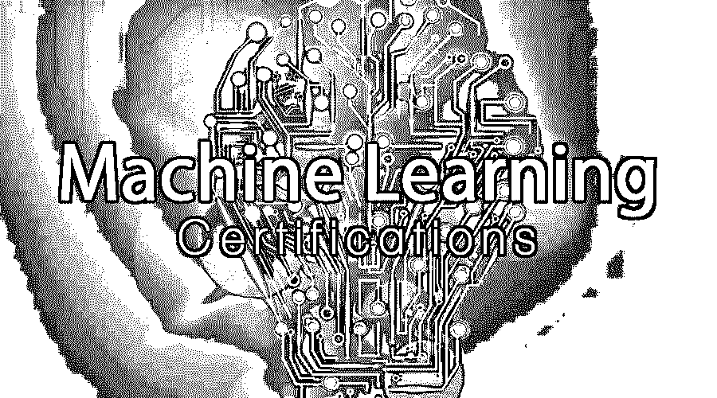
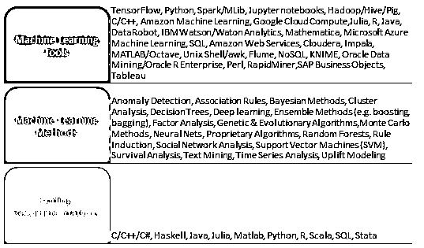

# 机器学习认证

> 原文：<https://www.educba.com/machine-learning-certifications/>

## 机器学习认证简介

你对阅读关于机器学习的书籍感兴趣吗？你在考虑从事[人工智能](https://www.educba.com/careers-in-artificial-intelligence/)和机器学习方面的职业吗？在我们开始认证之前，你需要知道一些基本的事情，这将帮助你在人工智能和机器学习领域开拓职业生涯。

<small>Hadoop、数据科学、统计学&其他</small>

人们可能想知道为什么学习是人工智能和机器学习的重要因素。机器学习认证训练计算机在处理数据时像人类一样思考。然而，这方面的投入必须非常先进，并且能够与人类的才能相匹配。这需要编码和[算法](https://www.educba.com/course/data-structures-and-algorithms/)精确，能够提取人眼不可见的图案。因此，机器学习工程师的教育背景和技能非常重要。选择从事机器学习的人最好拥有 T2 计算机科学和统计学的学士或硕士学位。除此之外，要成为一名机器学习工程师，还有一个完整的认证列表。

下面是成为机器学习工程师可以获得的所有工具和技能的列表。

### 机器学习认证(课程)

#### 1.吴恩达的机器学习

吴恩达是一名计算机科学家，他开设了吴恩达的机器学习认证课程，该课程可以在 Coursera 上找到。该课程提供了机器学习、[数据挖掘](https://www.educba.com/course/it-security-hacking-data-mining/)和统计模式识别的广泛介绍。这门课程为期 11 周。

特点/前景:

本课程涵盖回归、机器学习[技术](https://www.educba.com/course/technology-in-logistics/)和方法的概念。本课程使用 Octave，这是一个很好的工具，可以在使用之前测试已经构建好的算法。本课程的亮点在于，它让考生详细了解内置机器学习算法背后的数学和统计逻辑。课程结构从数学和统计学的基础开始，逐步深入到机器学习认证技术和方法的更高级的概念，例如对[神经网络](https://www.educba.com/course/predictive-modeling-with-sas-em-module-4-neural-networks/)和异常检测、机器学习系统设计和支持向量机等算法的讨论。本课程附有一个应用示例。总的来说，它旨在为学生提供强大的机器学习基础。

网址:[https://www.coursera.org/learn/machine-learning](https://www.coursera.org/learn/machine-learning)

语言:英语，带西班牙语、印地语、日语、中文字幕

课程创建者:斯坦福大学吴恩达

平均用户评分:4.9/5

#### 2.Coursera 的机器学习专业化

机器学习:华盛顿大学推出的 Coursera 回归课程探索了用于预测和特征选择任务的正则化线性回归模型。本课程使具备适当技能的考生能够处理大型数据集，并从一系列不同复杂程度的模型中识别出正确的模型。算法用于将这些模型扩展到大型数据集。这是一个为期六周的课程。

特点/前景:

本课程着重于机器学习中应用的各种回归方法。回归在机器学习算法构建中起着至关重要的作用。因此，本课程旨在让初学者以及有经验者对统计回归方法有一个透彻的理解，从简单的线性回归、多元回归和更难的概念开始，如评估性能、岭回归、特征选择、套索、最近邻和核回归。如果顺利完成，这门课程可以使考生具备构建统计上强有力的算法的正确技能。

网址:[https://www.coursera.org/learn/ml-regression](https://www.coursera.org/learn/ml-regression)

语言:英语

课程创建者:华盛顿大学

平均用户评分:4.8/5

#### 3.数据营的机器学习

《Data Camp 机器学习入门》是适合那些对 R 和统计学有很好理解，但又是机器学习初学者的人的课程。该课程是非常重要的机器学习认证任务的集合，如分类、回归和聚类。

特点/前景:

Data Camp 关于机器学习的课程是一门非常有条理和精确的课程。该课程分为简单的子部分，每个子部分都让考生彻底理解什么是机器学习、性能测量、分类、回归概念以及[聚类](https://www.educba.com/course/failover-clustering-tutorials/)的统计概念。合理理解 R 和[统计量](https://www.educba.com/course/statistics-essentials-analytics-beginners/)是先决条件。一旦完成，这门课程给考生足够的技能来实践机器学习算法建设。

网址:[https://www . data camp . com/courses/introduction-to-machine-learning-with-r](https://www.datacamp.com/courses/introduction-to-machine-learning-with-r)

语言:英语

课程创建者:数据营

平均用户评级:不可用

#### 4.EDUCBA 的机器学习专业化

成为机器学习专家是全球技能教育提供商 EDUCBA 的一门课程，也是 IIT IIM 大学印度校友的一项倡议。该课程涵盖了学习和掌握机器学习的要点，以使工程师能够[编程](https://www.educba.com/course/certified-sas-base-programmer/)计算机[自动分析](https://www.educba.com/course/multisim-schematics-capture-module-5-working-with-analyses/)数据。该课程使考生能够获得使用 [R](https://www.educba.com/get-promoted-as-a-project-manager/) 、 [Python](https://www.educba.com/course/web-application-development-pyramid-micro-framework-python/) 和 [MatLab](https://www.educba.com/course/beginner-lessons-matlab/) 分析数据的技能。还有助于从大量数据中提取有意义的见解，并为[决策](https://www.educba.com/course/consumer-behaviour-consumer-perception-and-decision-making/)做出准确预测。

特点/前景:

这门成为机器学习认证专家的课程着重于统计学的基础、统计工具、机器学习概念、技术和方法。简而言之，它涵盖了一个人成为机器学习专家所需的所有主题。完成后，它肯定会有助于为考生提供正确的技能，以进行基于合理逻辑的机器学习算法构建。对于那些想要快速学习机器学习认证的人来说，这是很好的。

网址:[https://www.educba.com/](https://www.educba.com/)

语言:英语

课程创建者:EDUCBA

平均用户评级:不可用

#### 5.Simplilearn 的机器学习

由认证提供商 Simplilearn 提供的机器学习认证课程将使您成为机器学习方面的专家，并使具备技能的候选人掌握机器学习认证概念和技术，包括监督和非监督学习、数学和启发式方面以及动手建模。人工智能和机器学习导论。

特点/前景:

本课程深入全面地收集了一个人成为机器学习工程师所必需的所有主题。人们可能需要耐心和合理的学习倾向来完成这门课程，因为它广泛涵盖了所有的主题。它从什么是机器学习认证及其应用的基础知识开始，机器学习、数据、数学、[回归](https://www.educba.com/course/regression-modelling-using-eviews/)、分类、聚类和[深度学习](https://www.educba.com/course/deep-learning-tutorials/)的技术。对于初学者和有经验的人来说，这是一门很好的课程，可以真正理解这门学科。

网址:[https://www . simpli learn . com/PGP-ai-机器学习-认证-培训-课程](https://www.simplilearn.com/pgp-ai-machine-learning-certification-training-course)

语言:英语

课程创建者:Simplilearn

平均用户评级:不可用

#### 6.Udacity 机器学习简介

这个课程是由全球认证提供商 udacity 组织的。该课程旨在向考生传授通过机器学习镜头调查数据的端到端流程。它教导从数据中提取有意义的信息，并评估机器学习算法的性能。本课程的结构如下。

特点/前景:

Udacity 上的技术和数据科学课程通常很受欢迎。这适用于它的机器学习课程。本课程涵盖基本概念、机器学习认证方法，如朴素贝叶斯、SVM、决策树、选择算法、数据、回归、异常值、聚类、特征缩放、文本学习、特征选择、PCA、验证和评估指标。这是一个很好的课程，让你一步一步地了解整个分析过程，以及在给计算机编程以执行分析任务时需要牢记的所有障碍。

网址:[https://classroom.udacity.com/courses/ud120](https://classroom.udacity.com/courses/ud120)

语言:英语

课程创建者:Udacity

平均用户评级:不可用

#### 7.Upgrad 的机器学习

Upgrad 的机器学习认证和人工智能 PG 文凭是一门旨在掌握高级机器学习认证和人工智能概念的课程，如神经网络、自然语言处理、图形模型和强化学习。它还通过与行业合作创建的项目帮助学习前沿应用程序:聊天机器人、图像分类器等。这是一门为期 11 个月的在线课程，其结构如下。

特点/前景:

Upgrad 的机器学习和人工智能课程侧重于算法构建中的技术、方法和逻辑，而不是从基本概念开始。它涵盖了数学，统计技能，回归和最大似然法。对于那些对什么是机器学习有基本了解，并希望进一步探索和拓宽他们在该主题上的知识的人来说，这是一个很好的课程。

网址:[https://upgrad . com/machine-learning-and-artificial-intelligence/？iref=NavBar_Program_MlAndAi](https://upgrad.com/machine-learning-and-artificial-intelligence/?iref=NavBar_Program_MlAndAi)

语言:英语

课程创建者:Upgrad

平均用户评级:不可用

### 结论

了解不同的认证后，候选人可以选择最适合他们职业要求和偏好的认证。尽管结构不同，但所有课程都谈到了相同的技能组合，能够让学习者掌握各种概念和技术来处理当前的数据趋势。

