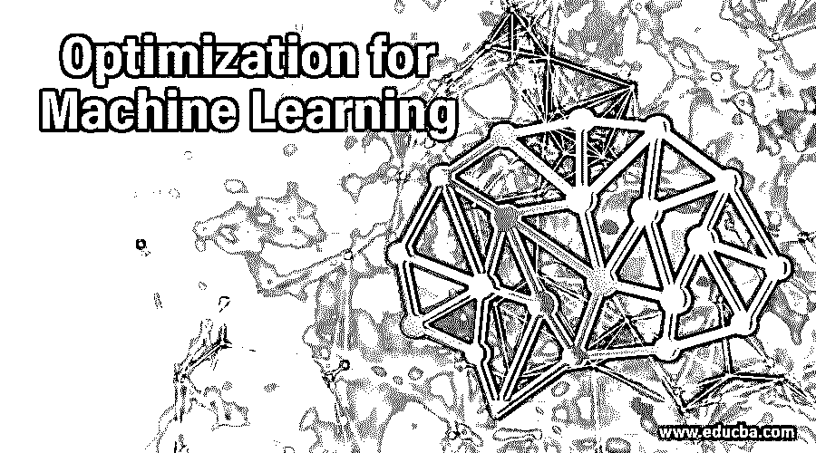

# 机器学习的优化

> 原文：<https://www.educba.com/optimization-for-machine-learning/>

## 机器学习优化导论

机器学习是对计算程序的研究，它根据提供的算法执行一组任务，而不需要外部的太多指令。今天，机器学习已经在计算行业创造了一个繁荣，利用人工智能，并利用计算平台优化了预测水平。在建立由输入和输出组成的数学模型时，其中提出的算法在很大程度上得到了优化。机器学习已经针对数据分析进行了优化，为解决许多商业问题铺平了道路。

### 什么是机器学习的优化？

就算法而言，优化是最重要的因素之一。在机器的帮助下，学习优化在很大程度上通过最小化价格来照顾成本函数。因此，结合机器学习选择优化算法已经在生产中产生了很大程度的准确性，同时利用了时间和金钱。在现代工业中，产生了大量的应用并得到广泛的研究。

<small>Hadoop、数据科学、统计学&其他</small>

各种 simples 算法集中于通过寻找参数来最小化成本函数。出于机器学习的目的，使用优化算法来寻找参数。

梯度下降算法计算影响成本函数的每个参数。梯度需要针对每个参数进行调整，以最小化成本。

使用机器学习的优化已经在算法方法中带来了一些革命性的变化，远远优于旧方法的各种公式和新范式。

最优化已经详细强调了凸算法、复杂性和其他最优化理论中的某些主题。

在这个时代，各种新的专业知识研究人员正在研究这种算法函数，以通过机器学习来优化解决方案。

### 我们为什么需要？

机器学习优化的好处在计算科学的发展中发挥了重要作用。

*   如果我们看看当前的场景，我们可以说在过去的一年中，优化技术被用于各种中小型组织、全球行业和其他企业解决方案中。
*   由于各种算法的优化解决方案，所有物理和虚拟制造的工程产品都变得紧凑。我们从中受益。
*   机器学习不是一项独立的技术，它不仅消耗了优化技术，而且还产生了新的优化思想，为最终用户创造了许多好处。
*   由于巨大的应用基础和多产的理论方法，最优化和机器学习一起变得非常重要。
*   由于模型的整体大小、容量和价格都在增加，优化技术已经提供了独特的和质量更好的优化方法来解决这些问题。
*   机器学习的核心是优化，因为算法涉及到利用经验找到目标模型的合适参数。
*   有很多优化问题，包括数据拟合，并且已经发明了不同的方法来寻找优化的解决方案。
*   算法用于启发式搜索策略的各种功能，以根除优化问题。
*   优化算法产生一组有组织的输入，这些输入产生数据驱动的预测作为输出，而不是遵循一组严格的静态算法指令。
*   先进的机器学习技术有助于引导企业快速找到最佳解决方案，解决所有优化问题。
*   利用机器学习的优化功能，可以解决和优化对巨大数据集的计算负载的总体估计。

### 重要

借助机器学习的优化方法以其快速的算法技术和克服传统行为的方法日益增多。

重要性如下:

*   该算法的第一个重要性是其更好的泛化能力，这种泛化能力对不同的情况或方法产生相同的输出或响应。
*   就其产生的功能而言，机器学习方法是高度可扩展的，并且已经解决了大量的优化问题，从而有助于大大小小的组织和企业解决方案的更大生产力。
*   优化算法在优化输出和高质量产品方面提供了最佳性能，有效地提高了算法的整体效率、整体执行时间，并在更大程度上解决了内存管理问题。
*   优化算法还产生了最简单的方法来实现算法原理以优化解决方案和问题，这在使用传统的算法方法时是非常困难的，传统的算法方法耗费时间并且在解决问题时也是低效的。
*   机器学习的优化算法在更大程度上揭示了通过问题结构来防止生产输出的整体效率。算法技术是如此先进和未来的证明，它深入到问题，并返回解决方案。
*   这些算法还有助于快速收敛，即产生模型近似解的有效时间。该算法更快且功能丰富，能够提取优化的时间和解决方案以提供最佳结果。
*   具有算法的方法也是非常鲁棒的，并且各种模型的数值解的方法的稳定性也被优化以产生总体性能的最佳质量结果。
*   使用一种方法可以更好地理解和解决每个算法的收敛性和复杂性。
*   该优化还有助于避免局部极小值，并搜索更好的方法和解决方案以提供优化的结果，还有助于消除多维空间的复杂性和困难性。

### 结论

因此，在技术快速发展的时代，机器学习模型的优化方法一直处于价值链的顶端，产生了许多流行的统计技术和方法算法，增加了研究数据科学的知识，以优化的方式生成输出。

### 推荐文章

这是一个机器学习的优化指南。在这里，我们讨论为什么我们需要优化机器学习及其重要性。您也可以看看以下文章，了解更多信息–

1.  [机器学习功能](https://www.educba.com/machine-learning-feature/)
2.  [机器学习生命周期](https://www.educba.com/machine-learning-life-cycle/)
3.  [机器学习中的决策树](https://www.educba.com/decision-tree-in-machine-learning/)
4.  [机器学习 C++库](https://www.educba.com/machine-learning-c-plus-plus-library/)

