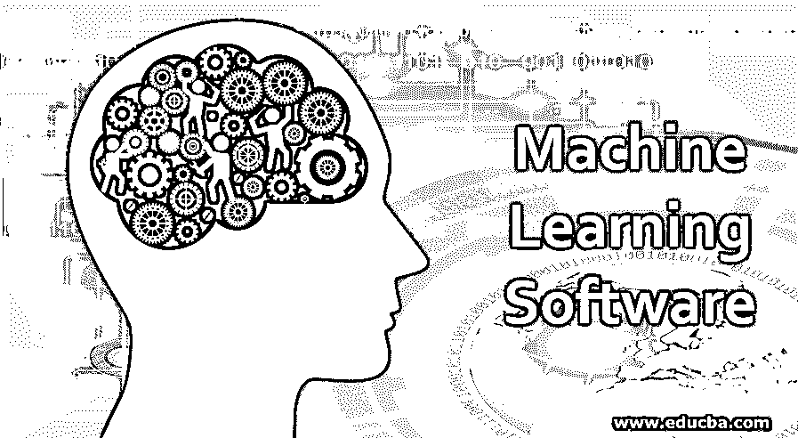

# 机器学习软件

> 原文：<https://www.educba.com/machine-learning-software/>

## 机器学习软件介绍

机器学习是一种基于 AI(人工智能)的科学应用，它使计算机系统能够学习、执行某项任务，并改善从中获得的经验，而无需专门对其进行编程。[机器学习算法](https://www.educba.com/machine-learning-algorithms/)用于日常实践，如搜索引擎、图像&语音识别、医疗诊断等。这些算法需要特定的软件和工具来执行和实施特定的动作。机器学习软件有自己的一套工具、库和资源来开发可以用智能机器和应用程序复制人类行为的应用程序。我们将重点介绍的软件如下所示。

### 机器学习软件的类型

市场上有大量的机器学习软件。有些软件具有独特的功能。与此同时，也有一些相对更好的工具。许多企业已经开始采用该技术来提高投资回报率(ROI)。由于机器学习是 AI(人工智能)的一部分，机器根据结果或模式进行训练，以自主开发新的变化。机器学习软件的一些类型有——Azure Machine Learning Studio、幕府将军、Apache Mahout、Apache Spark MLlib、IBM Watson 机器学习、RapidMinor、Weka、Google Cloud ML Engine、Pytroch、Figure Eight、Crab、微软认知工具包、Torch 等。让我们仔细看看机器学习专家依赖的一些顶级和最常用的软件。

<small>Hadoop、数据科学、统计学&其他</small>

### 顶级机器学习软件

下面是各种机器学习软件:

#### 1.谷歌云 ML 引擎

谷歌的云机器学习引擎是训练、分析和深度学习的流行应用之一。

#### 2.Azure ML 工作室

它是微软为 ML 专家提供的方便使用的无代码、拖放式解决方案。

#### 3.IBM 沃森机器学习

凭借其开源模型操作，[它帮助数据科学家](https://www.educba.com/what-is-a-data-scientist/)和开发者加速人工智能和机器学习应用。

#### 4\. TensorFlow

这是 2015 年发布的一个新的开源框架，操作起来并不复杂，也可以部署在各种平台上。TensorFlow 由 Google 制作，可用于 Python、C++、Java、Rust 等。

#### 5.微软认知工具包

微软新推出的人工智能解决方案可以用其[深度学习算法](https://www.educba.com/deep-learning-algorithms/)训练机器，使其行为像人类的大脑和面部。它可以处理来自 Python、C++等的数据。

#### 6.提亚诺

它是一个基于 Python 的深度学习算法开源库，用于加速机器学习部署。通过集成 Python 库，如 NumPy、Pandas 和一些本地程序，Theano 能够将数据结构带到下一个级别。

#### 7.火炬

这个典型的较老的[机器学习库](https://www.educba.com/machine-learning-libraries/)在部署机器学习项目时着迷于操作的灵活性和快速性。

#### 8.Apache Spark MLlib

Apache Spark 是一款可信的机器学习工具，用于高级机器学习和深度学习。这是一个无缝、可扩展的平台，可以与 Hadoop 集成，以从算法中获得更好的结果。分类、回归、梯度提升、决策树、LDA 等是支持 MLlib 的一些算法。

#### 9\. Pytorch

Pytorch 由脸书开发，用于使用神经网络和张量进行高级深度学习。可以确定的是，世界各地的研究人员使用 Pytorch 进行动态图形表示和蓝图技术。

#### 10.Ideas2T 技术公司

与其他工具不同，Ideas2T 工具有一个独特的功能，可以帮助招聘人员通过机器学习根据简历雇用合适的候选人。由于其前沿和先进的算法，它一直是初创企业、企业和商业机构的交汇点。

### 机器学习软件的优点

机器学习，人工智能的一个子集，帮助检查和学习数据，并从中做出某些决定。它能够高速、准确地做出决策和提出建议。所以，ML 软件很受欢迎。有趣的是，它们也不贵。机器学习和人工智能都是在大型复杂的数据集上工作，以可视化并做出完美的决策。几个例子如下:

*   脸书:当我们在脸书上传一张照片时，它会从同一张照片中认出一个人，并暗示彼此的友谊。这就是 ML 的工作方式。
*   网飞:网飞有时会根据我们之前看过的内容发送网络节目或电影的建议。基本上，机器学习用于基于选择来选择数据。

商业实体和组织将正确的算法对与某种工具一起使用，并基于对数据的学习来制作机器学习模型。它帮助企业更高效地工作，以低成本构建高端模型。机器学习软件有助于数据分析的自动化，从而减少人力并提高成本效益。这个过程是相当迭代和可伸缩的。

在日常生活中，ML 还有其他几个应用。ML 软件有效应用的一些领域如下:

*   **金融服务**:金融部门用它来识别投资、交易甚至确定金融风险的洞察力。
*   **营销&销售**:各种公司和其他类似的机构使用机器学习软件来分析购买历史，并根据它为客户提供建议。
*   **医疗保健**:如今电子可穿戴设备和传感器被广泛使用。这些可穿戴设备中的传感器提供血压、心跳和其他与健康相关的重要信息的实时数据。
*   **交通**:机器学习软件分析旅行历史和路线，以识别问题(如果有的话)，从而帮助客户/乘客在未来选择退出风险易发区域。
*   政府:一些政府机构使用 ML 工具来提取洞察力，以最小化成本并提高运营效率。
*   石油&天然气:机器学习主要用于能源领域。它有助于分析现有的和新的能源资源的勘探和分配。政府和私营部门的许多石油机构都采用了这些技术。

### 结论

机器学习和人工智能在现代各代人中有着越来越广泛的用途，并且仍在不断扩展。因此，认为机器学习软件根据输入数据集执行操作，并在从原始数据中提供见解以改善商业和其他目标方面发挥重要作用不会有错。

### 推荐文章

这是一个机器学习软件指南。在这里，我们讨论了机器学习的介绍和 10 大软件及其优点。你也可以看看下面的文章来了解更多-

1.  [什么是强化学习？](https://www.educba.com/what-is-reinforcement-learning/)
2.  [机器学习算法的类型](https://www.educba.com/types-of-machine-learning-algorithms/)
3.  [物联网简介](https://www.educba.com/introduction-to-iot/)
4.  [机器学习的应用](https://www.educba.com/applications-of-machine-learning/)

