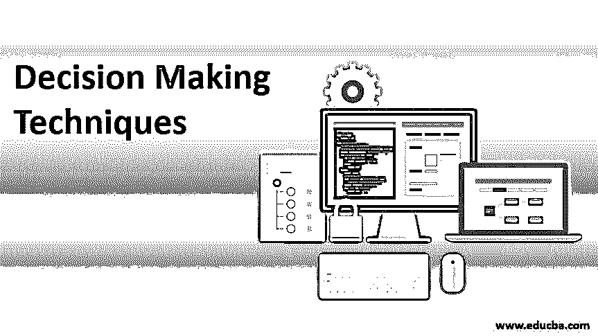
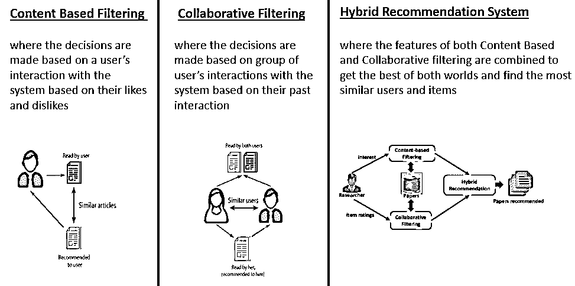
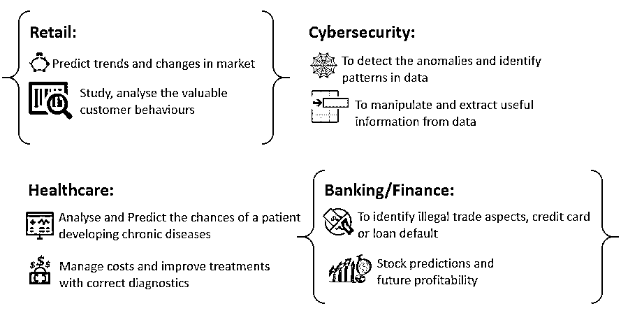

# 决策技术

> 原文：<https://www.educba.com/decision-making-techniques/>

## 决策技术介绍

*   在这些文章中，我们将学习决策技巧。人工智能/人工智能方法可能是我们理性决策的一种手段。这篇文章旨在提供 AI/ML 指导的最流行的决策技术的直觉。
*   从早上醒来，离开舒适的床，直到我们退休，我们所做的决定让我们茁壮成长。据估计，一个普通人每天会做出大约 35，000 个决定。即使是一个小小的决定也能对一系列事件产生巨大的影响，就像著名的“蝴蝶效应”所说的那样，一个微小的变化，比如一只蝴蝶扇动翅膀，就能产生惊人的变化。
*   有效决策的关键是确定可能的结果，评估它们以得到最佳结果。随着人工智能的兴起，我们的大多数理性决策都趋向于人工智能，无论是寻找到达工作地点的最短路线还是做出复杂的商业选择。人工智能/人工智能技术在决策中的应用使我们能够通过尝试手头问题的各种可能结果来找到最佳解决方案。

### 使用人工智能/人工智能的高层决策技术

决策是一个持续的、以目标为导向的过程。它涉及到为达到既定目标而要执行的一系列行动。以下技术给出了现代商业问题的解决方案，从而提高决策能力，在任何给定的领域提供有效的、成本有效的和盈利的增长。

#### 1.推荐系统

让我们花点时间来分析一下我们的日常活动。我们一天的大部分时间都是从智能手机开始的，并随着智能手机不断进步。从新闻，我们读到我们购物的东西，手表都是基于我们过去的选择推荐给我们的。在某种程度上，机器正在决定我们可能感兴趣的东西。这是通过构建一个使用如下所示技术的系统来实现的，

<small>Hadoop、数据科学、统计学&其他</small>

#### 2.预测分析

预测模型是使用基于统计的技术来估计或预测可能结果的模型，给定适当的有效数据来满足各种场景的要求。预测模型通常与机器学习算法相结合，以获得有效的业务成果。这是通过数据挖掘实现的，确定目标的趋势和模式，并应用合适的分类算法(预测各种类别)或回归算法(预测数字)。

预测分析在各行业中的使用如下所示:

#### 3.基于模糊逻辑的决策

术语“模糊”意味着含糊或不精确。我们做的很多决定不能非黑即白；有时，探索灰色区域提供的结果是必要的。模糊逻辑用于将人类推理的相似之处整合到机器中。模糊逻辑通常与控制系统一起实现，以提供可接受的实时结果。当与神经网络和强化技术合作时，模糊系统可以用来实现现实世界场景所需的智能和稳定性。

模糊系统提高了性能，对外部噪声和异常值不太敏感。这些系统更加灵活，可以包含代表两种以上可能情况的值。虽然模糊系统并不总是准确的，但它们更稳健，并在大多数家用产品中得到应用，如空调、微波炉、洗衣机、冰箱、电视等。

### 决策的重要性

以下是解释决策技巧的要点:

*   众所周知，每天我们都会产生超过 2.5 万亿字节的数据，而且这一数字还在与日俱增。因此，可以有把握地得出结论，对于“数据驱动型”公司来说，数据并不短缺。然而，由于这些数据中的大多数是非结构化的，因此需要对它们进行挖掘、清理和净化，以便能够从所述数据中提取有用的信息。
*   任何企业的成功都取决于他们接触客户的途径，以及客户对其产品的满意程度。人工智能和 [ML 技术](https://www.educba.com/machine-learning-techniques/)的使用对于企业了解他们的市场并保持对创新和有效利用可用资源的正确态度非常重要。
*   这些技术充当桥梁，以获得对数据的杠杆作用，并利用它们进行复杂的决策，使企业能够对其客户有更深入的个人理解，从而在他们之间建立更强的联系，并探索更好的业务机会。

### 决策的优势

以下是决策的优势

#### 1.探索更多选项

有了大量的数据，就有了许多探索和从中提取有用见解的可能性。虽然这项任务对人类来说可能很乏味，但机器可以帮助我们实现这一点。在实现理想决策的道路上，数据被分析，研究多种选择以找到未解决问题的解决方案。

#### 2.节省时间

随着数字平台的发展，人们迫切需要快速获得结果，而这可能需要高效且训练有素的机器的参与，这些机器应用复杂的数学规则来为我们提供最佳输出。随着神经网络和超级计算机的进步，这些复杂的算法现在可以在几秒到几小时内完成，而不是几天。

#### 3.更高的准确性和效率

除了节省我们的时间，AI 和 ML 系统为我们的问题提供了准确的结果。这是通过我们输入到这些系统中的大量机器可接受的数据实现的，随着时间的推移，随着历史数据的积累，解释的决策变得越来越好。

#### 4.了解消费者

留住消费者和获得消费者一样重要。企业可以利用他们获得的关于消费者的数据，围绕他们现有的方法工作，并决定什么对双方都最好，以确保他们的消费者不会很快离开。

### 结论

决策技巧，决策为我们提供了各种可能的选择，使我们能够做出最佳的选择。最近，我们依靠人工智能来为我们做出大多数决定，帮助我们做出更精确和更好的决定。尽管这对我们走向未来至关重要，但并非所有由机器和算法做出的决定都可以取代人类做出的决定。

人类决策中存在的道德是基于机器的决策最缺乏的，更不用说它们是由它们的创造者或提供给它们的数据引入的偏见。但人工智能在我们决策过程中的参与范围不会很快放缓；我们进一步发展的唯一方法是采用一种更聪明、更有计算能力的方法来改进作为我们行动结果的决策。

### 推荐文章

这是决策技巧指南。在这里，我们讨论使用人工智能/人工智能的高层决策技术，重要性及其优势。您也可以浏览我们的其他相关文章，了解更多信息——

1.  [深度学习技术](https://www.educba.com/deep-learning-technique/)
2.  数据挖掘中的决策树
3.  [职业决策](https://www.educba.com/career-making-decisions/)
4.  [人工智能如何工作？](https://www.educba.com/how-artificial-intelligence-works/)

