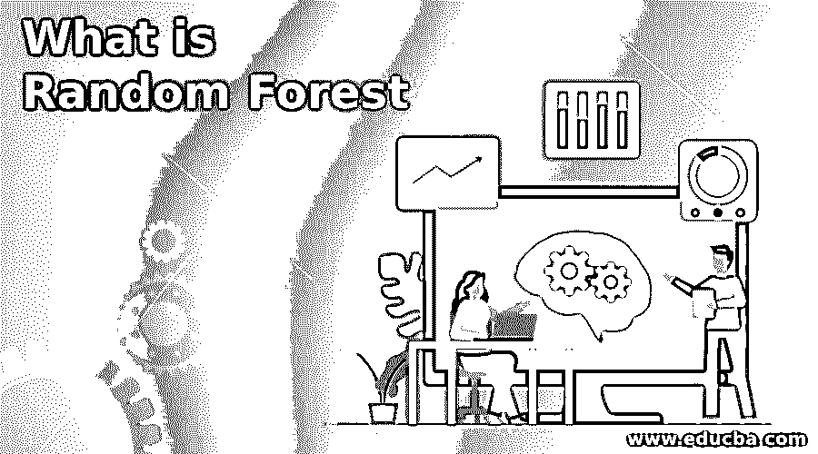
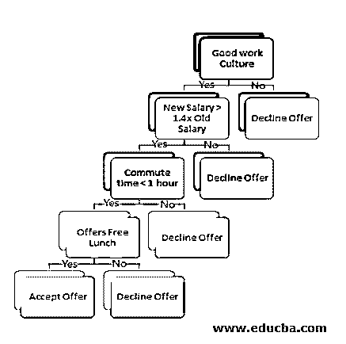

# 什么是随机森林

> 原文：<https://www.educba.com/what-is-random-forest/>

## 随机森林简介

首先，让我们向你们抛出一些大词，我们会一点一点地向你们解释，这样在一篇文章的结尾，我们就不会再把以前称为“术语”的词称为难懂的术语或“术语”了！数据科学世界中的随机森林是一种机器学习算法，即使没有超调参数，它也能够提供异常“伟大”的结果。这是一种监督分类算法，这实质上意味着我们需要一个变量来匹配我们的输出并与之进行比较。监督算法本质上意味着会有一些变量试图匹配另一个变量，我们称之为输出。现在，Random Forest 本质上是一个决策树的集合，它们一起工作来呈现输出。现在已经讨论了决策树，我们还没有完全引入这个术语。让我们先做那件事。

### 随机森林是如何工作的？

决策树是一种类似树的结构化算法，它不断地将整个数据集分成分支，然后再分成分支，最后形成一个不能再分的叶子。本质上，叶子中的数据集表示某种相似性范围，这本质上是由我们试图分割的数据决定的。一旦我们有了一个训练好的决策树，我们就可以用一个新的数据点来填充它，这个树将导致叶子，它有一个与新数据点相似的属性。例如，假设我们有一个名人列表，用可变属性训练树，在一个叶节点上我们有所有板球运动员。现在，我们介绍一个萨钦·腾杜尔卡尔的新数据点，“板球之神！”，树会自动导致由一群板球运动员组成的叶子。

<small>Hadoop、数据科学、统计学&其他</small>

既然我们对什么是随机森林以及随机森林和决策树是如何相互关联的有了一个相当好的理解，那么让我们试着理解决策树的工作，然后我们会有一个飞跃来理解随机森林的工作。

让我们举一个工作机会的例子来理解决策树的工作，然后我们将使用同一个例子来更好地理解随机森林的工作。现在，假设你手头有一份工作机会，你问你的一个在那里工作的朋友关于这家公司的情况，他回答说这家公司的工作文化棒极了！你最终会考虑接受这份工作，同时考虑更多的验证点，比如:这家公司提供的薪水是否比现在的公司高出 40%，办公地点有多远，是否提供免费午餐等等。本例中的决策树如下所示:

现在，如果一个新的提议到来，我们会做同样的层次决策，选择是否接受这个提议。这种通过使用树来得出最后一片叶子的决策方法就是决策树方法。

现在，在解释的过程中，你有没有遇到一些关于方法论的怪异之处。如果没有，我们来解释一下。如果你问的朋友有一些个人利益要对你说“是”或者可能“不是”，因为他或她对这个组织太失望了，怎么办？这会对你的最终决定产生偏见。现在，在这个困境中，我们会问一些其他的朋友或朋友的朋友关于这个决定，我们可能会排列出大多数人的个人树会指向的结果。

因此，在决策树的例子中，选择或拒绝一个提议是“目标”变量。工资、通勤时间、工作环境等。是决策所需的变量，新的报价是一个新的数据点。对于随机森林，询问许多其他朋友基本上是什么树创建，对于数据科学，创建的不同决策树本质上是随机的。

### 随机森林分类

现在，让我们来看一个在行业中广泛使用的方法，这是在分类问题的情况下。我们将用于分类的随机森林的使用称为集成方法，通过集成，我们意味着不同决策树的投票将被聚集，并且新数据的最终类别将被描绘。在随机森林的情况下，我们将训练许多决策树，然后采取“多数投票”来最终决定数据所属的类别。多数表决实质上意味着决策树的多数所代表的类别被判定为数据点的最终类别。

从本文前一节的例子来看，如果一个组织提供了一个机会，让我们假设我们在随机森林中有大约 9 个决策树，这些树的大部分输出是加入该组织。因此，这显然会让候选人有信心在下一个组织中寻求机会。

### 随机森林的优势

我们现在可以很好地理解为什么随机森林是最广泛使用的算法之一，特别是对于分类问题。

让我们看看它在以下几个方面提供的优势:

*   随机森林构建高度准确的分类器。
*   对于随机森林，在大型数据库上运行是高效的。
*   无需删除任何变量就可以处理大量输入变量。
*   变量重要性估计可以作为随机森林过程的一部分获得。
*   在建立该算法的方式中，以无偏的方式估计泛化误差。
*   必要时，我们还可以使用随机森林来估计缺失数据。

### 结论

在下面的文章中，我们假设我们能够打破随机森林的行话，现在人们可以放心地在他们的数据科学项目中使用随机森林。该算法提供了一种更快速的数据分析方法，并最终为快速周转案例建立了一个模型。此外，该算法提供了重要特征的指示。总而言之，这种算法肯定是一种缓解大型数据集中复杂性的方法。

### 推荐文章

这是一个什么是随机森林的指南。在这里，我们讨论随机森林的介绍，它是如何工作的，分类和优势。您也可以浏览我们的其他相关文章，了解更多信息——

1.  [随机森林算法](https://www.educba.com/random-forest-algorithm/)
2.  [机器学习中的回归](https://www.educba.com/regression-in-machine-learning/)
3.  [机器学习技术](https://www.educba.com/machine-learning-techniques/)
4.  [简单随机抽样](https://www.educba.com/simple-random-sample/)

