# 机器学习算法

> 原文：<https://www.educba.com/machine-learning-algorithms/>

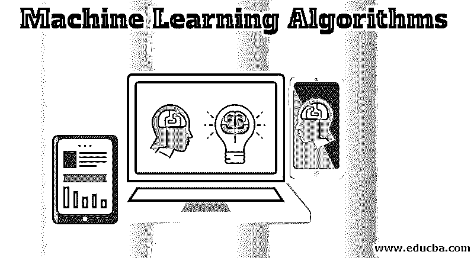

## 机器学习算法简介

机器学习算法被定义为用于训练模型的算法，在机器学习中，它被分为三种不同的类型，即监督学习(在该数据集中被标记，并且使用回归和分类技术)、非监督学习(在该数据集中未被标记，并且使用像降维和聚类这样的技术)和强化学习(在该算法中，模型从其每个动作中学习)以开发用于诸如客户保持、图像分类、技能获取、客户细分、游戏 AI、天气预报、市场预测、诊断等应用的机器学习解决方案。

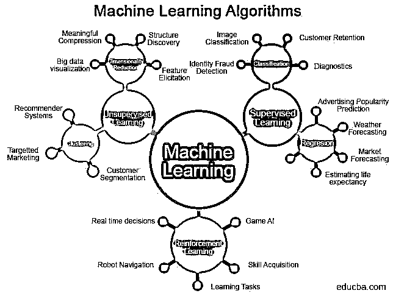

<small>Hadoop、数据科学、统计学&其他</small>

### 机器学习算法的类别

机器学习算法的领域可以分为:

*   **监督学习:**在[监督学习](https://www.educba.com/what-is-supervised-learning/)中，数据集是有标签的，即对于每一个特征或自变量，都有一个对应的目标数据，我们将用它来训练模型。
*   **无监督学习:**与监督学习不同，在这种情况下，数据集没有被标记。因此，聚类技术用于根据同一组中数据点之间的相似性对数据进行分组。
*   **强化学习:**一种特殊类型的机器学习，模型从采取的每个动作中学习。该模型对任何正确的决策进行奖励，对任何错误的决策进行惩罚，这使它能够学习模式，并对未知数据做出更准确的决策。

### 机器学习算法部

机器学习算法中的问题可以分为:

*   **回归:**因变量和自变量之间存在连续关系。目标变量本质上是数字，而自变量可以是数字或分类变量。
*   **分类:**在现实世界中，你会发现最常见的问题陈述是将一个数据点分类成一些二进制、多项式或有序类。目标变量只有两种结果(是/否，0/1，真/假)。在多项式分类问题中，目标变量中有多个类(苹果/橘子/芒果，等等)。在有序分类问题中，目标变量是有序的(例如，学生的年级)。

为了解决这类问题，程序员和科学家已经开发了一些程序或算法，可以用来对数据进行预测。这些算法可以分为线性和非线性或基于树的算法。当特征和目标变量之间存在线性关系时，通常使用线性算法，如线性回归、逻辑回归，而数据呈现非线性模式，基于树的方法，如[决策树](https://www.educba.com/decision-tree-in-machine-learning/)、随机森林、[梯度推进](https://www.educba.com/gradient-boosting-algorithm/)等。，是优选的。

### 算法

目前市场上有许多机器学习算法，考虑到在这一领域所做的大量研究，它只会增加。线性和逻辑回归通常是你作为数据科学家学习的第一个算法，接下来是更高级的算法。

以下是一些机器学习算法，以及 python 中的示例代码片段:

#### 1.线性回归

顾名思义，这种算法可用于目标变量(本质上是连续的)线性依赖于因变量的情况。

它的代表是:

**y = a*x + b + e** ，其中 y 是我们试图预测的目标变量，a 是截距，b 是斜率，x 是我们用来做预测的因变量。这是一个简单的线性回归，因为只有一个独立变量。

在[多元线性回归](https://www.educba.com/multiple-linear-regression/)的情况下，等式应该是:

`y = a1*x1 + a2*x2 + …… + a(n)*x(n) + b + e`

这里，e 是误差项，a1，a2..a (n)是自变量的系数。

使用一个度量来评估模型的性能，该度量可以是均方根误差，即实际值和预测值之差的和的平均值的平方根。

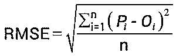

线性回归的目标是找到最佳拟合线，使实际数据点和预测数据点之间的差异最小化。

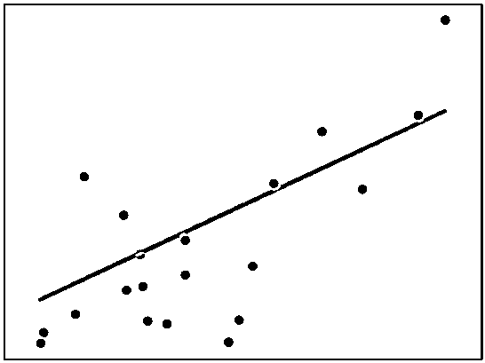

线性回归可以用 Python 编写如下:

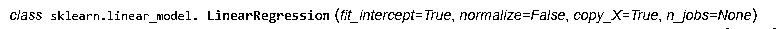

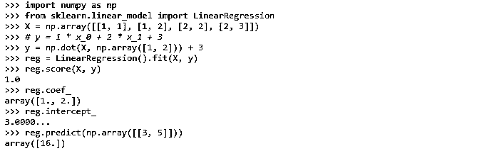

#### 2.逻辑回归

在保持线性关系方面，与线性回归相同。然而，与线性回归不同，逻辑回归中的目标变量是分类变量，即二元变量、多项式变量或序数变量。此外，激活函数的选择在逻辑回归中是重要的。对于二元分类问题，使用优势对数，即 sigmoid 函数。

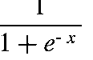

在多类问题的情况下，softmax 函数是首选函数，因为 sigmoid 函数需要大量的计算时间。

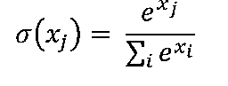

用于评估分类问题的度量通常是准确度或 ROC 曲线。ROC 下的面积越大，模型越好。例如，随机图表的 AUC 为 0.5。值 1 表示最准确，而值 0 表示最不准确。

逻辑回归在《学习》中可以写成:

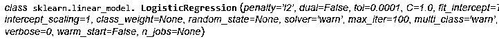

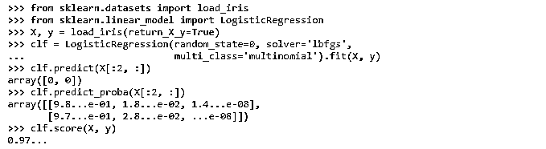

#### 3.k-最近邻

机器学习算法可用于分类和回归问题。KNN 方法背后的思想是，它根据一个新数据点的 K 个最近邻来预测该数据点的值。为了避免任何冲突，k 通常优选为奇数。在对任何新的数据点进行分类时，考虑在相邻数据点中具有最高模式的类别。而对于回归问题，均值被认为是值。

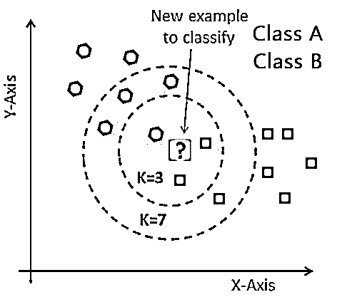

我了解到 KNN 是这样写的:

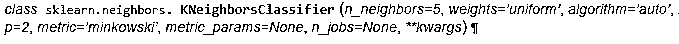

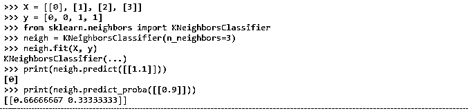

KNN 用于构建推荐引擎。

#### 4.支持向量机

一种分类算法，其中超平面将两个类别分开。在二元分类问题中，来自两个不同类别的两个向量被认为是已知的支持向量，并且超平面被绘制在离支持向量的最大距离处。

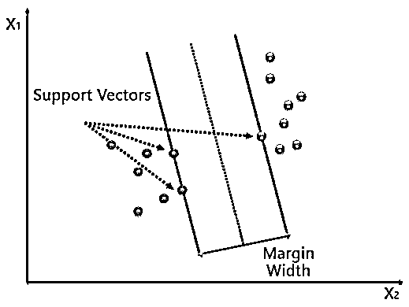

如您所见，这两个类之间只有一行之隔。然而，在大多数情况下，数据不会是完美的，并且简单的超平面不能将类别分开。因此，您需要调整正则化、内核、Gamma 等参数。

内核可以是线性的或多项式的，这取决于数据是如何分离的。在这种情况下，内核本质上是线性的。在正则化的情况下，您需要选择 C 的最佳值，因为高值可能会导致过度拟合，而小值可能会使模型欠拟合。Gamma 定义了单个训练示例的影响。接近线的点被认为是高灰度系数，反之则是低灰度系数。

在 sklearn 中，SVM 被写成:

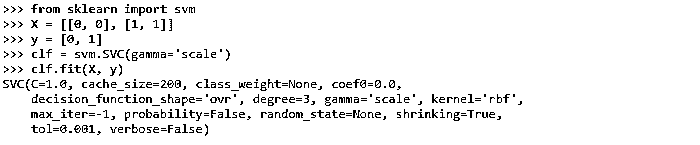

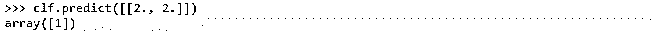

#### 5.朴素贝叶斯

它的工作原理是[贝叶斯定理](https://www.educba.com/bayes-theorem/)，在考虑一些真实条件的情况下，求出一个事件发生的概率。

贝叶斯定理表示为:

该算法被称为天真，因为它认为所有变量都是独立的，一个变量的存在与其他变量没有任何关系，这在现实生活中是不可能的。因此，朴素贝叶斯可以用于垃圾邮件分类和文本分类。

Python 中的朴素贝叶斯代码:

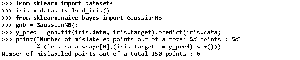

#### 6.决策图表

决策树算法用于分类和回归问题，是最简单、最容易解释的机器学习算法之一。此外，它不受数据中异常值或缺失值的影响，可以捕捉因变量和自变量之间的非线性关系。

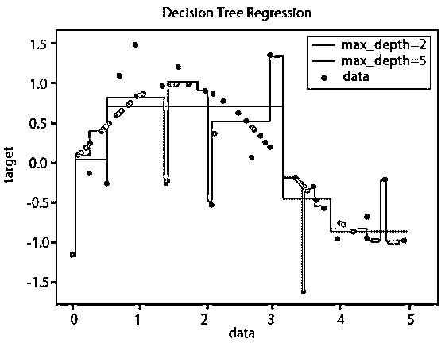

为了建立决策树，首先考虑所有特征，但是具有最大信息增益的特征被作为最终的根节点，基于该根节点进行连续分裂。基于最大信息标准，这种分割在子节点上继续进行，直到所有实例都被分类或者数据不能被进一步分割为止。决策树往往容易过度拟合，因此有必要调整超参数，如最大深度、最小叶节点、最小样本、最大特征等。有一种贪婪的方法，在每一步设置约束，并为该分割选择最佳可能标准，以减少过度拟合。还有另一种更好的方法称为修剪，首先将树构建到某个预定义的深度，然后从底部开始，如果它不能改善模型，则删除节点。

在 sklearn 中，决策树编码如下:

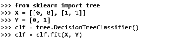

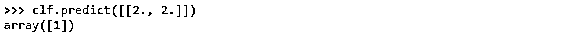

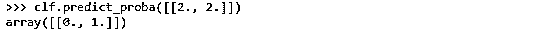

#### 7.随机森林

为了减少决策树中的过拟合，需要减少模型的方差，于是 bagging 的概念应运而生。Bagging 是一种技术，其中采用几个分类器的输出来形成最终输出。随机森林就是这样一种打包方法，其中数据集被采样为多个数据集，并且为每个数据集随机选择要素。然后在每个采样数据上，应用[决策树算法](https://www.educba.com/decision-tree-algorithm/)来获得每个模式的输出。在回归问题的情况下，取所有模型输出的平均值，而在分类问题的情况下，获得最多投票的类别被认为是对数据点进行分类。随机森林不受离群值、数据中缺失值的影响，它也有助于降维。然而，它是不可解释的，这是随机森林的一个缺点。

在 Python 中，您可以将随机森林编码为:

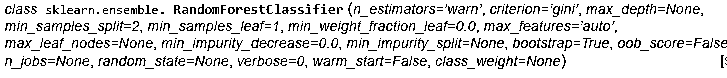

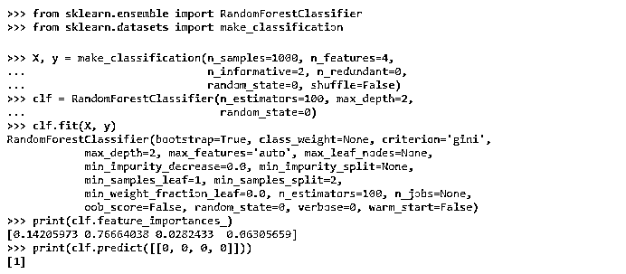

#### 8.k 均值聚类

到目前为止，我们已经处理了监督学习问题，其中每个输入都有相应的输出。现在，我们将学习无监督学习，其中数据是未标记的，需要被聚类到特定的组中。有几种可用的聚类技术。然而，其中最常见的是 K 均值聚类。Ink-means，k 是指在保持数据集中最大方差之前需要设置的聚类数。一旦 k 被设置，质心被初始化。然后重复调整质心，使得质心内的数据点之间的距离最大，并且两个单独的点之间的距离最大。欧几里德距离、曼哈顿距离等。，是一些用于这个目的的距离公式。

k 的值可以用肘法求出。

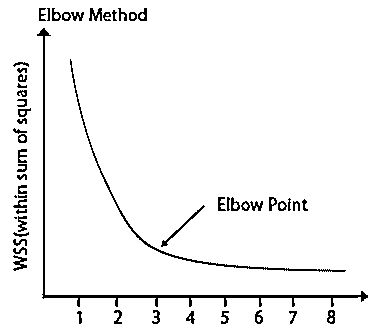

K-means 聚类用于电子商务行业，其中客户根据他们的行为模式被分组在一起。它也可以用于风险分析。

下面是 python 代码:

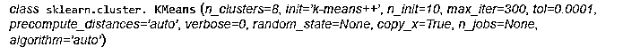

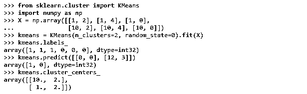

### 结论

数据科学家是 21 世纪最性感的工作，机器学习无疑是它的关键专业领域之一。要成为一名数据科学家，需要对所有这些算法有深入的理解，还需要一些其他的新技术，比如深度学习。

### 推荐文章

这是机器学习算法的指南。这里我们讨论了机器语言的基本概念、分类、问题和不同的算法。您也可以浏览我们推荐的其他文章，了解更多信息——

1.  [机器学习技术](https://www.educba.com/machine-learning-techniques/)
2.  [什么是深度学习](https://www.educba.com/what-is-deep-learning/)
3.  [数据科学家 vs 机器学习](https://www.educba.com/data-scientist-vs-machine-learning/)
4.  [超参数机器学习](https://www.educba.com/hyperparameter-machine-learning/)

