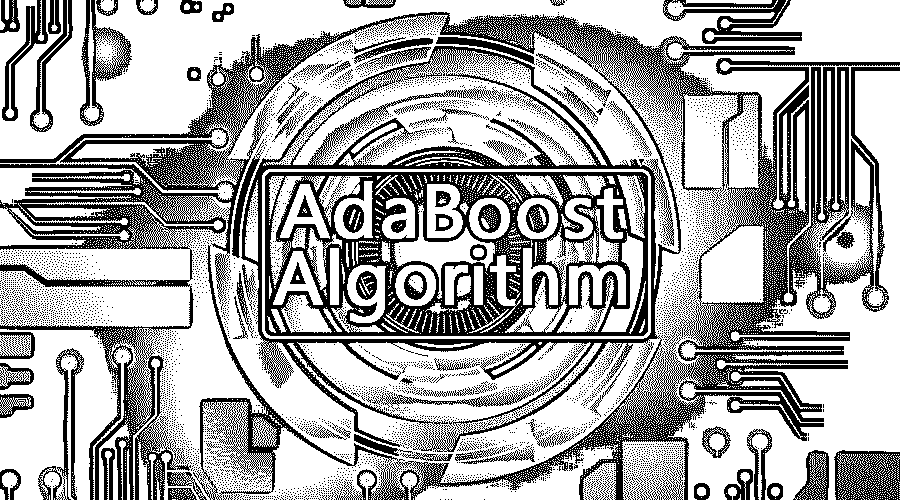
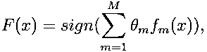
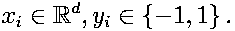
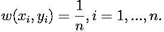
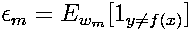
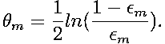
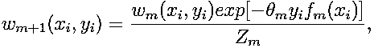

# AdaBoost 算法

> 原文：<https://www.educba.com/adaboost-algorithm/>

## AdaBoost 算法简介

adaBoost 算法可用于提升任何机器学习算法的性能。机器学习已经成为一种强大的工具，可以根据大量数据进行预测。近来它变得如此流行，以至于在我们的日常活动中可以找到机器学习的应用。一个常见的例子是，在网上购物时，根据顾客过去购买的商品获得产品建议。机器学习，通常被称为[预测分析](https://www.educba.com/what-is-predictive-analytics/)或预测建模，可以被定义为计算机在没有被显式编程的情况下进行学习的能力。相反，它使用编程算法来分析输入数据，以在可接受的范围内预测输出。

### 什么是 AdaBoost 算法？

在机器学习中，boosting 起源于一组弱分类器是否可以转换为强分类器的问题。弱学习器或分类器是比随机猜测更好的学习器。这在过拟合中是鲁棒的，因为在一大组弱分类器中，每个弱分类器都比随机的好。作为弱分类器，通常使用单个特征的简单阈值。如果该特征高于预测的阈值，则属于阳性，否则属于阴性。

<small>Hadoop、数据科学、统计学&其他</small>

AdaBoost 代表“自适应增强”，它将弱学习器或预测器转换为强预测器，以解决分类问题。

分类的话，最终方程可以放如下:

Here fm designates the mth weak classifier, and m represents its corresponding weight.

### AdaBoost 算法是如何工作的？

AdaBoost 可以用来提高机器学习算法的[性能。它最适用于弱学习者，并且这些模型在分类问题上实现了高于随机机会的高准确度。AdaBoost 常用的算法是一级决策树。弱学习器是在准确性方面表现相对较差的分类器或预测器。此外，可以暗示弱学习器易于计算，并且许多算法实例被组合以通过增强来创建强分类器。](https://www.educba.com/machine-learning-algorithms/)

如果我们取一个包含 n 个数据点的数据集，并考虑以下情况

-1 表示负类，1 表示正类。它被初始化如下，每个数据点的权重为:

如果我们考虑 M 从 1 到 M 的迭代，我们将得到下面的表达式:

首先，我们必须通过将弱分类器拟合到数据集来选择具有最低加权分类误差的弱分类器。

然后计算第 m 个弱分类器的权重如下:

对于精度高于 50%的任何分类器，权重都是正的。如果分类器更准确，则权重变得更大，如果分类器的准确度小于 50%，则权重变为负值。可以通过反转符号来组合预测。通过反转预测的符号，具有 40%准确度的分类器可以被转换成 60%的准确度。所以分类器有助于最终的预测，即使它的表现比随机猜测差。然而，最终的预测将不会有任何贡献，或者以精确的 50%精度从分类器获得信息。

对于来自正加权分类器的误分类情况，分子中的指数项总是大于 1。在迭代之后，错误分类的案例用更大的权重进行更新。负权重分类器的行为方式相同。但不同的是，符号颠倒后，原本正确的分类会变成错误的分类。通过考虑每个分类器，然后执行它们的加权预测的和，可以计算最终的预测。

如下更新每个数据点的权重:

Z m 是这里的归一化因子。它确保所有实例权重的总和等于 1。

### AdaBoost 算法是用来做什么的？

AdaBoost 可以用于人脸检测，因为它似乎是图像中人脸检测的标准算法。它使用由多层分类器组成的拒绝级联。当检测窗口在任何层都没有被识别为面部时，它被拒绝。窗口中的第一分类器丢弃负窗口，保持计算成本最小。虽然 AdaBoost 组合了弱分类器，但是 AdaBoost 的原理也用于寻找在级联的每一层中使用的最佳特征。

### 利弊

AdaBoost 算法的众多优点之一是快速、简单且易于编程。此外，它具有与任何机器学习算法相结合的灵活性，并且除了 t 之外，不需要调整参数。它已经扩展到二进制分类之外的学习问题，并且它是通用的，因为它可以用于文本或数字数据。

AdaBoost 也有一些缺点，例如它来自经验证据，特别容易受到均匀噪声的影响。弱分类器太弱会导致低利润和过度拟合。

### 例子

我们可以考虑一个大学录取学生的例子，他们要么被录取，要么被拒绝。这里可以从不同的方面找到定量和定性的数据。例如，录取结果可能是“是/否”,可以是定量的，而任何其他方面，如学生的技能或爱好，都可以是定性的。我们可以很容易地对训练数据进行正确的分类，而不是像学生擅长某一特定科目，那么她/他就会被录取这样的情况。但是很难找到高度准确的预测，然后弱学习者就出现了。

### 结论

AdaBoost 有助于为每个新分类器选择训练集，这些新分类器是基于先前分类器的结果进行训练的。此外，在组合结果时，它确定应该给每个分类器的建议答案多少权重。它结合弱学习器来创建一个强学习器来纠正分类错误，这也是第一个成功的用于二进制分类问题的 [boosting 算法](https://www.educba.com/boosting-algorithm/)。

### 推荐文章

这是一个 AdaBoost 算法的指南。在这里，我们讨论了 AdaBoost 算法的基本概念、用途、工作原理以及优缺点。您也可以浏览我们推荐的其他文章，了解更多信息——

1.  [朴素贝叶斯算法](https://www.educba.com/naive-bayes-algorithm/)
2.  [社交媒体营销面试问题](https://www.educba.com/social-media-marketing-interview-questions/)
3.  [链接构建策略](https://www.educba.com/link-building-strategies/)
4.  [社交媒体营销平台](https://www.educba.com/seven-sins-of-social-media-marketing-platform/)

