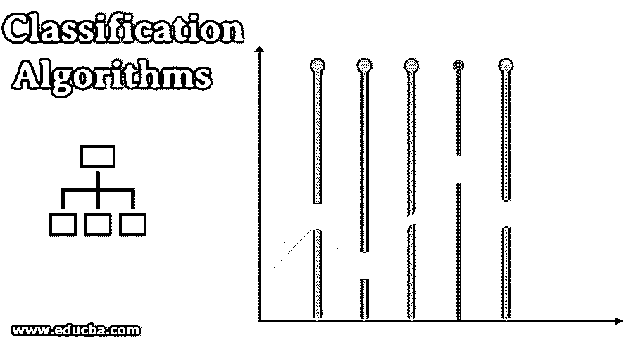
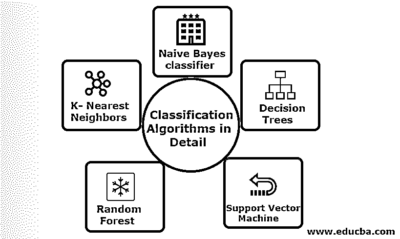
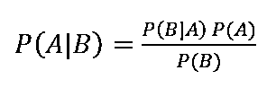

# 分类算法

> 原文：<https://www.educba.com/classification-algorithms/>

## 分类算法简介

这篇关于分类算法的文章概述了[数据挖掘技术](https://www.educba.com/data-mining-techniques/)中常用的具有不同原理的不同方法。分类是一种将数据分类到不同类别的技术，并为每个类别分配标签。分类的主要目标是通过观察适当的边界，通过分析训练集来识别要发射新数据的类。一般来说，预测目标类和上述过程称为分类。

例如，医院管理层记录病人的姓名、地址、年龄、病人的既往病史，以便对他们进行诊断；这有助于对病人进行分类。它们可以分为两个阶段:学习阶段和评估阶段。学习阶段基于训练数据对方法建模，而评估阶段预测给定数据的输出。我们可以在垃圾邮件、银行贷款预测、语音识别、情感分析中找到它们的应用。该技术包括具有输入 X 和输出 y 的数学函数 f。

<small>Hadoop、数据科学、统计学&其他</small>

### 详细解释分类算法

可以对结构化和非结构化数据执行分类。分类可以分为

1.  朴素贝叶斯分类器
2.  决策树
3.  支持向量机
4.  随机森林
5.  k 近邻

#### 1.朴素贝叶斯分类器

这是一种基于贝叶斯定理的算法，是统计分类的一种，需要少量的训练数据来估计参数，也称为概率分类器。它被认为是最快的分类器，具有高度的可伸缩性，可以处理离散和连续数据。此外，该算法用于实时预测。有不同类型的朴素分类器，多项式朴素贝叶斯，伯努利朴素贝叶斯，高斯朴素贝叶斯。

具有后验概率的贝叶斯分类由下式给出

其中 A，B 是事件，P(A|B)-后验概率。

如果两个值相互独立，

P(A，B) =P(A) P(B)

可以使用 python 库构建朴素贝叶斯。天真的预测器是独立的，尽管它们被用在推荐系统中。它们被用在许多实时应用中，并且被很好地用于文档分类。

**优点:**

优点是它们需要非常少的计算能力，在多类预测问题中被假定，在大数据集上精确地工作。

**劣势:**

这种分类器的主要缺点是它们将分配零概率。并且它们具有彼此独立的特征。

#### 2.决策图表

这是一个自顶向下的方法模型，具有处理高维数据的流程图结构。基于给定的输入变量预测结果。决策树由以下元素组成:一个根、许多节点、分支、叶子。根节点根据类的属性值进行划分；内部节点获取一个属性用于进一步分类；分支制定决策规则，将节点拆分为叶节点；最后，叶节点给出了最终的结果。决策树的时间复杂度取决于记录的数量、训练数据的属性。如果决策树太长，就很难得到想要的结果。

**优势:**它们被应用于解决问题的预测分析，并在日常活动中用于根据决策分析选择目标。基于源数据自动构建模型。最擅长处理缺失值。

**缺点:**树的大小是不可控的，直到它有了一些停止标准。由于它们的层次结构树是不稳定的。

#### 3.支持向量机

这种算法在分类问题中起着至关重要的作用，最流行的是机器学习监督算法。这是研究人员和数据科学家使用的重要工具。这个 SVM 非常简单，它的过程是在一个 N 维空间数据点中寻找一个超平面。超平面是对数据点进行分类的决策边界。所有这些向量更接近超平面，最大化分类器的余量。如果差值最大，则泛化误差最小。它们的实现可以通过使用 python 和一些训练数据集的内核来完成。SVM 的主要目标是将对象训练成特定的类别。SVM 不限于成为线性分类器。由于其核函数，SVM 比任何分类模型都更优选，这提高了计算效率。

优点:它们因计算能力低和有效精度高而备受青睐。在高维空间有效，记忆效率好。

**缺点:**速度、内核和大小的限制

#### 4.随机森林

这是一个基于集成学习方法的强大的机器学习算法。随机森林的基本构造块是用于建立预测模型的决策树。工作演示包括创建一个随机决策树的森林，并通过设置停止分裂以产生更好的结果来执行修剪过程。随机森林是使用一种称为决策打包的技术实现的。这种打包通过减少偏差来防止数据的过度拟合；同样，这种随机可以达到更好的精度。最后，通过许多决策树的平均值进行最终预测，即频繁预测。随机森林包括许多用例，如股票市场预测、欺诈检测、新闻预测。

**优点:**

*   它不需要任何大的处理来处理数据集，并且是一个非常容易构建的模型。此外，它提供了更高的准确性，有助于解决预测问题。
*   在处理缺失值时工作良好，并自动检测异常值。

**劣势:**

*   需要高计算成本和高内存。
*   需要更多的时间。

#### 5.K-最近邻

这里我们将讨论用于 CART 的带监督学习的 K-NN 算法。他们用一个 K 的正小整数；一个对象被分配到基于邻居的类，或者我们将通过观察邻居位于哪个组来分配组。这是通过距离度量欧几里得距离和蛮力选择的。K 的值可以通过调谐过程得到。KNN 不喜欢学习任何模型来训练新的数据集，也不喜欢使用归一化来重新调整数据。

**优势:**如果训练数据庞大，则产生有效的结果。

**缺点:**最大的问题是，如果变量很小，它工作得很好。其次，在分类时选择 K 因子。

### 结论

总之，我们已经了解了不同分类算法的能力，这些算法仍然是特征工程中的强大工具，图像分类是机器学习的重要资源。分类算法是解决难题的强大算法。

### 推荐文章

这是一个分类算法指南。在这里，我们讨论可以对结构化和非结构化数据执行分类，各有利弊。您还可以浏览我们推荐的其他文章——

1.  [聚类算法](https://www.educba.com/clustering-algorithm/)
2.  [数据挖掘过程](https://www.educba.com/data-mining-process/)
3.  [机器学习算法](https://www.educba.com/machine-learning-algorithms/)
4.  [最常用的集成学习技术](https://www.educba.com/bagging-and-boosting/)
5.  [C++算法| c++算法的例子](https://www.educba.com/c-plus-plus-algorithm/)

