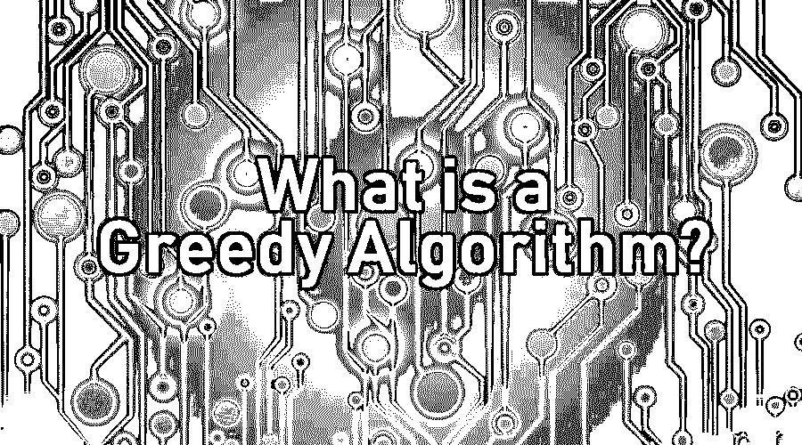

# 什么是贪婪算法？

> 原文：<https://www.educba.com/what-is-a-greedy-algorithm/>

## 贪婪算法简介

贪婪算法是一种特殊类型的算法，用于通过导出特定实例的最大值或最小值来解决优化问题。该算法独立于后续结果选择对于当前场景可行的最佳结果。贪婪算法通常用于特定条件的场景。该算法用于解决最优化问题、最大化问题和最小化问题。并且它提供可行的或优化的解决方案。一些最适合的问题场景，如霍夫曼编码，使用 Prim 或 Kruskal 算法的最小生成树图，以及寻找图的两个顶点之间的最短路径。

### 什么是贪婪算法？

这是一种算法策略，用于在非常小的阶段做出最佳可选选择，同时最终输出全局最优解。[该算法选择](https://www.educba.com/what-is-an-algorithm/)当时可行的最佳解决方案，而不考虑任何后果。贪婪方法认为，问题应该分阶段解决，其中每个输入都被认为是可行的。由于这种方法只关注眼前的结果而不考虑大局，因此被认为是贪婪的。

<small>Hadoop、数据科学、统计学&其他</small>

### 定义核心概念

直到现在，我们才知道它是什么，为什么这样命名。下面的指针会让你更好地理解贪婪算法。到目前为止，已经非常清楚，贪婪算法只在出现问题时才起作用；然而，这种方法只有在我们对问题有一个条件或约束时才适用。

#### 问题的类型

1.  **最小化问题:**在所有条件都满足的情况下，得到问题的解很容易。然而，当这个问题需要一个最小值时，它就被称为最小化问题。
2.  **最大化问题:**要求结果最大化的问题称为最大化问题。
3.  **优化问题:**当一个问题需要最小或最大的结果时，这个问题称为优化问题。

#### 解决方案的类型

1.  **可行方案:**现在，当一个问题出现的时候，我们对于这个问题有很多看似合理的解决方案。然而，考虑到问题的条件，我们选择满足给定条件的解决方案。这种帮助我们得到满足给定条件的结果的解决方案称为可行方案**。**
2.  **最优解:**当一个解已经是可行的，并且实现了问题的目标时，这个解就称为最优；最好的结果。这个目标可以是最小或最大的结果。这里要注意的一点是，任何问题都只会有一个最优解。

下面的例子会让你很容易理解贪心法。假设有人想买市场上最好的汽车。选择这款车的方法之一是分析市场上所有的车。现在，这很费时间，为了简单起见，人们从他们感兴趣投资的特定品牌中选择一辆车。进一步分类，人们将再次选择期望的模型看它的特征。因此，这里使用的方法是贪婪的，因为这个解决方案是你的最佳解决方案，同时考虑了所有对你有利的因素。

### 贪婪算法的核心组件

现在，当我们对这种机制有了更好的理解后，让我们来探索一下贪婪算法的核心组件，它将贪婪算法与其他进程区分开来:

*   **候选集合:**从这个集合中创建一个答案。
*   **选择功能:**选择最佳候选项，将其包含在解决方案中。
*   **可行性函数:**此部分计算候选人是否可用于解决方案。
*   **一个目标函数:**它给一个完整的或部分的解赋值。
*   **解函数:**用于表示是否遇到合适的解。

### 贪婪算法在哪里效果最好？

它可以应用于下述问题。

*   使用 Prim 的或 [Kruskal 的算法](https://www.educba.com/kruskals-algorithm/)，贪婪方法可用于找到最小生成树图。
*   寻找两个顶点之间的最短路径是另一个可以使用贪婪算法解决的问题。将 Dijkstra 算法与贪婪算法结合使用将会给你一个最优解。
*   霍夫曼编码

### 优势

贪婪算法相对于其他算法的最大优点是易于实现，并且在大多数情况下非常高效。

### 不足之处

它基本上是一部分一部分地构建一个解决方案，然后选择下一部分，这样就能立即产生当前问题的最佳解决方案。因此，没有人关心或担心当前决策的后果。尽管它给出了一个接近最优的解决方案**，但它从来没有重新考虑过之前的选择，因此无法产生一个最优的解决方案。**背包问题和旅行推销员问题是不能产生最优解的问题的例子。

*   背包问题:最常见的名称是背包问题，这是许多人面临的日常问题。假设我们有一组物品，每一个都有不同的重量和价值(利润),需要装入一个容器，或者应该以这样的方式收集，总重量小于或等于容器的重量，同时总利润最大化。

### 结论

当一个人需要实时的解决方案并且近似的答案“足够好”时，它是最适用的。显然，它最大限度地减少了时间，同时确保产生最佳解决方案；因此，它更适用于需要较少时间的情况。读完这篇文章，你可能会对贪婪算法有一个公平的想法。此外，这篇文章解释了为什么它被认为是回答几乎所有编程挑战的最佳框架，并帮助您在给定的时间点决定最佳解决方案。

然而，粗略地说，为了应用贪婪算法的理论，人们必须更加努力地去了解正确的问题。虽然它是一个有逻辑的科学概念，但它也有创造性的本质。

### 推荐文章

这是一个什么是贪婪算法的指南。这里我们讨论了贪婪算法的核心概念、组成、优点和缺点。您也可以浏览我们推荐的其他文章，了解更多信息——

1.  [编程中的算法](https://www.educba.com/algorithm-in-programming/)
2.  [什么是 Perl？](https://www.educba.com/what-is-perl/)
3.  [算法介绍](https://www.educba.com/introduction-to-algorithm/)
4.  [什么是敏捷冲刺？](https://www.educba.com/what-is-agile-sprint/)

