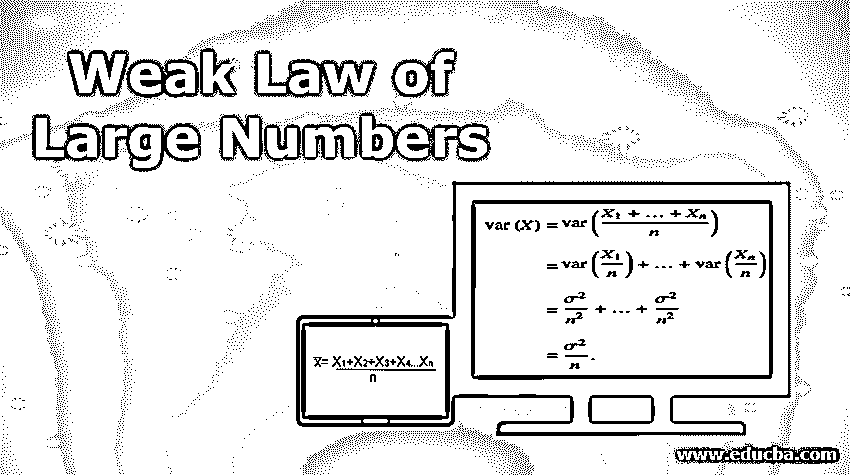
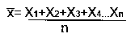
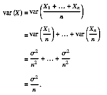
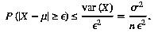
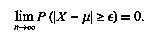

# 弱大数定律

> 原文：<https://www.educba.com/weak-law-of-large-numbers/>

## 弱大数定律导论

大数定律是统计学中的一个重要概念，它说明了大量进行相同实验时的结果。根据该定理，通过进行大量实验获得的结果的平均值应该接近期望值(总体平均值),并且随着实验次数的增加，将更趋向于期望值。大数定律有两种不同的版本，分别是强大数定律和弱大数定律，它们之间有细微的差别。弱大数定律也称为“钦钦定律”，指出对于同分布随机变量的样本，随着样本量的增加，样本均值向总体均值收敛。

对于足够大的样本量，样本观察值的平均值很有可能接近总体平均值(在容限内),因此当我们从总体平均值中减去样本平均值时，两者之间的差值趋于零，或者当观察值较大时，得到正数ε的概率几乎为零。

<small>Hadoop、数据科学、统计学&其他</small>

### 弱大数定律的定义

对于独立同分布的随机变量 X 1 ，X 2 ，X n 样本均值，用 x̅表示，定义为:

此外，

通过使用切比雪夫不等式，

根据伯努利定理，

其中，x̅是样本量足够大时的样本均值，μ是总体均值。

**解释:**根据非零边际值的弱大数定律，当样本量足够大时，观察值的平均值在边际内几乎等于期望值的概率非常高。弱定律除了适用于独立同分布的随机变量，也适用于其他情况。例如，如果每个随机变量的方差不同，但期望值保持不变，则该规则也适用。如果方差是有界的，那么切比雪夫在 1867 年证明的规则也适用。只要前 n 个平均值的方差随着 n 向无穷大移动而收敛到零，切比雪夫的证明就有效。

**举例:**考虑一个公平的六面骰子，编号为 1、2、3、4、5 和 6，获得任意面的概率相等。所以任何一次掷骰的期望值都是，

`(1+2+3+4+5+6)/6 =3.5`

因此，根据大数定律，当您掷骰子很多次时，它们的平均值接近 3.5，随着试验次数的增加，精度会进一步提高。另一个例子是扔硬币。领先或落后的理论概率是 0.5。根据大数定律，当投掷硬币的次数趋于无穷大时，正面和反面的比例接近 0.5。直观来看，当尾迹数量变得非常大时，头尾数量的绝对差值就变得非常低。

### 大数定律的应用

下面是大数定律的应用，解释如下:

#### 1.赌场的利润

赌场可能会因为少量的尝试而赔钱，但随着尝试次数的增加，其收入将朝着可预测的百分比移动，因此在较长的时间内，赔率总是对赌场有利，而不管赌徒在短时间内的运气如何，因为大数定律仅在观察次数较多时适用。

#### 2.蒙特卡洛问题

蒙特卡罗问题是基于大数定律的，它是一种依靠随机抽样来获得数值结果的计算问题算法。蒙特卡洛问题的主要概念是利用随机性来解决一个在本质上看似确定性的问题。它们经常被用于难以用其他技术解决的计算问题。蒙特卡罗方法主要用于三类问题，即:最优化问题、数字的整合和从概率分布中产生图形。

### 大数定律的局限性

在某些情况下，大量试验的平均值可能不会向预期值收敛。这尤其发生在柯西分布或帕累托分布(α<1)的情况下，因为它们具有长尾。柯西分布没有期望值，而对于柯西分布，当α<1 时，期望值是无穷大。当 n 接近无穷大时，这些分布不会收敛到期望值。

### 强大数定律和弱大数定律的区别

弱大数定律和强大数定律的区别是非常微妙的，而且是理论上的。弱大数定律表明样本平均值向期望值收敛是可能的，而强大数定律表明几乎必然收敛。弱定律的概率接近 1，而强定律的概率等于 1。根据弱定律，对于 n 的大值，平均值很可能接近μ。因此，(–μ)>ɛ现象有可能发生很多次，尽管间隔并不频繁。根据强定律，几乎可以肯定(–μ)>ɛ不会发生，即概率为 1。

### 结论

大数定律是统计学中最重要的定理之一。大数定律不仅帮助我们从一个序列中找到未知分布的期望，而且帮助我们证明概率的基本定律。大数定律有两个主要版本——弱定律和强定律，两者非常相似，只是相对强度不同。

### 推荐文章

这是一个弱大数定律的指南。这里我们讨论弱大数定律的定义、应用、区别和局限性。您也可以浏览我们推荐的其他文章，了解更多信息——

1.  [NumPy 数据类型](https://www.educba.com/numpy-data-types/)
2.  [数据挖掘中的模型](https://www.educba.com/models-in-data-mining/)
3.  数据挖掘中的决策树
4.  [数据分析软件](https://www.educba.com/data-analysis-software/)

