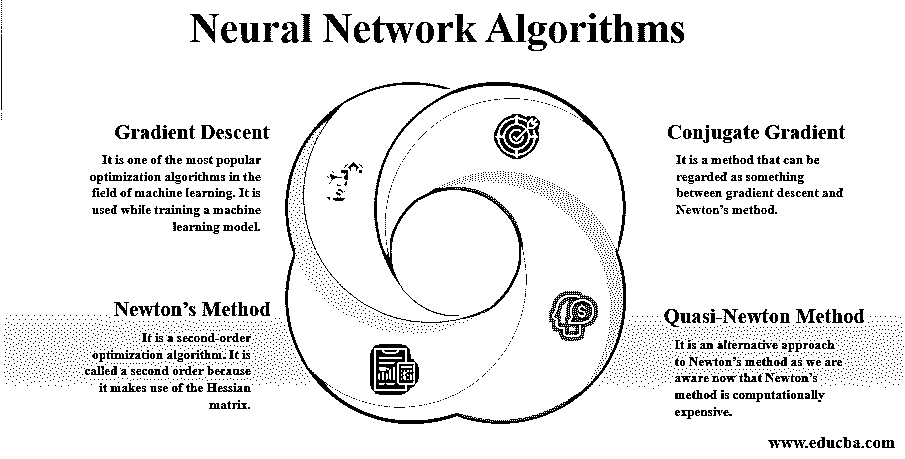
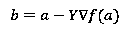

# 神经网络算法

> 原文：<https://www.educba.com/neural-network-algorithms/>

## 神经网络算法简介

下面的文章提供了神经网络算法的概要。我们先来了解一下神经网络是什么意思？神经网络的灵感来自大脑中的生物神经网络，或者我们可以说神经系统。它已经产生了很多兴奋，业界对机器学习子集的研究仍在进行。神经网络的基本计算单元是神经元或节点。它接收来自其他神经元的值，并计算输出。每个节点/神经元与权重(w)相关联。这个权重是根据特定神经元或节点的相对重要性给出的。

因此，如果我们将 f 作为节点函数，那么节点函数 f 将提供如下所示的输出:

<small>Hadoop、数据科学、统计学&其他</small>

**神经元的输出(Y)** = f(w1。X1 +w2。X2 +b)

*   其中 **w1** 和 **w2** 为重量， **X1** 和 **X2** 为数字输入，而 **b** 为偏差。
*   上述函数 f 是一个非线性函数，也称为激活函数。它的基本目的是引入非线性，因为几乎所有真实世界的数据都是非线性的，我们希望神经元学习这些表示。

### 不同的神经网络算法

下面给出了四种不同的算法:

#### 1.梯度下降

它是机器学习领域中最流行的优化算法之一。它在训练机器学习模型时使用。简而言之，它基本上用于找到尽可能简单地降低成本函数的系数的值。首先，我们从定义一些参数值开始，然后通过使用微积分，我们开始迭代调整值，以便减少损失的函数。

现在，让我们来看看什么是梯度？.所以，梯度意味着任何函数的输出都会改变，如果我们稍微减少输入，换句话说，我们可以称之为斜率。如果坡度很陡，模型同样会学习得更快；当斜率为零时，模型停止学习。这是因为它是一个最小化算法，最小化一个给定的算法。

下面是在梯度下降的情况下找到下一个位置的公式。

其中 b 是下一个位置，

a 是当前位置；伽马正在等待功能。

所以，正如你所看到的，梯度下降是一个非常好的技术，但是在很多地方梯度下降不能正常工作。

以下是其中的一些:

*   如果算法执行不当，那么我们可能会遇到类似消失梯度的问题。当梯度太小或太大时，就会出现这种情况。
*   当数据排列提出非凸优化问题时，问题就来了。梯度下降只适用于凸优化问题。
*   在应用该算法时，要寻找的一个非常重要的因素是资源。如果分配给应用程序的内存较少，我们应该避免梯度下降算法。

#### 2.牛顿方法

它是一种二阶优化算法。它被称为二阶，因为它利用了 Hessian 矩阵。因此，Hessian 矩阵只不过是一个标量值函数的二阶偏导数的平方矩阵。在牛顿法优化算法中，应用于一个双可微函数 f 的一阶导数，使其能找到根/驻点。现在让我们进入牛顿最优化方法所需的步骤。

它首先评估损失指数。然后检查停止标准是真还是假。如果为假，则计算牛顿的训练方向和训练速率，然后改进神经元的参数或权重，同样的循环再次继续。所以，你现在可以说，与梯度下降法相比，它需要更少的步骤来得到函数的最小值。尽管与梯度下降算法相比，它需要较少的步骤，但是它仍然没有被广泛使用，因为 hessian 及其逆的精确计算在计算上非常昂贵。

#### 3.共轭梯度

是一种可以算是介于梯度下降法和牛顿法之间的方法。主要区别在于它加速了慢收敛，我们一般把慢收敛和梯度下降联系在一起。另一个重要的事实是，它既可用于线性系统，也可用于非线性系统，而且它是一种迭代算法。

它是由马格努斯·赫斯提内斯和爱德华·斯蒂费尔开发的。如上所述，它比梯度下降产生更快的收敛；它能够做到这一点的原因是，在共轭梯度算法中，搜索是沿着共轭方向进行的，因此它比梯度下降算法收敛得更快。需要注意的重要一点是，γ称为共轭参数。

训练方向被周期性地重置为梯度的负值。该方法在训练神经网络时比梯度下降法更有效，因为它不需要增加计算量的 Hessian 矩阵，并且它也比梯度下降法收敛得更快。它适用于大型神经网络。

#### 4.拟牛顿法

这是一种替代牛顿法的方法，因为我们现在知道牛顿法计算量很大。该方法在一定程度上解决了这些缺点，使得该方法不是计算 Hessian 矩阵，然后直接计算逆 Hessian 矩阵，而是在该算法的每次迭代中建立逆 Hessian 矩阵的近似。

现在，这个近似值是利用损失函数一阶导数的信息计算出来的。因此，我们可以说，这可能是最适合处理大型网络的方法，因为它节省了计算时间，而且它比梯度下降或共轭梯度法快得多。

### 结论

让我们比较一下上述算法的计算速度和内存。根据内存需求，梯度下降需要最少的内存，也是最慢的。相反，牛顿的方法需要更多的计算能力。所以考虑到所有这些，拟牛顿法是最适合的。

### 推荐文章

这是神经网络算法的指南。在这里，我们还分别讨论了神经网络算法的概述以及四种不同的算法。您也可以浏览我们推荐的其他文章，了解更多信息——

1.  [PyTorch 神经网络](https://www.educba.com/pytorch-neural-network/)
2.  [神经网络 vs 深度学习](https://www.educba.com/neural-networks-vs-deep-learning/)
3.  [过拟合神经网络](https://www.educba.com/overfitting-neural-network/)
4.  [DNN 神经网络指南](https://www.educba.com/dnn-neural-network/)

