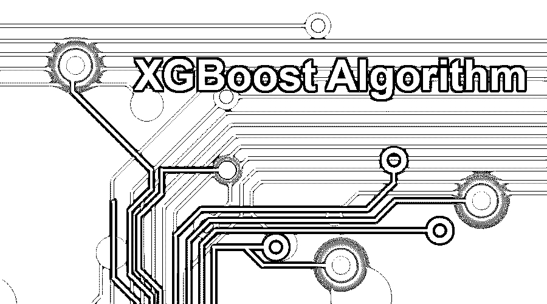
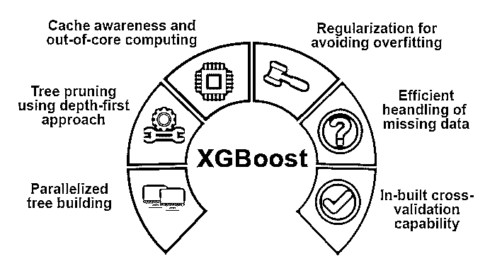
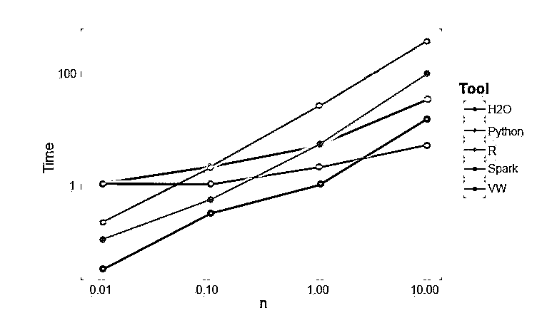

# XGBoost 算法

> 原文：<https://www.educba.com/xgboost-algorithm/>

## XGBoost 算法是什么？

XGBoost 或极端梯度提升是一种[机器学习算法](https://www.educba.com/machine-learning-algorithms/)，用于梯度提升决策树的实现。为什么选择决策树？当我们谈到图像、非结构化文本数据等非结构化数据时。当我们试图预测时，ANN 模型(人工神经网络)似乎位于顶部。而当我们谈论结构化/半结构化数据时，决策树是目前最好的。XGBoost 基本上是为大大提高机器学习模型的速度和性能而设计的，它很好地服务于这个目的。

### XGBoost 算法的工作原理

XGBoost 有一个树学习算法和线性模型学习，正因为如此，它能够在单台机器上进行并行计算。这使得它比任何现有的梯度推进算法快 10 倍。

<small>Hadoop、数据科学、统计学&其他</small>

XGBoost 和 GBMs(即梯度推进机器)通过使用梯度下降架构来使用树方法。XGBoost 将其他 GBM 抛在后面的领域是系统优化和算法增强领域。

让我们来看看这些细节:

#### 1.系统优化

*   **树修剪–**XGBoost 算法使用深度优先方法，不同于 GBMS 使用的树分裂停止标准，后者本质上是贪婪的，并且还依赖于负损失标准。XGBoost 使用最大深度特性/参数，因此它向后修剪树。
*   **并行化–**使用 XGBoost 算法中的并行化实现来完成顺序树构建过程。这是可能的，因为外环和内环是可互换的。外部循环列出了树的叶节点，而内部循环将计算特征。此外，为了启动外部循环，内部循环必须完成。这种切换过程提高了算法的性能。
*   **硬件优化—**XGBoost 算法的设计过程中也考虑了硬件优化。为每个线程分配内部缓冲区来存储梯度统计数据。

#### 2.算法增强

*   已知 XGBoost 可以非常有效地处理所有不同类型的稀疏模式。该算法通过观察训练损失来学习嵌套缺失值。
*   **正则化-**为了防止过度拟合，它通过实施套索(也称为 L1)和脊正则化(也称为 L2)来校正更复杂的模型。
*   **交叉验证–**它具有内置的交叉验证特性，在模型创建的每次迭代中都会实现这些特性。这避免了计算所需的提升迭代次数的需要。
*   **分布式加权分位数草图—**它使用分布式加权分位数草图来获得加权数据集中的最佳分割点数。

### XGBoost 的特性

虽然 XGBoost 是为大大提高机器学习模型的速度和性能而设计的，但它也提供了许多高级功能。

**模型特征:**

XGBoost 支持 sci-kit 学习正则化和 R 语言实现等特性。

支持的主要梯度增强方法有:

让我们看看他们两个:

#### 1.执行速度

当我们将 XGBoost 与[其他梯度增强算法](https://www.educba.com/gradient-boosting-algorithm/)进行比较时，XGBoost 确实非常快，比其他实现快大约 10 倍。

Szilard Pafka 进行了一些实验，旨在评估不同随机森林实现算法的执行速度。

下面是实验结果的快照:

原来 XGBoost 是最快的。更多阅读可以在这里找到。

#### 2.模型性能

当我们谈到图像、非结构化文本数据等非结构化数据时。当我们试图预测时，ANN 模型(人工神经网络)似乎位于顶部。当我们谈论结构化/半结构化数据时，决策树是目前最好的，当使用 XGBoost 实现时，到目前为止，没有其他 boosting 算法可以超越它。

### XGBoost 使用的算法

*   XGBoost 算法使用梯度推进[决策树算法](https://www.educba.com/decision-tree-algorithm/)。
*   梯度推进方法创建新模型，这些新模型执行预测所有先前模型的误差和残差的任务，然后依次将这些误差和残差加在一起，然后做出最终预测。

### 结论

在这里，我们看到了用于机器学习的 XGBoost 算法。然后我们看到了这个算法的工作原理，它的主要特性，以及为什么它是实现梯度推进决策树的完美选择。

### 推荐文章

这是 XGBoost 算法的指南。这里我们讨论 XGBoost 中算法的基本概念、特性和工作原理。您也可以阅读以下文章，了解更多信息——

1.  [Python 中的 NLP](https://www.educba.com/nlp-in-python/)
2.  [光线追踪算法](https://www.educba.com/ray-tracing-algorithm/)
3.  [数字签名算法](https://www.educba.com/digital-signature-algorithm/)
4.  [算法面试问题](https://www.educba.com/algorithm-interview-questions/)

