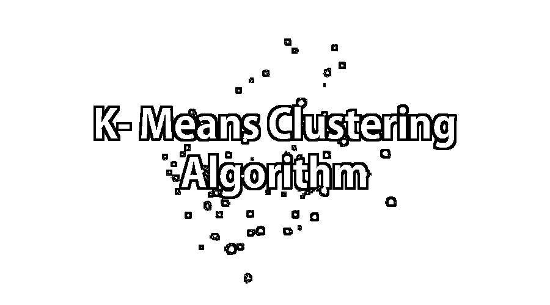
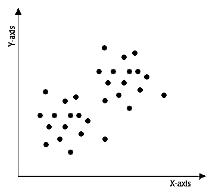
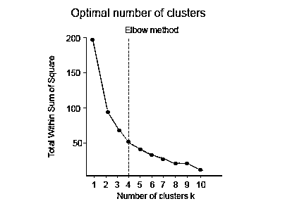
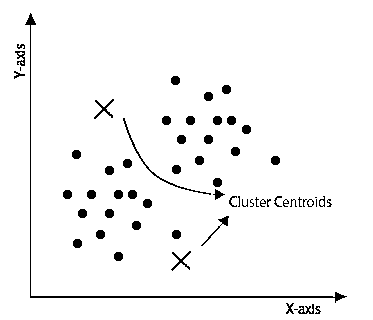
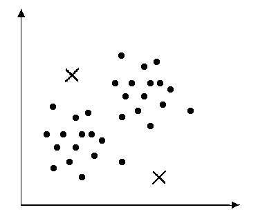
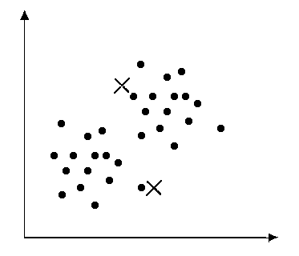
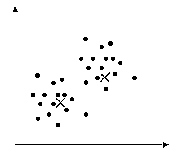

# k 均值聚类算法

> 原文：<https://www.educba.com/k-means-clustering-algorithm/>

## K- Means 聚类算法介绍？

K-Means 聚类算法被定义为具有迭代过程的无监督学习方法，其中数据集被分组为 k 个预定义的非重叠聚类或子组，使得聚类的内部点尽可能相似，同时试图将聚类保持在不同的空间。它将数据点分配给聚类，使得聚类质心和数据点之间的平方距离之和最小，在该位置，聚类的质心是聚类中的数据点的算术平均值。

### 理解 K- Means 聚类算法

该算法是一种迭代算法，它根据数据集的特征将数据集划分成 K 个预定义的非重叠的不同聚类或子组。它使类间的数据点尽可能地相似，并尽可能地保持类。如果聚类的质心与数据点之间的平方距离之和最小，则它会将数据点分配给该聚类，其中聚类的质心是该聚类中数据点的算术平均值。聚类中较小的变化导致聚类中相似或同类的数据点。

<small>Hadoop、数据科学、统计学&其他</small>

### K- Means 聚类算法是如何工作的？

K- Means 聚类算法需要以下输入:

*   K =子群或集群的数量
*   样本或训练集= {x 1 ，x 2 ，x 3 ，……x n }

现在让我们假设我们有一个未标记的数据集，我们需要把它分成几个簇。

现在我们需要找到集群的数量。

这可以通过两种方法实现:

*   肘法
*   目的方法

#### 1.肘法

在这种方法中，在“平方和内”(WSS)和聚类数之间画一条曲线。绘制的曲线类似于人的手臂。它被称为肘形法，因为曲线上的肘形点给出了最佳的聚类数。在图形或曲线中，在肘点之后，WSS 的值变化非常缓慢，因此必须考虑肘点来给出聚类数的最终值。

#### 2.基于目的

在这种方法中，数据根据不同的指标进行划分，然后判断在这种情况下数据的表现如何。例如，在一个商场的男装部里，衬衫的摆放是以尺寸为标准的。这可以在价格和品牌的基础上进行。将选择最合适的来给出最佳的聚类数，即 k 值

现在让我们回到上面给定的数据集。我们可以通过使用上述任何一种方法来计算簇的数量，即 K 的值。

### 以上方法怎么用？

现在让我们看看执行过程:

#### 步骤 1:初始化

首先，初始化任何随机点称为质心的集群。初始化时，必须注意聚类的质心必须小于训练数据点的数量。这个算法是一个迭代算法；因此，接下来的两个步骤是迭代执行的。

#### 步骤 2:集群分配

初始化后，遍历所有数据点，并计算所有质心和数据点之间的距离。现在，将根据离质心的最小距离来形成聚类。在本例中，数据分为两个簇。

#### 步骤 3:移动质心

由于在上述步骤中形成的聚类没有被优化，所以我们需要形成优化的聚类。为此，我们需要反复移动质心到一个新的位置。取一个聚类的数据点，计算它们的平均值，然后将该聚类的质心移动到这个新位置。对所有其他集群重复相同的步骤。

#### 第四步:优化

上述两个步骤反复进行，直到质心停止移动，即它们不再改变它们的位置，并且已经变成静态的。一旦做到这一点，k- means 算法被称为是收敛的。

#### 第五步:融合

现在，这种算法已经收敛，形成了明显的簇，并且清晰可见。根据第一步中如何初始化聚类，该算法可以给出不同的结果。

### K-均值聚类算法的应用

下面是提到的应用:

*   市场分割
*   文档聚类
*   图象分割法
*   图像压缩
*   矢量量化
*   聚类分析
*   特征学习或字典学习
*   确定犯罪多发地区
*   保险欺诈检测
*   公共交通数据分析
*   IT 资产集群
*   客户细分
*   识别癌症数据
*   用于搜索引擎
*   药物活性预测

### K- Means 聚类算法的优势

下面是提到的优点:

*   它很快
*   粗野的
*   容易理解
*   相对高效
*   如果数据集不同，则给出最佳结果
*   产生更紧密的集群
*   重新计算质心时，群集会发生变化。
*   灵活的
*   容易理解
*   更好的计算成本
*   提高准确性
*   适用于球形集群

### K- Means 聚类算法的缺点

下面是提到的缺点:

*   需要预先指定集群中心的数量
*   如果有两个高度重叠的数据，则无法区分，也无法判断是否有两个聚类
*   由于数据的表示方式不同，得到的结果也不同
*   欧几里德距离可以不相等地加权这些因素
*   它给出了平方误差函数的局部最优解
*   有时随机选择形心并不能产生丰硕的成果
*   只有在定义了含义的情况下才能使用它
*   无法处理异常值和噪声数据
*   不适用于非线性数据集
*   缺乏一致性
*   对比例敏感
*   如果遇到非常大的数据集，那么计算机可能会崩溃。
*   预测问题

### 推荐文章

这是一个 K- Means 聚类算法的指南。这里我们讨论了基本概念，工作原理，应用与优缺点。您也可以浏览我们推荐的其他文章，了解更多信息——

1.  [什么是神经网络？](https://www.educba.com/what-is-neural-networks/)
2.  [什么是数据挖掘？](https://www.educba.com/what-is-data-mining/)
3.  [机器学习 vs 神经网络](https://www.educba.com/machine-learning-vs-neural-network/)
4.  [机器学习中的聚类](https://www.educba.com/clustering-in-machine-learning/)

