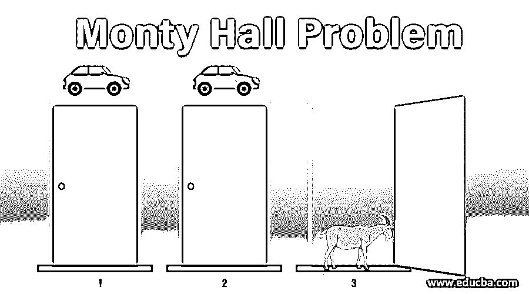
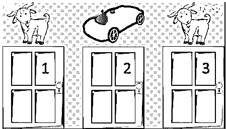
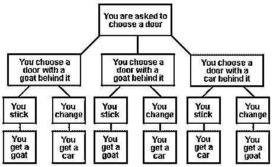
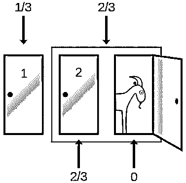
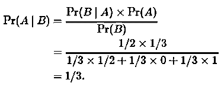
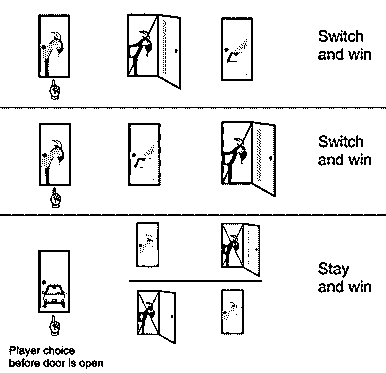
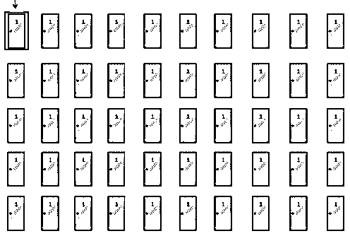

# 蒙蒂·霍尔问题

> 原文：<https://www.educba.com/monty-hall-problem/>

## 蒙蒂·霍尔问题导论

蒙蒂霍尔问题是基于概率的最令人困惑的数学难题之一。它是由玛丽莲·莎凡特在 1990 年推出的。它是以一个著名电视游戏节目《让我们做个交易》的主持人命名的。在这个游戏中，游客必须在三个关闭的门之间进行选择，只有一个门后面有一辆惊喜车，其中两个门后面有山羊，如下图所示。参赛者必须选择一扇门。在他们做出第一个选择后，蒙蒂·霍尔(主持人)打开一扇门(参赛者没有选择)，门后面总是有一只山羊。Monty Hall(主持人)随后会询问参赛者是否想改变选择，即参赛者和主持人都没有选择或打开的门。

<small>Hadoop、数据科学、统计学&其他</small>

**来源链接:**[https://www . Norwegian creations . com/2018/10/Bayes-rule-and-the-monty-hall-problem/](https://www.norwegiancreations.com/2018/10/bayes-rule-and-the-monty-hall-problem/)

### 蒙蒂·霍尔问题的解释

这个难题的主要目标是最大化赢得游戏的机会。这个问题可以借助概率分析来解决:

**来源链接:**【https://brilliant.org/wiki/monty-hall-problem/ T2】

一开始，顾客有三分之一的机会选择正确的门。当客人在三扇门中选择一扇门，然后主人打开剩下的两扇门中的一扇门，就会发现这是一只山羊；游客比最初随机选择的 1/3 拥有更多的信息。在此之后，主人会让客人选择坚持之前选择的 1/3 的机会，或者选择 2/3 的机会。

**来源链接:**【https://www.theifod.com/the-monty-hall-problem-explained/ T2】

正确的选择是客人应该换。如果客人没有换，他/她有 1/3 的机会赢得汽车，因为主人总是向您展示一扇有山羊的门，不管客人最初是否选择了正确的门。由于主人为客人取消了其中一个车门，通过对换车门可以将中奖几率提高到 1/3 以上，因为有 2/3 的几率中奖。

### 蒙蒂霍尔问题的解决方案

下面是天魔堂问题的解决方案:

*   假设客人首先从 1 号门开始选择，而主人总是显示除 1 号门以外的任何门，1 号门不包含汽车。
*   如果汽车在 1 号门后面，那么在客人选择 1 号门之后，主人打开另一个门，2 号门或 3 号门，然后客人切换到剩下的门，3 号门或 2 号门，因此客人输了。
*   如果汽车在 2 号门后面，那么在客人选择 1 号门之后，主人被迫打开 3 号门，然后切换到 2 号门，从而赢得汽车。
*   如果汽车在 3 号门后面，那么当客人选择 1 号门时，主人被迫打开 2 号门，然后客人将切换到 3 号门；因此，在这种情况下，客人赢得了汽车。
*   从而在 3 种可能性中的 2 种中，获胜的机会更多，由于切换，获胜的概率为 2/3。条件概率就是这种情况，可以用贝叶定理计算。Baye 定理陈述了如下给出的概率计算:

*   汽车在 1 号门后面的可能性是 1/3。因为现在还剩两扇门。剩下的两扇门各有 1/2 的机会被选中。由此我们可以计算出概率为 Pr(B|A)，即给定 A 时事件 B 的概率。分母上的 Pr(B)可计算如下:
*   当客人选择 1 号门时，主人在 2 号门后展示了一只山羊，那么就有这样的情况:在第二种情况下，如果汽车在 2 号门后，那么主人打开 3 号门，因为主人从来不想展示汽车。因为主人打开了 2 号门，所以我们可以确认汽车是在 1 号门后面，这是客人的第一选择，还是在 3 号门后面。汽车在 1 号门后面的概率是 1/3。这意味着汽车在 3 号门后面的概率是[1-(1/3)]= 2/3。因此，客人必须转而赢得汽车。

**来源链接:**【https://en.wikipedia.org/wiki/Monty_Hall_problem T2】

### 推广 Monty Hall 问题

这个问题可以用 100 个门而不是 3 个门来概括。所以，假设一开始有 100 扇门可供选择。客人选择一扇门。主持人打开所有其他 99 扇门中的一扇门，门后有一只山羊。然后，他让客人选择是坚持他/她的获胜概率为 1/100 的原始门选择，还是希望切换到从 99 中过滤出来的另一个门。现在，这里出现的问题是，客人是想要最初猜测的 100 个门中的一个随机门，还是他/她想要 99 个门中的最佳门，即他/她想要坚持 1 个随机机会还是想要从 99 个随机机会中选择最佳机会。

**来源链接:**[https://brilliant . org/discussions/thread/the-best-explain-to-monty-hall/](https://brilliant.org/)

### 结论

当游戏进行 50 次时，使用的策略是我们只选择一扇门一次并坚持下去，也就是说，让主人打开门并展示门后的物品。通过观察胜率百分比，我们会发现胜率稳定在 1/3 左右。然后用一种挑选和切换技术的策略玩 20 次，即客人挑选一扇门，然后主人在其他门后面露出一只山羊，然后客人切换到另一扇门。现在通过观察胜率，可以发现胜率是 50%到 60%。但是，N 阶段蒙蒂霍尔问题的最佳策略是坚持第一个选择，直到最后一个选择，然后切换。

### 推荐文章

这是一个蒙蒂霍尔问题的指南。为了更好地理解，我们在这里详细讨论解释、解决方案和概括。您也可以浏览我们的其他相关文章，了解更多信息——

1.  [R 中的图形](https://www.educba.com/graphs-in-r/)
2.  [大数据分析](https://www.educba.com/big-data-analytics/)
3.  [什么是数据分析](https://www.educba.com/what-is-data-analytics/)
4.  [大数据分析示例](https://www.educba.com/big-data-analytics-examples/)

