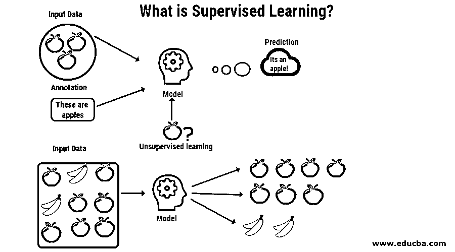
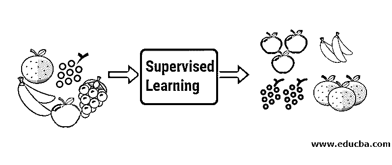
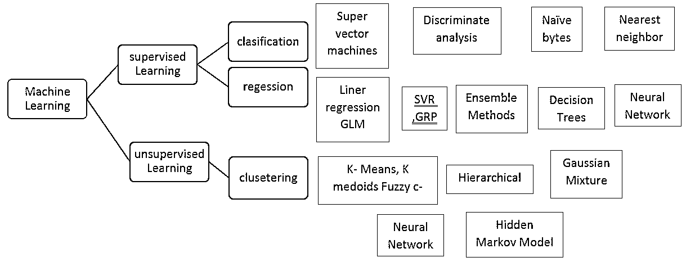

# 什么是监督学习？

> 原文：<https://www.educba.com/what-is-supervised-learning/>

## 监督学习简介

监督学习是一种基于标记数据集的机器学习算法。此类算法实现了预测分析，其中算法的结果(称为因变量)取决于独立数据变量的值。它基于训练数据集，并通过迭代进行改进。监督学习主要有回归和分类两大类。它被实现到几个真实的场景中，例如为零售组织预测特定产品下一季度的销售评论。

### 致力于监督机器学习

让我们借助一个例子来理解有监督的机器学习。假设我们有一个装满不同种类水果的水果篮。我们的工作是根据水果的种类对它们进行分类。

<small>Hadoop、数据科学、统计学&其他</small>

在我们的例子中，我们考虑了四种水果:苹果、香蕉、葡萄和橙子。

现在，我们将尝试提及这些水果的一些独特特征，这些特征使它们与众不同。

| **Sr 号** | **尺寸** | **颜色** | **形状** | **名字** |
| One | 小的 | 绿色的 | 圆形至椭圆形，束状圆柱形 | 葡萄 |
| Two | 大的 | 红色 | 顶部有凹陷的圆形 | 苹果，苹果公司 |
| Three | 大的 | 黄色 | 长弯曲圆柱体 | 香蕉 |
| Four | 大的 | 柑橘 | 圆形 | 柑橘 |

现在让我们说，你从果篮中拿起一个水果，你看了它的特征，例如，它的形状、大小和颜色，然后你推断这个水果的颜色是红色的，大小如果大，形状是圆形的，顶部有凹陷；因此它是一个苹果。

*   同样地，你也可以对所有其他剩余的水果做同样的事情。
*   最右边的一列(“水果名称”)被称为响应变量。
*   这就是我们如何制定一个监督学习模型；现在，对于任何具有特定属性的新人(比如说机器人或外星人)来说，很容易将相同类型的水果归类在一起。

### 监督机器学习算法的类型

让我们看看不同[类型的机器学习算法](https://www.educba.com/types-of-machine-learning-algorithms/):

#### 回归

回归用于使用训练数据集预测单值输出。输出值总是被称为因变量，而输入是自变量。

在监督学习中，我们有不同类型的回归。

**例如:**

*   **线性回归:**这里我们只有一个自变量用来预测产量，即因变量。
*   **多元回归:**这里我们有不止一个自变量用来预测产量，也就是因变量。
*   **多项式回归:**这里，因变量和自变量之间的图形遵循多项式函数。例如，起初，记忆力随着年龄的增长而增长，然后在某个年龄达到一个阈值，然后随着我们变老，记忆力开始下降。

#### 分类

监督学习算法的分类用于将相似的对象分组到唯一的类中。

*   **二进制分类:**如果算法试图将 2 组不同的类进行分组，则称之为二进制分类。
*   **多类分类:**如果算法试图将对象分组到 2 个以上的组，那么就称为多类分类。
*   **实力:** [分类算法](https://www.educba.com/classification-algorithms/)通常表现很好。
*   **缺点:**容易过度拟合，可能不受约束。例如**–**垃圾邮件分类器。
*   **逻辑回归/分类:**当 Y 变量为二元分类(即 0 或 1)时，我们使用逻辑回归进行预测。例如**–**预测给定的信用卡交易是否是欺诈。
*   **朴素贝叶斯分类器:**朴素贝叶斯分类器基于贝叶斯定理。当输入的维数很高时，这种算法通常是最适合的。它由具有一个父节点和许多子节点的非循环图组成。子节点相互独立。
*   **决策树:**决策树是一个类似于树形图的结构，由一个内部节点(对属性的测试)、一个表示测试结果的分支和代表类分布的叶节点组成。根节点是最顶层的节点。这是一种非常广泛使用的技术，用于分类。
*   **支持向量机:**支持向量机或 SVM，通过寻找超平面来完成分类工作，这将最大化两个类别之间的间隔。这些 SVM 机器连接到内核函数。支持向量机广泛应用的领域有生物识别、[模式识别](https://www.educba.com/pattern-recognition/)等。

### 优势

以下是监督机器学习模型的一些优势:

*   用户体验可以优化模型的性能。
*   它利用以前的经验产生输出，还允许您收集数据。
*   [监督机器学习算法](https://www.educba.com/supervised-machine-learning-algorithms/)可用于实现许多现实世界的问题。

### 缺点

 <u>以下是给出的缺点:

*   如果数据集较大，训练受监督的机器学习模型的工作可能会花费大量时间。
*   大数据的分类有时会带来更大的挑战。
*   人们可能不得不处理过度拟合的问题。
*   在训练分类器时，如果我们希望模型表现良好，我们需要大量的好例子。

### 构建学习模型时的良好实践

以下是构建机器模型时的良好实践:

*   在建立任何好的机器学习模型之前，必须执行数据的预处理过程。
*   人们必须决定哪种算法最适合给定的问题。
*   我们需要决定什么类型的数据将用于训练集。
*   需要决定算法和函数的结构。

### 推荐文章

这是一本关于什么是监督学习的指南？在这里，我们讨论了监督学习的概念、工作原理、类型、优点和缺点。您也可以浏览我们推荐的其他文章，了解更多信息——

1.  [什么是深度学习](https://www.educba.com/what-is-deep-learning/)
2.  [监督学习 vs 深度学习](https://www.educba.com/supervised-learning-vs-deep-learning/)
3.  [创建具有优势的决策树的方法](https://www.educba.com/create-decision-tree/)
4.  [多项式回归|用途和特点](https://www.educba.com/polynomial-regression/)

</u>