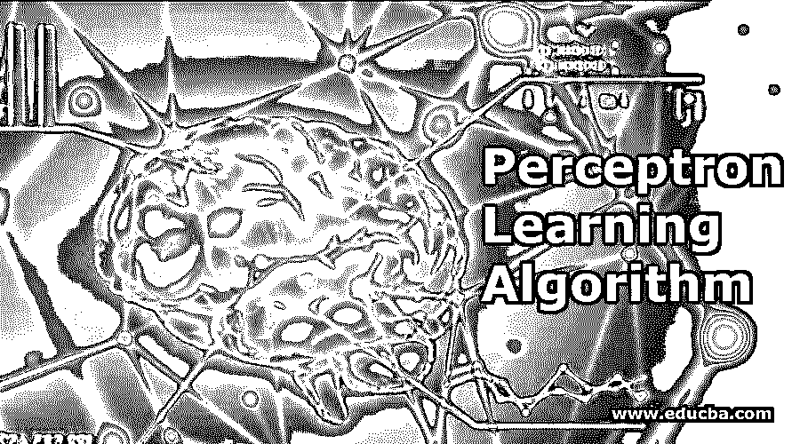
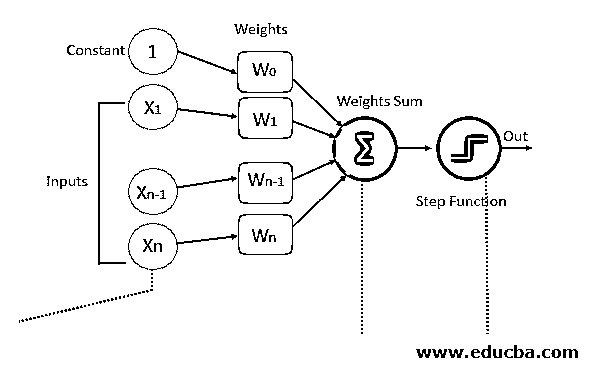
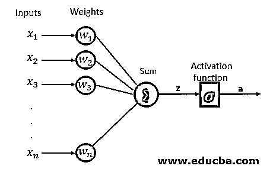
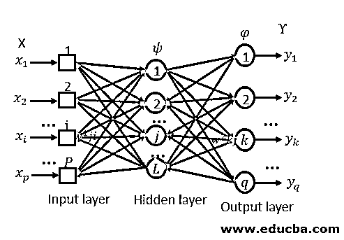

# 感知机学习算法

> 原文：<https://www.educba.com/perceptron-learning-algorithm/>

## 简介**到**感知器**学习算法**

下面的文章给出了感知器学习算法的概述。感知器这个词在机器学习行业指的是什么？感知器是一种人工神经网络单元，它进行计算以更好地理解数据。什么是神经网络单元？一组通过突触连接相互连接的人工神经元[被称为神经网络](https://www.educba.com/what-is-neural-networks/)。

### **Wh** at 是人工神经元？

考虑到当今世界的状况，为了解决我们周围的问题，我们试图通过了解自然如何运作来确定解决方案，这也被称为仿生。同样，为了像人脑一样工作，人们开发了人工神经元，其工作方式类似于人类的生物神经元。人工神经元是一个复杂的数学函数，它分别获取输入和权重，将它们合并在一起，并通过数学函数产生输出。

<small>Hadoop、数据科学、统计学&其他</small>

### 感知机学习算法

感知器算法用于[监督机器学习领域](https://www.educba.com/supervised-machine-learning/)进行分类。在分类上，有线性分类和非线性分类两种。线性分类是什么，但如果我们可以通过绘制一条简单的直线来分类数据集，那么它可以被称为线性二元分类器。而如果我们不能通过画一条简单的直线来分类数据集，那么它可以被称为非线性二进制分类器。

#### 感知器算法框图

让我们看看上图的术语。

**1。输入:**我们要训练神经网络的模型的所有特征都将作为输入传递给它，就像特征集[X1，X2，X3…..Xn】。其中 n 代表特性的总数，X 代表特性的值。

**2。Weights:** 最初，我们必须将一些随机值作为值传递给权重，这些值在每个训练错误之后自动更新，即在模型训练期间生成的值。在某些情况下，权重也可以称为权重系数。

**3。权重总和:**每个输入值将首先与分配给它的权重相乘，所有相乘值的总和称为加权总和。

Weights sum = ∑Wi * Xi (from i=1 to i=n) + (W0 * 1)

### 步进或激活功能

激活函数应用步长规则，将数值转换为 0 或 1，以便数据集易于分类。基于我们需要作为输出的值的类型，我们可以改变激活函数。Sigmoid 函数，如果我们希望值在 0 和 1 之间，我们可以使用具有平滑梯度的 sigmoid 函数。

符号函数，如果我们希望值是+1 和-1，那么我们可以使用符号函数。双曲正切函数是以零为中心的函数，这使得多层神经网络很容易实现。Relu 函数计算量很大，但它不能处理接近零的输入值。它适用于大于和小于零的值。

#### 偏见

如果你注意到，我们已经在开始部分传递了值 1 作为输入，在权重部分 W0 是一个调整边界远离原点的元素，以向左、向右、向上或向下移动激活函数。因为我们希望它独立于输入要素，所以我们在语句中添加了常数 1，这样要素就不会受此影响，这个值称为偏差。

感知器算法可以分为两种类型，它们是[单层感知器](https://www.educba.com/single-layer-perceptron/)和多层感知器。在单层感知器中，神经元组织在一层中，而在多层感知器中，一组神经元将组织在多层中。第一层中的每个神经元都会接收输入信号，并向第二层中的神经元发送响应，依此类推。

**单层感知器**

**多层感知器**

### 感知器学习步骤

1.  我们想要训练的模型的特征应该作为输入传递给第一层中的感知器。
2.  这些输入将乘以权重或权重系数，并且来自所有感知器的生产值将被相加。
3.  添加偏移值，将输出函数从原点移开。
4.  该计算值将被馈送到激活函数(如果简单感知器系统激活函数是阶跃函数，则根据要求选择)。
5.  激活函数的结果值就是输出值。

用感知器添加的特征在深度神经网络中产生。反向传播是其中最重要的特征。

#### 反向传播

在执行第一遍(基于输入和随机给定的输入)后，将计算误差，反向传播算法执行迭代反向传递，并试图找到权重的最佳值，使得误差值最小化。为了最小化误差，反向传播算法将从误差函数计算偏导数，直到每个神经元的特定权重，该过程将为我们提供从总误差值到导致误差的特定权重的完全透明性。

### 结论–感知器学习算法

当我们说分类时，这里提出了一个问题，为什么不使用简单的 KNN 或其他分类算法？当数据集变得复杂时，就像在图像识别的情况下，很难用一般的分类技术来训练算法，在这种情况下，感知器学习算法最适合。单层感知器只能在线性可分离的数据集上训练。如果我们想在复杂的数据集上训练，我们必须选择多层感知器。

激活函数在感知中起着主要作用。如果我们认为学习速度很慢，或者在通过的梯度中有很大的差异，那么我们可以尝试不同的激活函数。

### 推荐文章

这是一个感知器学习算法的指南。这里我们讨论感知器学习算法框图，步骤或激活函数，感知器学习步骤等。您也可以看看以下文章，了解更多信息–

1.  [深度学习算法](https://www.educba.com/deep-learning-algorithms/)
2.  [机器学习算法](https://www.educba.com/machine-learning-algorithms/)
3.  [机器学习技术](https://www.educba.com/machine-learning-techniques/)
4.  [数据挖掘算法](https://www.educba.com/data-mining-algorithms/)

