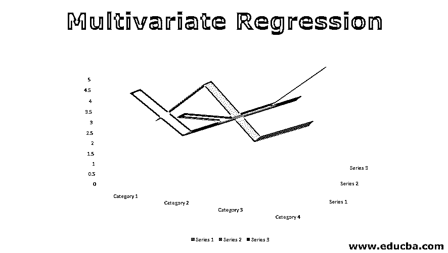

# 多变量回归

> 原文：<https://www.educba.com/multivariate-regression/>

## 多元回归介绍

多元回归是一种机器学习算法，涉及多个数据变量进行分析。它通常被认为是一种有监督的机器学习算法。多元回归分析涉及的步骤是特征选择和特征工程、归一化特征、选择损失函数和假设参数、优化损失函数、测试假设和生成回归模型。多元回归的主要优点是识别与数据集相关的变量之间的关系。它有助于发现因变量和多个自变量之间的相关性。多元线性回归是一种常用的机器学习算法。

### 为什么单一回归模型不起作用？

*   众所周知，[回归分析](https://www.educba.com/what-is-regression-analysis/)主要用于探究因变量和自变量之间的关系。
*   在现实世界中，有许多情况下，许多独立变量会受到其他变量的影响，因此我们不得不转向不同的选项，而不是只采用一个独立变量的单一回归模型。

### 什么是多元回归？

*   多元回归有助于测量多个自变量和多个因变量的角度。它找出变量之间的关系(线性相关)。
*   它用于预测结果变量的行为和预测变量的关联，以及预测变量如何变化。
*   它可以应用于许多实际领域，如政治、经济、医学、研究工作和许多不同种类的业务。
*   多元回归是多元回归的简单扩展。
*   多元回归用于根据多个预测变量的集合值来预测和交换一个变量的值。
*   首先，我们将举一个例子来了解多元回归的使用，然后我们将寻找解决这个问题的方法。

### 多元回归的例子

*   如果电子商务公司已经收集了其客户的数据，例如客户的年龄、购买历史、性别和公司想要找到这些不同的从属变量和独立变量之间的关系。
*   一位健身教练收集了来到他的健身房的客户的数据，并希望观察客户的一些事情，如健康、饮食习惯(客户每周消费哪种产品)、客户的体重。它想找出这些变量之间的关系。

正如你在上面的两个例子中所看到的，在这两种情况下，都有不止一个变量，有些是相关的，有些是独立的，所以单一回归不足以分析这类数据。

<small>Hadoop、数据科学、统计学&其他</small>

这是多元回归分析。

#### 1.特征选择

特征的选择在多元回归中起着最重要的作用。

找到需要的特征，以找到哪个变量依赖于该特征。

#### 2.标准化特征

为了更好地进行分析，需要对要素进行缩放，以将其纳入特定范围。我们还可以改变每个特性的值。

#### 3.选择损失函数和假设

损失函数计算假设预测错误值时的损失。

假设意味着特征变量的预测值。

#### 4.设置假设参数

设置能减少损失函数并能预测的假设参数。

#### 5.最小化损失函数

通过使用一些损失最小化算法来最小化损失，并在数据集上使用它，这可以帮助调整假设参数。一旦损失最小化，那么它可以用于预测。

有许多算法可用于减少损失，例如梯度下降。

#### 6.测试假设函数

检查假设函数的预测值有多正确，用测试数据来检验它。

遵循存档多元回归的步骤

1)导入必要的常用库，如 numpy、pandas

2)使用熊猫图书馆读取数据集

3)正如我们上面所讨论的，我们必须对数据进行标准化，以获得更好的结果。为什么要归一化，因为每个要素都有不同的取值范围。

4)如果您正在使用线性回归，请使用方程式创建一个可以存档回归的模型

Y = mx + c

其中 x 是给定的输入，m 是斜率，c 是常数，y 是输出变量。

5)使用超参数训练模型。了解超参数根据模型设置它。例如学习速率、时期、迭代。

6)如上所述假设如何在分析中发挥重要作用，检查假设并测量损失/成本函数。

7)损失/成本函数将帮助我们衡量假设值的真实和准确程度。

8)最小化损失/成本函数将有助于模型改进预测。

9)损失方程可定义为预测值和实际值之间的平方差除以数据集大小的两倍。

10)为了最小化损失/成本函数，使用梯度下降，它从一个随机值开始，并找到其损失函数最小的点。

按照上面的方法，我们可以实现多元回归

### 多元回归的优势

*   多变量技术允许找到变量或特征之间的关系
*   它有助于发现自变量和因变量之间的相关性。

### 多元回归的缺点

*   多元技术是有点复杂和高层次的数学计算
*   多元回归模型的输出不容易解释，有时是因为一些损失和错误输出不相同。
*   它不能应用于小数据集，因为在大数据集中结果更直接。

### 结论-多元回归

*   使用多元回归的主要目的是当有多个变量可用时，在这种情况下，单一线性回归将不起作用。
*   主要是现实世界有多个变量或特征，当多个变量/特征发挥作用时，使用多元回归。

### 推荐文章

这是多元回归的指南。这里我们讨论多元回归的介绍、例子以及优点和缺点。您也可以浏览我们推荐的其他文章，了解更多信息——

1.  [回归公式](https://www.educba.com/regression-formula/)
2.  [伦敦数据科学课程](https://www.educba.com/data-science/courses/data-science-course-in-london/)
3.  [SAS 操作员](https://www.educba.com/sas-operators/)
4.  [数据科学技术](https://www.educba.com/data-science-techniques/)
5.  [JavaScript 中的变量](https://www.educba.com/variables-in-javascript/)
6.  [回归与分类的最大差异](https://www.educba.com/regression-vs-classification/)
7.  [什么是回归和类型？](https://www.educba.com/what-is-regression/)

