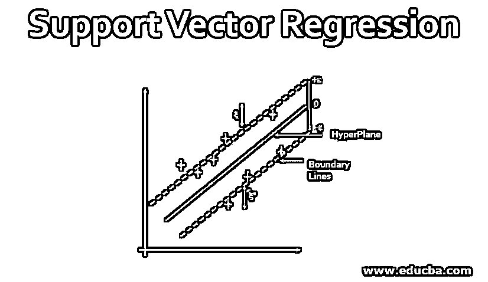
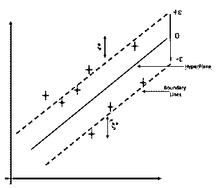
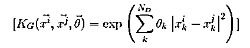
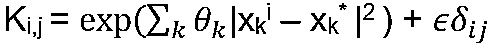
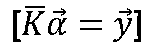
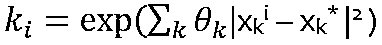

# 支持向量回归

> 原文：<https://www.educba.com/support-vector-regression/>

## 支持向量回归简介

顾名思义，支持向量回归是一种支持线性和非线性回归的回归算法。该方法基于支持向量机的原理。SVR 与 SVM 的不同之处在于， [SVM 是一个用于](https://www.educba.com/svm-algorithm/)预测离散分类标签的分类器，而 SVR 是一个用于预测连续有序变量的回归变量。

在简单回归中，想法是最小化错误率，而在 SVR 中，想法是将误差拟合在某个阈值内，这意味着 SVR 的工作是在称为ε- tube 的给定余量内逼近最佳值。看下图了解 SVR:

<small>Hadoop、数据科学、统计学&其他</small>

要理解这个数字，你需要知道以下术语:

**1。超平面:**是两个数据类在比实际维度更高的维度上的分隔线。在 SVR 中，它被定义为帮助预测目标值的线。

**2。内核:**在 SVR 中，回归是在一个更高的维度上进行的。为此，我们需要一个函数将数据点映射到更高的维度。这个函数被称为内核。SVR 中使用的核的类型是 s 形核、多项式核、高斯核等，

**3。边界线:**这是在超平面周围距离ε(ε)处画的两条线。它用于在数据点之间创建边距。

**4。支持向量:**它是用于定义超平面的向量，或者我们可以说，这些是数据集中的极值数据点，有助于定义超平面。这些数据点靠近边界。

SVR 的目标是在不违反边界的情况下拟合尽可能多的数据点。注意，在支持向量的 SVM 使用中的分类是为了定义超平面，但是在 SVR 中，它们用于定义线性回归。

### SVR 的工作

SVR 根据 SVM 原理工作，几乎没有细微差别。给定数据点，它试图找到曲线。但是因为它是一种回归算法，而不是使用曲线作为判定边界，所以它使用曲线来寻找向量和曲线位置之间的匹配。支持向量有助于确定数据点和用于表示它们的函数之间的最接近匹配。

以下是 SVR 工作所需的步骤:

*   训练集的集合
*   选择核及其参数，并根据需要进行任何正则化。
*   相关矩阵的创建
*   训练机器得到收缩系数 *α = α i*
**   使用系数创建一个估计值。*

 *#### 1.训练集集合

训练集由收集的样本组成，我们必须对这些样本执行预测。我们需要确定训练集的特征应该满足我们期望的领域。因为 SVR 只能在训练数据集中的现有数据之间进行插值。假设，SVR 用于估计余弦函数，那么它应该被训练的域是:0 → 2π。如果我们在已经评估的域之外评估估计，那么结果将直接取决于用于 SVR 和优化例程的核的选择。

#### 2.内核的选择

你可以根据问题选择任何核，如 Sigmoid 核，多项式核，高斯核等。所有这些内核都有需要训练的超参数。在本文中，我将采用高斯核。高斯核被定义为:

其中:

*   **NDT3】:每个数据点的尺寸**
*   ***x 和 *θ:*** *是超参数的集合。**

 **超参数以最大化使用核作为贝叶斯先验生成的训练集的概率的方式来选择。这是因为在超参数优化步骤中使用的损失函数是参数的对数概率。

在 SVR 中，这个训练阶段是最昂贵的部分，许多研究正在进行中，以开发更好的方法来完成它。我们可以使用基于梯度的优化方法(如 CG)和最小化成本函数来训练它。

核的选择很重要，因为如果我们选择像高斯这样的核，随着参数之间的距离增加，它开始给出零，然后随着我们开始远离训练数据，机器将开始返回训练集的平均值。核的选择决定了估计量的渐近行为。

#### 3.相关矩阵的创建

相关矩阵的形成是容易形成的。在这种情况下，我们评估训练集的所有数据点对。评估后，在对角线上添加正则项。这样做我们会得到一个矩阵:

其中:

*   **ε(ε):**是正则子
*   **δ i，j :** 是克罗尼克δ函数

这个矩阵是半定的，很容易使用。它用于在比我们从中导出训练集的空间更高维的空间中表示数据的相关矩阵。

#### 4.求解矩阵以形成估计量

这是创建 SVR 机器的主要部分。它的简单线性代数。机器的工作可以描述为:

其中:

*   ***y:** 对应于训练集的向量值。*
**   ***K:** 相关矩阵。***   ***α:** 需要求解的未知集合。***

 ***求解 *α很简单，只需对相关矩阵求逆，并将其应用于 *y。由于我们的相关矩阵构造得非常好，因此用于求逆的有效方法可以是 QR/Cholesky。**

 **#### 5.形成估计量

一旦 *α的值已知，我们就可以很容易地求出估计量。使用优化步骤中找到的系数和本例中使用的高斯核。为了估计测试点的 y *(*x *)计算和 k，并找到它与 alpha 向量的内积。**

 **Y* = *α。 *k**

 **使用以下公式计算的元素:

根据前面的等式，我们可以计算出，如果我们对矩阵求逆，并且正则项为零，那么估计量会完美地通过所有的训练点。这是因为如果测试点在训练集中， *k 与 *K 中的行相同。一旦我们包含了正则项或得到了所需的参数，我们就不需要恢复我们的训练集解，它们应该是闭合的。**

 **### SVR 的优势

1.  SVR 对异常值是稳健的。
2.  决策模型很容易更新
3.  可以使用使用概率规则对不同类型的数据进行训练的多个分类器。
4.  它可以通过度量分类的置信度来提高预测精度。
5.  与其他回归技术相比，SVR 执行的计算量更低。
6.  它的实现很容易。

到目前为止，您应该对支持向量回归有了清晰的理解，这将有助于您在实施支持向量回归时有一个良好的开端。由于实现不在本文的讨论范围内，我们将在以后把它作为一个单独的主题。

### 结论–支持向量回归

在本文中，我们了解到 SVR 是一种有用且灵活的技术。我们看到了它是如何用于使用数据点进行预测的。需要注意的重要一点是，内核的选择在 SVR 建模中起着至关重要的作用，我们已经看到了内核的选择如何影响我们的机器。我们还学习了 SVR 的工作原理，随后我们看到了它相对于其他回归算法的优势。

### 推荐文章

这是一个支持向量回归的指南。这里我们讨论支持向量回归机的工作原理和优点。您也可以看看以下文章，了解更多信息–

1.  [R 矢量](https://www.educba.com/vectors-in-r/)
2.  [Matlab 中的向量](https://www.educba.com/vectors-in-matlab/)
3.  [R 中的向量](https://www.educba.com/vectors-in-r/)
4.  [数据挖掘的类型](https://www.educba.com/type-of-data-mining/)

**************