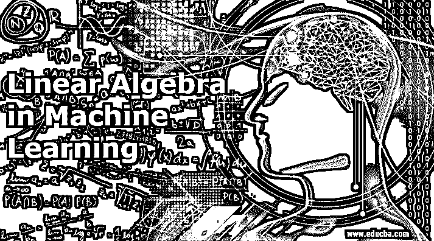
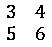
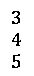
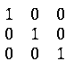
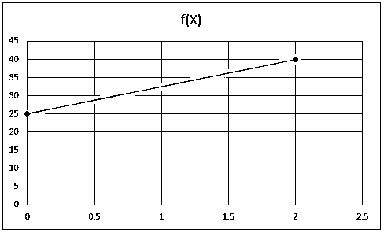
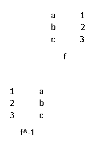
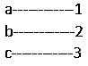
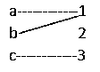

# 机器学习中的线性代数

> 原文：<https://www.educba.com/linear-algebra-in-machine-learning/>

## 机器学习中的线性代数导论

机器学习中的线性代数定义为数学中使用向量空间和矩阵来表示线性方程的部分，从代码中实现算法和技术(如正则化、深度学习、One hot 编码、主成分分析、单值分解等。)到用于描述机器学习算法的操作的符号，它充当机器学习领域中的关键基础。

**矩阵:**是以行和列表示的矩形形式的数字数组。

<small>Hadoop、数据科学、统计学&其他</small>

**举例:**

**向量:**向量是矩阵的一行或一列。

**举例:**

**张量:**张量是一组数字或函数的数组，当坐标发生变化时，这些数字或函数会按照一定的规则发生嬗变。

### 线性代数在机器学习中是如何工作的？

由于[机器学习是计算机科学和统计学的](https://www.educba.com/what-is-machine-learning/)接触点，线性代数有助于将科学、技术、金融&账户和商业融合在一起。 [Numpy 是](https://www.educba.com/what-is-numpy/) Python 中的一个库，用于数据科学和 ML 中的科学计算的多维数组。

线性代数以各种方式起作用，如下面列出的一些例子中所反映的:

#### 1.数据集和数据文件

数据是线性代数中的矩阵或数据结构。数据集以表格形式包含一组数字或数据。行代表观察结果，而列代表观察结果的特征。每行长度相同。所以，数据是矢量化的。行是预先配置的，并且一次一行地插入到模型中，以便更容易和可靠地进行计算。

#### 2.图像和照片

所有图像都是表格结构。黑白图像中的每个单元格都由高度、宽度和单像素值组成。类似地，彩色图像除了高度和宽度之外，还有 3 个像素值。它在线性代数中形成一个矩阵。所有类型的编辑，如裁剪、缩放等，以及操作技术都是使用代数运算来执行的。

#### 3.正规化

正则化是一种在将系数插入数据时最小化系数大小的方法。L1 和 L2 是正则化的一些常见实现方法，它们是向量中系数大小的度量。

#### 4.深度学习

这种方法主要用于具有各种实际解决方案的神经网络，如机器翻译、照片字幕、语音识别和许多其他领域。它与向量、矩阵甚至张量一起工作，因为它需要线性数据结构相加和相乘。

#### 5.一个热编码

这是分类变量的一种流行编码，便于代数运算。表中每个类别有一列，每个示例有一行。为分类值添加数字 1，其余数字为 0，依此类推，如下所示:

#### 6.线性回归

线性回归是一种统计方法，用于预测回归问题的数值以及描述变量之间的关系。

例如:y= A. b 其中 A 是数据集或矩阵，b 是系数，y 是输出。

#### 7.主成分分析

[主成分分析](https://www.educba.com/principal-component-analysis/)适用于处理用于可视化和模型操作的高维数据。当我们发现不相关的数据时，我们倾向于删除冗余的列。所以 PCA 作为一种解决方案。矩阵分解是 PCA 的主要目的。

#### 8.单值分解或 SVD

它也是一种矩阵分解方法，通常用于可视化、降噪等。

#### 9.潜在语义分析

在这个过程中，文档被表示为大矩阵。用这些矩阵处理的文档易于比较、查询和使用。构建一个矩阵，其中行代表单词，列代表文档。SVD 用于减少列数，同时保持相似性。

#### 10.推荐系统

预测模型依赖于产品的推荐。在线性代数的帮助下，SVD 函数使用欧几里德距离或点积来净化数据。例如，当我们在亚马逊上购买一本书时，推荐是基于我们的购买历史，将其他不相关的商品放在一边。

### 线性代数在机器学习中的优势

下面是提到的优点:

*   作为机器学习的坚实基础，包括数学和统计学。表格和图像都可以在线性数据结构中使用。
*   它也是分配的、关联的和交流的。
*   在 ML 中，这是一种简单的、建设性的和通用的方法。
*   线性代数可应用于许多领域，如预测、信号分析、面部识别等。

### 机器学习中的线性代数函数

如下所述，一些线性代数函数在 ML 和数据科学运算中至关重要:

#### 1.线性函数

线性回归算法使用线性函数，其中输出是连续的并且具有恒定的斜率。线性函数在图中有一条直线。

F(x)=mx+b

在哪里，

*   F(x)是函数值。
*   m 是直线的斜率。
*   b 是 x=0 时的函数值。
*   x 是 x 坐标的值..

**举例:** y=5x+25

设 x=0，那么 y=5*1+25=25

设 x=2，那么 y=5*2+25=40

#### 2.身份功能

恒等函数属于无监督算法，主要用于 ML 中的神经网络，其中多层神经网络的输出等于其输入，如下所述。

对于每个 x，f(x)映射到 x，即 x 映射到它自己。

**举例:** x+0=x

x/1=x

1——–>1

2——–>2

3——–>3

#### 3.作文

ML 在其数学计算和可视化算法中使用高阶合成和流水线功能。

合成功能描述如下:

(g o f)(x)=g(f(x))

**举例:**设 g(y)=y

f(x)=x+1

g o f(x+1)=x+1

#### 4.反函数

逆是一个自身反转的函数。函数 f 和 g 是逆的如果 f o g 和 g o f 被定义并且是恒等函数。

**举例:**

#### 5.可逆函数

有逆的函数是可逆的。

**一对一**

**到**

### 结论

线性代数是数学的一个分支。然而，它在机器学习中有更广泛的用途，从符号到数据集和图像中算法的实现。在 ML 的帮助下，代数在现实生活中的应用有了更大的影响，如搜索引擎分析、面部识别、预测、计算机图形学等。

### 推荐文章

这是机器学习中的线性代数指南。在这里，我们讨论线性代数在机器学习中的优势和一些例子。您也可以阅读以下文章，了解更多信息——

1.  [超参数机器学习](https://www.educba.com/hyperparameter-machine-learning/)
2.  [机器学习中的聚类](https://www.educba.com/clustering-in-machine-learning/)
3.  [数据科学机器学习](https://www.educba.com/data-science-machine-learning/)
4.  [无监督机器学习](https://www.educba.com/unsupervised-machine-learning/)

