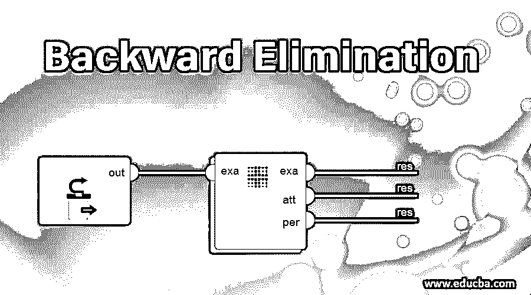
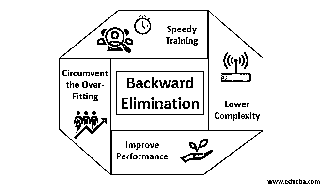

# 反向消除

> 原文：<https://www.educba.com/backward-elimination/>

## 逆向淘汰简介

随着人类和机器向数字进化迈进，各种技术的机器不仅被训练，而且被聪明地训练，以更好地识别现实世界的物体。早先引入的这种技术被称为“反向消除”，旨在支持不可或缺的特性，同时消除无用的特性，以便更好地优化机器。机器对物体识别的整体熟练程度与其所考虑的特征成正比。

与预测输出无关的特征必须从机器中删除，并通过反向消除得出结论。机器识别任何真实单词对象的良好精度和时间复杂度取决于它的学习。因此后向淘汰法在特征选择中发挥了它的刚性作用。它计算特征对因变量的依赖率，发现其在模型中的重要性。为了对此进行鉴定，它使用标准显著性水平(比如 0.06)检查计算的比率，并做出特征选择的决定。

<small>Hadoop、数据科学、统计学&其他</small>

### 为什么我们需要逆向淘汰？

不必要和多余的特征增加了机器逻辑的复杂性。它不必要地消耗时间和模型资源。因此，前面提到的技术在简化模型方面发挥了重要作用。该算法通过优化其性能和截断其可消耗的指定资源来培养模型的最佳版本。

它减少了模型中最不值得注意的特征，这些特征在确定回归线时会产生噪声。不相关的对象特征可能导致错误分类和预测。实体的不相关特征可能构成模型中相对于其他对象的其他重要特征的不平衡。反向淘汰促进了模型对最佳情况的拟合。因此，建议在模型中使用向后消除法。

### 如何应用逆向淘汰法？

反向消除从所有特征变量开始，在选定的模型拟合标准下用因变量对其进行测试。它开始消除那些恶化回归拟合线的变量。重复这种删除，直到模型达到良好的拟合。以下是练习反向消去法的步骤:

**步骤 1:** 选择适当的显著性级别，以驻留在机器的模型中。(取 S=0.06)

**第二步:**将所有可用的自变量输入到关于因变量的模型中，并计算斜率和截距，以绘制回归线或拟合线。

**步骤 3:** 逐个遍历所有具有最大值的自变量(取 I ),继续下面的 toast:-

a)如果大于，执行第 4 步。b)否则中止，模型就完美了。

**步骤 4:** 删除所选变量并递增遍历。

**第五步:**再次重新锻造模型，用残差变量再次计算拟合线的斜率和截距。

上述步骤概括为拒绝那些显著性比率高于所选显著性值(0.06)的特征，以避免被观察为高复杂性的资源的过度分类和过度利用。

### 逆向淘汰的利与弊

以下是后向淘汰法的一些优点和缺点:

#### 1.优点

反向淘汰的优点如下:

*   **快速训练:**机器用一组可用的模式特征进行训练，如果从模型中删除了不必要的特征，训练会在很短的时间内完成。只有当模型处理重要特征并排除所有噪声变量时，数据集的快速训练才会显现出来。它为训练画了一个简单的复杂度。但是该模型不应该经历由于缺少特征或样本不足而发生的欠拟合。为了获得最佳分类，模型中的样本特征应该是丰富的。训练模型所需的时间应该更少，同时保持分类精度，并且没有欠预测变量。
*   **较低的复杂度:**如果模型考虑了包括噪声和不相关特征的特征范围，则模型的复杂度恰好较高。该模型消耗大量空间和时间来处理这样一系列特征。这可能会提高[模式识别](https://www.educba.com/pattern-recognition/)的准确率，但该准确率也可能包含噪声。为了消除模型的如此高的复杂性，向后消除算法通过从模型中缩减不想要的特征来发挥必要的作用。它简化了模型的处理逻辑。只有几个基本特征就足以画出满足合理精度的良好拟合。
*   **提升性能:**模型性能取决于很多方面。该模型通过使用向后消除进行优化。模型的优化是用于训练模型的数据集的优化。模型的性能与其优化率成正比，优化率取决于重要数据的频率。反向消除过程不是要从任何低频预测器开始改变。但它只从高频数据开始改变，因为模型的复杂性主要取决于这一部分。
*   **规避过拟合:**当模型得到太多数据集，进行分类或预测，其中一些预测器得到其他类的噪声时，会出现过拟合的情况。在这种拟合中，模型应该给出出乎意料的高精度。在过度拟合中，由于太多的条件在逻辑上造成混乱，模型可能无法对变量进行分类。反向消除技术削减了无关特征以避免过拟合的情况。

#### 2.缺点

逆向淘汰的缺点如下:

*   在逆向排除法中，人们无法找出哪个谓词对另一个谓词的拒绝负责，因为它变得无足轻重。例如，如果预测符 X 有一定的重要性，在添加了 Y 预测符之后，这种重要性足以存在于模型中。但是当另一个预测者 Z 进入模型时，X 的重要性就过时了。因此，向后消除算法并不明显地表现出“向前选择技术”中发生的两个预测器之间的任何依赖性。
*   通过反向消除算法从模型中丢弃任何特征后，不能再次选择该特征。简而言之，反向消除没有添加或删除特征/预测值的灵活方法。
*   模型中选择显著性值(0.06)的标准是不灵活的。后向消去法没有灵活的程序来根据需要不仅选择而且改变无关紧要的值，以便在适当的数据集下提取最佳拟合。

### 结论

反向淘汰技术的实现改善了模型的性能，优化了模型的复杂度。它生动地应用于多元回归中，在多元回归中，模型处理大量的数据集。与遇到优化过载前向选择和交叉验证相比，这是一种容易和简单的方法。反向消除技术启动更高重要性值的特征的消除。它的基本目标是使模型不那么复杂，并禁止过拟合的情况。

### 推荐文章

这是一个逆向淘汰的指南。在这里，我们讨论如何应用反向消除以及优点和缺点。你也可以看看下面的文章来了解更多-

1.  [超参数机器学习](https://www.educba.com/hyperparameter-machine-learning/)
2.  [机器学习中的聚类](https://www.educba.com/clustering-in-machine-learning/)
3.  [Java 虚拟机](https://www.educba.com/java-virtual-machine/)
4.  [无监督机器学习](https://www.educba.com/unsupervised-machine-learning/)
5.  [各种模式识别应用](https://www.educba.com/pattern-recognition-applications/)

