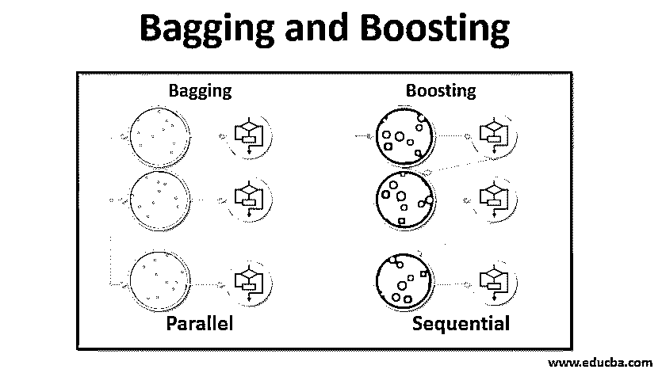

# 装袋和增压

> 原文：<https://www.educba.com/bagging-and-boosting/>

## 装袋和增压简介

打包和提升是两种流行的集成方法。所以在理解 Bagging 和 Boosting 之前，让我们先了解一下什么是集成学习。它是在机器学习中使用多种学习算法来训练具有相同数据集的模型以获得预测的技术。从每个模型中获得预测后，我们将使用加权平均、方差或最大投票等模型平均技术来获得最终预测。这种方法旨在获得比单个模型更好的预测。这使得精确度更高，避免了过度拟合，并减少了偏差和共方差。两种流行的集成方法是:

1.  打包(引导汇总)
2.  助推

#### 制袋材料

Bagging，也称为 Bootstrap Aggregating，用于通过减少方差(即避免过拟合)来提高准确性并使模型更加一般化。在这种情况下，我们采用训练数据集的多个子集。对于每个子集，我们采用具有相同学习算法[的模型，如决策树上的 Decisi](https://www.educba.com/decision-tree-in-machine-learning/) ，逻辑回归等。，以预测同一组测试数据的输出。一旦我们预测了每个模型，我们就使用模型平均技术来获得最终的预测输出。装袋的著名技术之一是随机森林**。**在随机森林中，我们使用多个决策树。

<small>Hadoop、数据科学、统计学&其他</small>

#### 助推

Boosting 主要用于减少监督学习技术中的偏差和变化。它是指将弱学习者(基础学习者)转换为强学习者的算法家族。弱学习器是仅在很小程度上与实际分类正确的分类器，而强学习器是与实际分类非常相关的分类器。少数著名的增强技术是 AdaBoost、梯度增强、XgBOOST(极端梯度增强)。所以现在我们知道了什么是 bagging 和 boosting，以及它们在机器学习中的作用。

### 装袋和增压工作

现在，让我们来了解装袋和增压的工作原理:

#### 制袋材料

为了理解 Bagging 的工作原理，假设我们有 N 个模型和一个数据集 d，其中 m 是数据的数量，N 是每个数据中的要素数量。我们应该做二元分类。首先，我们将分割数据集。现在，我们将把这个数据集分成训练集和测试集。我们称之为训练数据集，其中是训练样本的总数。

从训练集中获取记录样本，并使用它来训练第一个模型，比如 m1。对于下一个模型，m2 对训练集进行重新采样，并从训练集中获取另一个样本。我们将对 N 个模型做同样的事情。由于我们对训练数据集进行重采样并从中获取样本，而没有从数据集中移除任何内容，因此我们可能在多个样本中有两个或更多训练数据记录。这种对训练数据集进行重采样并将样本提供给模型的技术称为带替换的行采样。假设我们已经训练了每个模型，现在我们希望看到对测试数据的预测。因为我们正在进行二进制分类，所以输出可以是 0 或 1。测试数据集被传递给每个模型，我们从每个模型得到一个预测。假设在 N 个模型中，超过 N/2 个模型预测它是 1；因此，使用像最大投票这样的模型平均技术，我们可以说测试数据的预测输出是 1。

#### 助推

在 boosting 中，我们从数据集中提取记录，然后依次传递给基础学习者；在这里，基础学习者可以是任何模型。假设数据集中有 m 条记录。然后我们传递一些记录给基础学习者 BL1 并训练它。一旦 BL1 得到训练，然后我们传递来自数据集的所有记录，并查看基础学习者如何工作。对于所有被基础学习者错误分类的记录，我们只获取它们并将其传递给其他基础学习者，比如 BL2，同时将由 BL2 分类的错误记录传递给训练 BL3。这种情况会一直持续下去，直到我们指定了一些我们需要的特定数量的基本学习者模型。最后，我们结合这些基础学习者的输出，创建一个强学习者；因此，模型的预测能力得到提高。好的。现在我们知道装袋和助推是如何工作的了。

### 装袋的利与弊

下面给出的是最大的优点和缺点。

#### 装袋的优点

*   bagging 最大的好处就是多个弱学习者可以比单个强学习者做得更好。
*   它提供了稳定性，并提高了用于统计分类和回归的机器学习算法的准确性。
*   它有助于减少差异，即避免过度拟合。

#### 装袋的缺点

*   如果建模不当，可能会导致高偏差，从而导致拟合不足。
*   由于我们必须使用多个模型，这在计算上变得昂贵，并且可能不适合各种用例。

### 升压的优点和缺点

下面给出的是最大的优点和缺点。

#### 增压的优势

*   这是解决两类分类问题最成功的技术之一。
*   它擅长处理缺失数据。

#### 增压的缺点

*   由于算法的复杂性增加，升压很难实时实现。
*   这些技术的高度灵活性导致了直接影响模型行为的多个参数。

### 结论

主要的要点是，Bagging 和 Boosting 是一种机器学习范式，在这种范式中，我们使用多个模型来解决同一个问题并获得更好的性能，如果我们适当地组合弱学习器，那么我们可以获得稳定、准确和鲁棒的模型。在本文中，我已经给出了打包和升压的基本概述。在接下来的文章中，您将了解两者中使用的不同技术。最后，我将提醒您，打包和提升是集成学习中最常用的技术之一。提高性能的真正艺术在于您对何时使用哪个模型以及如何调整超参数的理解。

### 推荐文章

这是一个装袋和助推的指南。在这里，我们讨论了打包和增压的介绍及其工作原理和优缺点。您也可以浏览我们推荐的其他文章，了解更多信息——

1.  [集成技术介绍](https://www.educba.com/ensemble-techniques/)
2.  [机器学习算法的类别](https://www.educba.com/machine-learning-algorithms/)
3.  [样本代码为](https://www.educba.com/gradient-boosting-algorithm/)的梯度推进算法
4.  [什么是 Boosting 算法？](https://www.educba.com/boosting-algorithm/)

