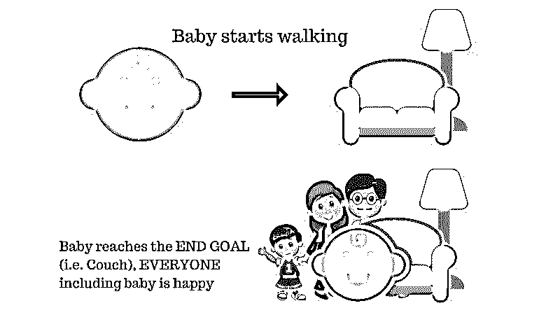
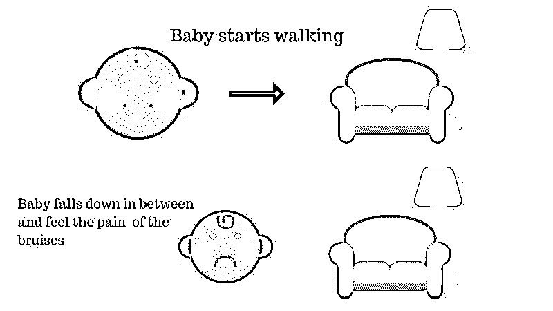
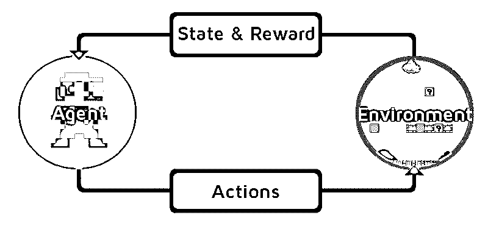
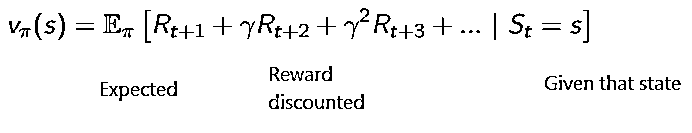
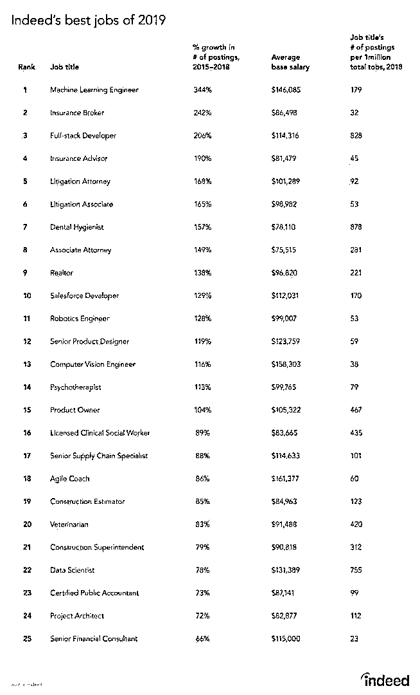

# 什么是强化学习？

> 原文：<https://www.educba.com/what-is-reinforcement-learning/>

## 强化学习简介

强化是机器学习的领域，它涉及不涉及任何人类交互的学习，因为它有一个代理，该代理通过执行动作来学习如何在环境中表现，然后基于这些动作的结果进行学习，以获得由系统 two complete 设置的所需目标。根据目标的类型，它被分为积极和消极的学习方法，以及它们在医疗保健、教育、计算机视觉、游戏、NLP、交通等领域的应用。

### 什么是强化学习？

让我们借助两个简单的用例来尝试强化学习的工作:

<small>Hadoop、数据科学、统计学&其他</small>

#### 案例 1

家里有个宝宝，刚开始走路，大家都挺开心的。所以有一天，父母试着设定一个目标，让我们的宝宝够到沙发，看看宝宝是否能做到。

**案例 1 的结果:**婴儿成功到达长椅，因此家里的每个人都很高兴看到这一幕。选择的道路现在会带来积极的回报。

**积分:**奖励+ (+n) →正奖励。

#### 案例 2

婴儿够不到沙发，所以摔倒了。好痛！可能是什么原因呢？在通往沙发的路上可能会有一些障碍物，而婴儿已经摔倒在障碍物上了。

**案例二结果:**宝宝掉到了一些障碍物上，她哭了！哦，那太糟糕了，她学会了，下次不要掉进障碍的陷阱里。选择的道路现在带来了负面的回报。

**积分:**奖励+(-n)→负奖励。

现在我们已经看到了案例 1 和案例 2，强化学习，在概念上做了同样的事情，除了它不是人类的，而是通过计算完成的。

### 逐步使用强化

让我们通过逐步引入强化剂来理解强化学习。在本例中，我们的强化学习代理是 Mario，它将自己学习游戏:

*   马里奥游戏环境的当前状态是 S_0。因为游戏还没开始，而马里奥在原地。
*   接下来游戏开始，马里奥移动，马里奥，也就是 RL 代理，采取行动，假设 A_0。
*   现在游戏环境的状态变成了 S1。
*   此外，RL 代理，即马里奥，现在被分配了一些正的奖励点 R1，可能是因为马里奥还活着并且没有遇到任何危险。

现在，上述循环将继续运行，直到马里奥最终死亡或马里奥到达其目的地。该模型将持续输出动作、奖励和状态。

### 最大化奖励

强化学习的目标是通过考虑某些其他因素，如奖励折扣，使奖励最大化；我们将借助于一个例子来解释折扣的含义。

折扣奖励的累积公式如下:

### 折扣奖励

让我们通过一个例子来理解这一点:

*   在给定的图中，目标是游戏中的老鼠在被猫吃掉或不被电击之前必须吃掉尽可能多的奶酪。
*   我们可以假设，我们离猫或电捕笼越近，我们就越有可能让老鼠被吃掉或电击。
*   这意味着，即使我们在电击区或猫附近有完整的奶酪，去那里的风险也越大；最好在附近吃奶酪，以避免任何风险。
*   因此，即使我们有一个“块 1”奶酪，它是满的，并且远离猫和电击块，而另一个“块 2”，它也是满的，但是靠近猫或电击块，后一个奶酪块，即“块 2”，在奖励上将比前一个奶酪块折扣更多。

### 强化学习的类型

以下是两种强化学习及其优缺点:

#### 1.积极的

当行为的强度和频率由于某种特定行为的发生而增加时，就被称为正强化学习。

*   **优点:**性能最大化，变化保持时间更长。
*   **缺点:**如果强化过多，效果会减弱。

#### 2.否定的；消极的；负面的；负的

它是行为的强化，主要是因为负面术语的消失。

*   **优势:**行为增加。
*   **缺点:**在负强化学习的帮助下只能达到模型的最小行为。

### 强化学习应该用在哪里？

强化学习可以做的事情/例子。

以下是目前强化学习的应用领域:

*   卫生保健
*   教育
*   比赛
*   计算机视觉
*   企业管理
*   机器人学
*   金融
*   自然语言处理
*   运输
*   活力

### 强化学习中的职业

确实有来自工作现场的报告，因为 RL 是机器学习的一个分支；根据报告，机器学习是 2019 年最好的工作。下面是报告的快照。根据目前的趋势，机器学习工程师的平均工资高达 146，085 美元，增长率为 344%。

**来源:**确实

### 强化学习的技巧

以下是强化学习所需的技能:

#### 1.基本技能

*   可能性
*   统计数字
*   数据建模

#### 2.编程技能

*   编程和计算机科学基础
*   软件设计
*   能够应用机器学习库和算法

#### 3.机器学习编程语言

*   大蟒
*   英语字母表中第十八个字母
*   虽然也有其他语言可以设计机器学习模型，如 Java、C/C++，但 Python 和 R 是最受欢迎的语言。

### 结论

在本文中，我们首先简要介绍了强化学习，然后深入研究了强化学习的工作原理以及强化学习模型工作中涉及的各种因素。然后我们放了一些真实世界的例子来更好地理解他们的主题。因此，在本文结束时，人们应该理解强化学习的工作原理。

### 推荐文章

这是一个什么是强化学习的指南？在这里，我们讨论了开发强化学习模型的功能和各种因素，并举例说明。您也可以浏览我们的其他相关文章，了解更多信息——

1.  [机器学习算法的类型](https://www.educba.com/types-of-machine-learning-algorithms/)
2.  [人工智能简介](https://www.educba.com/introduction-to-artificial-intelligence/)
3.  [人工智能工具](https://www.educba.com/artificial-intelligence-tools/)
4.  [物联网平台](https://www.educba.com/iot-platform/)

