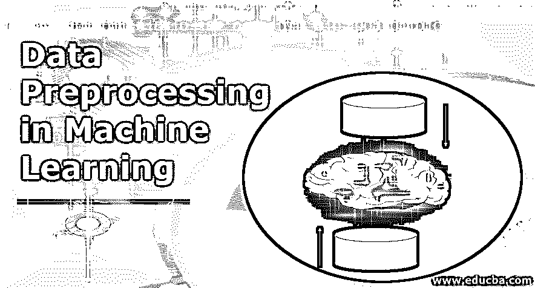
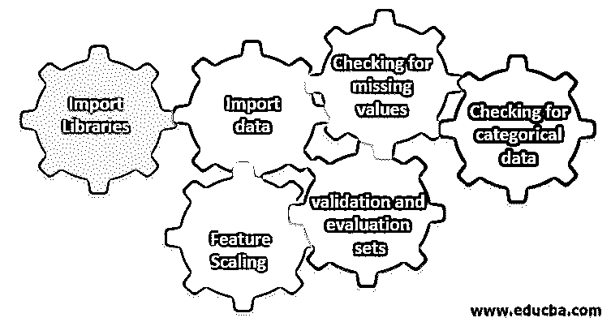

# 机器学习中的数据预处理

> 原文：<https://www.educba.com/data-preprocessing-in-machine-learning/>

## 机器学习中的数据预处理导论

以下文章概述了机器学习中的数据预处理。数据预处理也称为数据争论，是一种使用不同的步骤(即，从导入库、数据到检查缺失值、分类后进行验证和特征缩放)将原始数据(即，不完整、不一致、有大量错误的数据以及缺乏特定行为的数据)仔细转换为可理解格式的技术，以便从中做出正确的解释并避免负面结果，因为机器学习中模型的质量高度依赖于我们训练它所依据的数据的质量。

为训练模型而收集的数据来自各种来源。这些收集到的数据通常是原始格式的，即它们可能含有缺失值、相关信息、字符串格式的数字等噪音。或者它们可以是非结构化的。数据预处理提高了机器学习模型的效率和准确性。因为它有助于从数据集中去除这些噪声并赋予数据集意义

<small>Hadoop、数据科学、统计学&其他</small>

### 机器学习涉及的六个不同步骤

以下是机器学习中执行数据预处理的六个不同步骤:

**第一步:**导入库

**第二步:**导入数据

**步骤 3:** 检查缺失值

**步骤 4:** 检查分类数据

**第五步:**特征缩放

**步骤 6:** 将数据分成训练集、验证集和评估集

#### 1.导入库

第一步是导入数据预处理所需的一些重要库。库是可以被调用和使用的模块的集合。在 python 中，我们有很多对数据预处理有帮助的库。

python 中的一些重要库如下:

*   **Numpy:** 大多使用库来实现或使用机器学习的复杂数学计算。这对于在多维数组上执行操作非常有用。
*   **Pandas** :这是一个开源库，用 python 提供了高性能、易用的数据结构和数据分析工具。它旨在使处理关系和带标签的数据变得简单而直观。
*   Matplotlib: 是 python 为数组的 2D 图提供的可视化库。它建立在一个 [numpy 数组](https://www.educba.com/what-is-numpy/)上，并被设计为与更广泛的 Scipy 堆栈一起工作。数据集的可视化在大数据可用的情况下很有帮助。matplot lib 中可用的图形有折线图、条形图、散点图、直方图等。
*   **Seaborn:** 也是 python 给出的可视化库。它提供了一个高级界面，用于绘制有吸引力和信息丰富的统计图。

#### 2.导入数据集

一旦库被导入，我们的下一步是加载收集的数据。 [Pandas 库用于](https://www.educba.com/what-is-pandas/)导入这些数据集。大多数数据集都以 CSV 格式提供，因为它们的大小很小，这使得处理速度很快。因此，使用 panda 库的 read_csv 函数加载一个 csv 文件。可以看到的数据集的各种其他格式有

一旦数据集被加载，我们必须检查它并寻找任何噪声。为此，我们必须创建一个特征矩阵 X 和一个相对于 X 的观测向量 Y。

#### 3.检查缺少的值

一旦你创建了特征矩阵，你可能会发现有一些丢失的值。如果我们不处理它，那么它可能会在培训时造成问题。

有两种处理缺失值的方法:

*   删除包含缺失值的整行，但最终可能会丢失一些重要信息。如果数据集很大，这可能是一个好方法。
*   如果一个数字列有一个缺失值，那么您可以通过取平均值、中值、众数等来估计该值。

#### 4.检查分类数据

数据集中的数据必须是数字形式，以便对其执行计算。由于机器学习模型包含复杂的数学计算，我们不能给它们输入非数值。因此，将所有文本值转换成数值是很重要的。label encoder()learned 类用于将这些分类值转换成数值。

#### 5.特征缩放

原始数据的值变化很大，这可能导致模型训练有偏差，或者最终增加计算成本。因此，重要的是将它们规范化。要素缩放是一种用于缩小数据值范围的技术。

用于特征缩放的方法有:

*   重新缩放(最小-最大归一化)
*   均值归一化
*   标准化(Z 分数标准化)
*   缩放至单位长度

#### 6.将数据分为训练集、验证集和评估集

最后，我们需要将我们的数据分成三个不同的集合，训练集合来训练模型，验证集合来验证我们的模型的准确性，最后测试集合来测试我们的模型在一般数据上的性能。在分割数据集之前，对数据集进行洗牌以避免任何偏差是很重要的。划分数据集的理想比例是 60:20:20，即 60%作为训练集，20%作为测试和验证集。若要拆分数据集，请使用 sklearn.model_selection 的 train_test_split 两次。一次将数据集分成训练集和验证集，然后将剩余的训练数据集分成训练集和测试集。

### 结论–机器学习中的数据预处理

数据预处理是一件需要实践的事情。它不像一个简单的数据结构，你可以学习并直接应用它来解决问题。为了更好地了解如何清理数据集或如何可视化数据集，您需要使用不同的数据集。你使用这些技巧越多，你对它的理解就会越好。这是关于数据处理如何在机器学习中发挥重要作用的一般想法。除此之外，我们还看到了数据预处理所需的步骤。因此，下次在使用收集的数据训练模型之前，请确保应用数据预处理。

### 推荐文章

这是机器学习中数据预处理的指南。在这里，我们讨论机器学习的介绍和六个不同的步骤。您也可以浏览我们推荐的其他文章，了解更多信息——

1.  [人工智能的重要性](https://www.educba.com/importance-of-artificial-intelligence/)
2.  [物联网技术](https://www.educba.com/iot-technology/)
3.  [PL/SQL 数据类型](https://www.educba.com/pl-sql-data-types/)
4.  [配置单元数据类型](https://www.educba.com/hive-data-types/)

