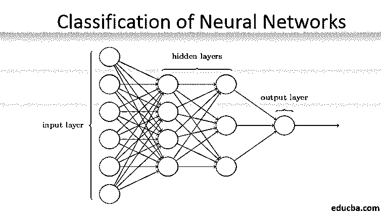
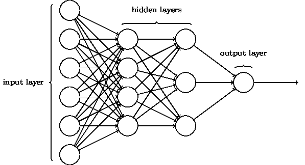
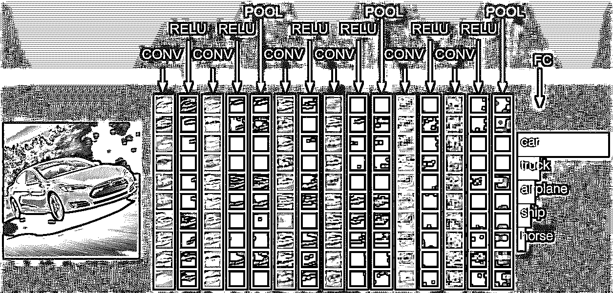
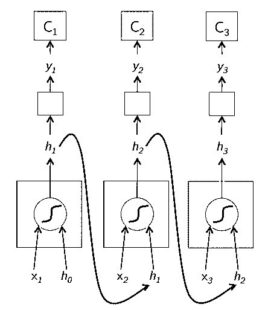
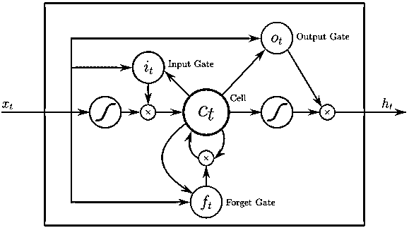
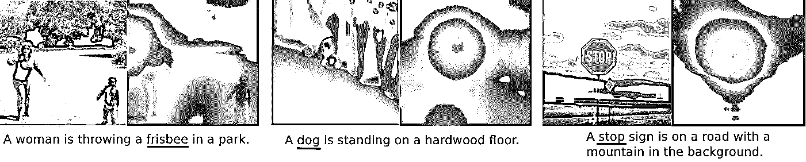
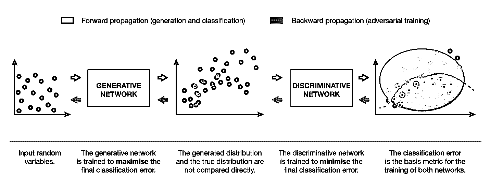
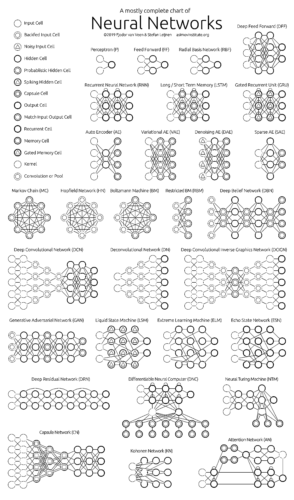

# 神经网络的分类

> 原文：<https://www.educba.com/classification-of-neural-network/>

## 神经网络分类介绍

神经网络是人工智能中解决现实世界问题的最高效的方式(是的，你没看错)。目前，这也是计算机科学中被广泛研究的领域之一，当你阅读这篇文章时，一种新形式的神经网络已经被开发出来。有数百个神经网络来解决特定于不同领域的问题。在这里，我们将按照复杂性递增的顺序，带您浏览不同类型的基本神经网络。

### 神经网络分类中不同类型的基础

它将不同类型的神经网络分类为:

<small>Hadoop、数据科学、统计学&其他</small>

#### 1.浅层神经网络(协同过滤)

神经网络由一组感知器组成，以模拟人脑的神经结构。浅层神经网络只有一个感知器隐藏层。浅层神经网络的一个常见例子是协同过滤。感知器的隐藏层将被训练来表示实体之间的相似性，以便生成推荐。网飞、亚马逊、YouTube 等网站的推荐系统。使用一个版本的协同过滤来根据用户兴趣推荐他们的产品。

#### 2.多层感知器(深度神经网络)

具有一个以上隐含层的神经网络称为深度神经网络。剧透警报！以下所有神经网络都是深度神经网络的一种形式，经过调整/改进，可以解决特定领域的问题。总的来说，它们帮助我们实现普遍性。给定足够数量的神经元隐藏层，深度神经网络可以近似即解决任何复杂的现实世界问题。

通用逼近定理是深度神经网络训练和拟合任何模型的核心。深度神经网络的每个版本都是由矩阵乘法的最大池积的全连接层开发的，该矩阵乘法由反向传播算法优化。我们将继续了解不同形式的深度神经网络带来的改进。

#### 3.卷积神经网络(CNN)

CNN 是深度神经网络的最成熟形式，可以在计算机视觉中产生最准确的(即比人类更好的)结果。CNN 由多层卷积组成，这些卷积是通过扫描数据集中图像的每个像素而创建的。随着数据逐层逼近，CNN 开始识别模式，从而识别图像中的物体。这些物体广泛用于各种识别、分类等应用中。最近的实践，如 CNN 中的迁移学习，已经导致模型不准确性的显著改善。谷歌翻译和谷歌镜头是 CNN 最先进的例子。

CNN 的应用是指数级的，因为它们甚至被用于解决主要与计算机视觉无关的问题。一个非常简单但直观的 CNN 解释可以在这里找到。

#### 4.递归神经网络(RNN)

RNNs 是用于解决 NLP 中的问题的深度神经网络的最新形式。简而言之，RNNs 将几个隐藏层的输出反馈到输入层，以聚合并结转对输入数据集的下一次迭代(历元)的近似。它还帮助模型进行自我学习，并在一定程度上更快地纠正预测。这样的模型对于理解 NLP 操作中文本的语义非常有帮助。RNNs 有不同的变体，如长短期记忆(LSTM)、门控循环单位(GRU)等。在下图中，h1 和 h2 的激活分别由输入 x2 和 x3 提供。

#### 5.长短期记忆(LSTM)

LSTMs 专门设计用于解决 RNN 的消失梯度问题。消失梯度发生在大型神经网络中，其中损失函数的梯度趋向于向零移动，使得暂停神经网络进行学习。LSTM 通过阻止其递归组件中的激活功能和使存储值不发生突变来解决这个问题。这个小小的改变给最终模型带来了巨大的改进，导致科技巨头在他们的解决方案中采用了 LSTM。到 LSTM 的“最简单的不言自明的”插图，

#### 6.基于注意力的网络

在实践中，注意力模型正在慢慢接管甚至新的 rnn。注意力模型是通过专注于给他们的信息子集的一部分来建立的，从而消除手头任务不需要的大量背景信息。注意模型由软注意和硬注意的组合构成，并通过反向传播软注意进行拟合。分层堆叠的多个注意力模型被称为 Transformer。这些转换器可以更有效地并行运行堆栈，从而使用相对较少的数据和时间来训练模型，从而产生最先进的结果。当与 CNN/RNN 一起使用时，注意力分布变得非常强大，并且可以对图像产生如下的文本描述。

像谷歌、脸书等科技巨头。正在迅速调整注意力模型来构建他们的解决方案。

#### 7.生成对抗网络

尽管深度学习模型提供了最先进的结果，但它们可能会被聪明得多的人类同行通过向现实世界的数据添加噪声而愚弄。gan 是深度学习解决这种情况的最新发展。GANs 使用无监督学习，其中深度神经网络使用人工智能模型生成的数据以及实际数据集进行训练，以提高模型的准确性和效率。这些对抗性数据主要用于欺骗歧视性模型，以便建立一个最佳模型。所得到的模型往往是比克服这种噪声更好的近似。对 GAN 的研究兴趣导致了更复杂的实现，如条件 GAN (CGAN)、拉普拉斯金字塔 GAN (LAPGAN)、超分辨率 GAN (SRGAN)等。

### 结论

深度神经网络一直在挑战计算机的极限。它们不仅仅局限于分类(CNN，RNN)或预测(协同过滤)，甚至还包括数据生成(GAN)。这些数据可能从美丽的艺术形式到有争议的深层赝品，但它们每天都在以一项任务超越人类。因此，我们也应该考虑人工智能的伦理和影响，同时努力建立一个有效的神经网络模型。是时候制作一个关于神经网络的简洁的信息图了。

### 推荐文章

这是神经网络分类的指南。这里我们详细讨论了不同分类的基本神经网络的基本概念。您也可以浏览我们的文章，了解更多信息——

1.  [什么是神经网络？](https://www.educba.com/what-is-neural-networks/)
2.  [神经网络算法](https://www.educba.com/neural-network-algorithms/)
3.  [递归神经网络(RNN)](https://www.educba.com/recurrent-neural-networks-rnn/)
4.  [神经网络应用指南](https://www.educba.com/application-of-neural-network/)
5.  [DNN 神经网络](https://www.educba.com/dnn-neural-network/)

