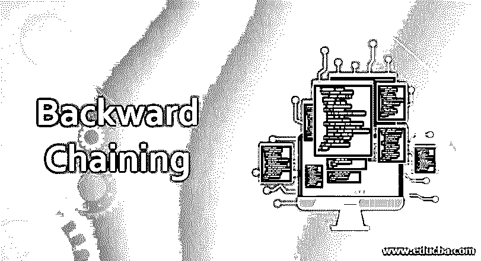

# 反向链接

> 原文：<https://www.educba.com/backward-chaining/>

## 反向链接简介

反向链接是人工智能领域中推理的一种推理方法。它指的是从目标或终点回溯到导致目标本身的先前步骤的过程。它是一种目标驱动的推理算法，在最终目标确定的地方寻找解决方案。

例如，各种退休或储蓄计算器使用这样的算法，如果你退休时需要 100 万英镑，它将有助于确定开始投资所需的金额或达到预期目标所需的每月付款。

<small>Hadoop、数据科学、统计学&其他</small>

### 需要反向链接

人工智能的发展已经持续了许多年，它是在某些预定义的系统或路径上进行的，机器或人工智能遵循这些系统或路径来提供逻辑解决方案。当路径或一系列逻辑步骤中的最终目标是预先确定的，并且需要反向步骤来建立反向或回溯逻辑步骤以确定心中的解决方案时，存在某些挑战。它旨在找到实现给定解决方案的步骤。

这就是反向链接的优势所在，它的工作方式与正向链接相似，但不同之处在于它从端点开始寻找逻辑解决方案。它几乎被用于人工智能已经取得进展的每个领域，并且是从已知结论推断未知结果的一系列过程。

### 反向链接是如何工作的？

正如所讨论的，反向链接从某些结论或目标开始，然后反向工作以理解实现这些目标所采取的步骤，以及我们是否可以从逻辑上找出任何推理或逻辑步骤来找出其他解决方案。

为了理解它是如何工作的，我们需要理解'*然后'*的概念，

#### 反向链接的示例

**规则 1:** 如果 X 是猎豹那么 X 快或者 Y 快。

规则 2: 如果它是猎豹，速度很快，那么它的身体上有圆点。

现在以上面的猎豹为例，如果要识别一个动物并确定它是不是猎豹，我们可以从我们手头的信息中推导出来。动物园里有一只名叫托尼的不明动物，我们需要确认它是不是印度豹。

托尼身上有斑点是我们的目标。现在，系统将根据推断来查看动物身上是否有斑点，并查看它是否与推断相匹配。

“如果托尼是一只猎豹，那么托尼就是一只猎豹”。

由此，我们可以确定托尼是一只猎豹。

“如果托尼是印度豹，那么他身上就有圆点”。

由此我们可以认定托尼是一只身上有圆点的猎豹。在上面的例子中，规则是推理机，通过它可以推导出逻辑含义。此外，它被称为自上而下的方法，反向链接主要使用深度优先搜索来遍历图形，以获得搜索和扩展所有可能节点的推理。它也只产生有限数量的可能性，而它的对应物正向链接可以产生无限的推论。

### 反向链接的使用

以下是反向链接的用法:

*   它可用于金融服务、市场研究行业，在这些行业中，某些结果是已知的，可以进行推断，以决定并采取必要的措施来改变结果或流程，以实际达到该目标。比如，如果投资回报率需要达到 25%，就可以通过推理来实现这些目标。
*   在医学上，当需要排除一种疾病时，可以进行推理，看看是否有针对这种疾病的逻辑模式，如果没有，我们可以安全地排除这种疾病。所有这些对于反向链接算法来说都是可能的，在反向链接算法中，可以在几秒钟内处理大量数据并确定结果。
*   在制造部门，通过对结果进行假设，然后运行反向链接算法，可以发现某些单元或流程中的故障。它提供了分析能力
*   使用反向和正向链接算法的人工智能进步已经并将继续以这样或那样的方式影响几乎所有可能的部门，包括法律、医药、生产、IT 和其他部门。此外，某些编程语言，如 Prolog、knowledge Machine 等，对反向链接的支持正在急剧增加，这开辟了新的

### 反向链接的优点和缺点

以下是优点和缺点:

#### 优势

*   当结果是已知的并且要推导出推论时，反向链接是有利的。
*   因此，它也比可以得出多个结论的正向链接更快。
*   这是一种有效的方法来达到预期的解决方案，因为它主要依赖于推理机和某些预先定义的规则。如果推理满足这些规则，它可以有效地和高效地导出正确的解决方案。
*   它只检查所需的规则，因此比检查所有规则的正向链接更快。

#### 不足之处

*   在反向链接中，目标必须事先知道。
*   如果要推导出多个答案或解决方案来练习或给出最佳可能的解决方案供用户选择，则链接失败，因为它只推导出一个正确的解决方案，因此拒绝了用户的多个有意义的见解。
*   因此，与正向链接相比，它也不太灵活，因为只有所需的数据是从中导出的，并且用户被限制于此，并且不能选择导出多个结论，而这是决策制定的主要商业需求。

### 结论

反向链接和正向链接都是重要的工具，因为两者都有不同的用例，不能一起使用。对于任何人来说，理解人工系统如何工作以及我们如何能够使系统中的智能基于某些规则或推理引擎提供逻辑解决方案是很重要的。对于任何希望学习人工智能甚至搜索或数据库管理系统的人来说，学习这一点尤为重要，因为这是设计跨领域复杂数据库系统解决方案的关键。

### 推荐文章

这是一个反向链接的指南。这里我们讨论反向链接是如何工作的，它的优点和缺点以及它的用途。您也可以浏览我们推荐的其他文章，了解更多信息——

1.  [向前和向后链接](https://www.educba.com/forward-and-backward-chaining/)
2.  [正向链接与反向链接](https://www.educba.com/forward-chaining-vs-backward-chaining/)
3.  [正向链接](https://www.educba.com/forward-chaining/)
4.  [运行数据存储器](https://www.educba.com/operational-data-stores/)

