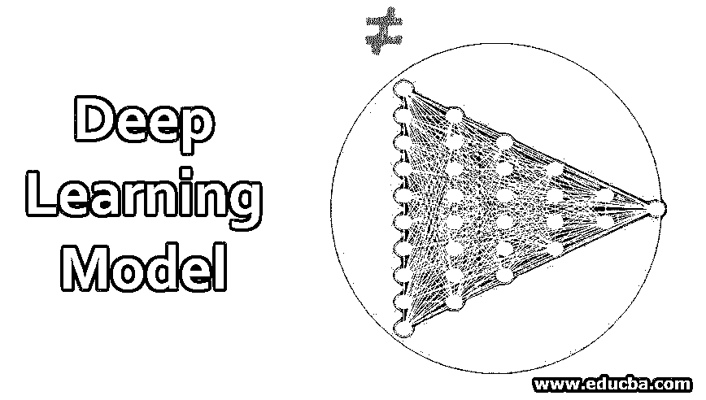
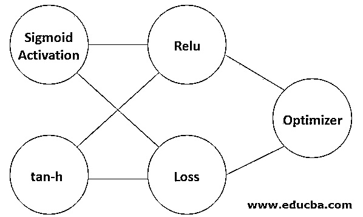

# 深度学习模型

> 原文：<https://www.educba.com/deep-learning-model/>

## 深度学习模型简介

深度学习模型通常消耗大量数据，模型总是复杂的，需要用 CPU、GPU 处理单元来执行训练。所以当 GPU 资源没有分配的时候，那么你[用某种机器学习算法](https://www.educba.com/machine-learning-algorithms/)来解决问题。当更多的数据添加到架构中时，深度学习模型将会得到很好的改善。深度学习模型可以从零开始训练，也可以使用预训练的模型。有时，特征提取也可以用于从深度学习模型层中提取某些特征，然后馈入机器学习模型。

### 如何创建深度学习模型？

使用神经网络创建深度学习模型[。它有一个输入层、隐藏层和输出层。输入层接受输入，隐藏层使用可以在训练期间微调的权重来处理这些输入，然后模型将给出预测，可以对每次迭代进行调整以最小化误差。例如，可以使用 Keras 创建顺序模型，而可以指定每层中的节点数。](https://www.educba.com/what-is-neural-networks/)

<small>Hadoop、数据科学、统计学&其他</small>

**举例:**

`from keras.models import Sequential
from keras.layers import Dense
model = Sequential()
model.add(dense(10,activation='relu',input_shape=(2,)))
model.add(dense(5,activation='relu'))
model.add(dense(1,activation='relu'))`

激活功能允许您引入非线性关系。您可以在第一步中指定输入图层形状，其中 2 表示输入中的列数，您也可以在逗号后指定所需的行数。输出层只有一个用于预测的节点。引入激活函数的目的是从提供给它们的数据中学习一些复杂的东西。该函数应该是可微分的，因此当反向传播发生时，网络将能够优化误差函数以减少每次迭代的损失。权重乘以输入并加上偏差。

### 深度学习的功能

以下是我们在深度学习中使用的函数:

#### 1.Sigmoid 激活函数

该函数的形式为 f(x) = 1/1+exp(-x)。输出介于 0 和 1 之间。它不是以零为中心的。该函数存在消失梯度问题。当反向传播发生时，小导数相乘在一起，当我们传播到初始层时，梯度呈指数下降。

#### 2.双曲正切函数

该函数的形式为 f(x) = 1-exp(-2x)/1+exp(2x)。输出介于-1 和+1 之间。它以零为中心。与 Sigmoid 函数相比，优化收敛是容易的，但是 tan-h 函数仍然遭受消失梯度问题。

#### 3.整流线性单位

函数是 if 形式 f(x) = max(0，x) 0 当 x <0, x when x> 0 时。与 tan-h 函数相比，Relu 收敛更多。该函数没有消失梯度问题。它只能在网络的隐藏层中使用。有时，模型会遇到死神经元问题，这意味着永远无法在某些数据点上激活权重更新。因为漏 Relu 函数可以用来解决神经元死亡的问题。所以在精度和性能上比较 Sigmoid 和 tan-h 实习生，还是用 Relu 函数比较好。

使用 model.compile()编译下一个模型。它有损失和优化器等参数。取决于目标函数，可以使用损失函数，如平均绝对误差、均方误差、铰链损失、分类交叉熵、二进制交叉熵。也可以使用 Adadelta、SGD、Adagrad、Adam 等优化函数。

#### 4.损失函数

以下是损失函数的类型，解释如下:

*   **MAE(平均绝对误差):**它是计算预测值和实际值之间的绝对差的评价指标之一。取所有绝对差之和，除以观察次数。与 MSE 相比，它不会惩罚这么高的大值，这意味着它们对异常值很敏感。
*   **MSE(均方误差):** MSE 是通过预测值和实际值之差的平方和除以观察次数计算出来的。当度量值较高或较低时，需要注意。只有当我们对预测值出乎意料时才有用。我们不能依赖 MSE，因为有时当模型表现良好时，它可能具有较高的 MSE。
*   **铰链损失:**该函数多用于支持向量机。该函数的形式为=[0，1-yf(x)]。当 yf(x) > =0 时，损失函数为 0，但当 yf(x) < 0 时，误差呈指数增加，对远离边缘的误分类点的惩罚更大。所以误差会在这些点上呈指数增长。
*   交叉熵:它是一个对数函数，预测值介于 0 和 1 之间。它衡量分类模型的性能。因此，当该值为 0.010 时，交叉熵损失更多，并且该模型在预测方面较差。对于二元分类，交叉熵损失定义为-(ylog(p)+(1-y)log(1-p))。对于多分类，交叉熵损失由-ylog(p)的总和定义。

#### 5.优化器功能

以下是优化器函数的类型，解释如下:

*   **SGD:** 随机梯度下降存在收敛稳定性问题。这里出现了局部最小值问题。损失函数中有更多的波动，因此计算全局最小值是一项繁琐的任务。
*   **Adagrad:** 在此 Adagrad 函数中，不需要手动调整学习率。但主要的缺点是学习率持续下降。因此，当每次迭代的学习率下降太多时，模型在那之后不会获得额外的知识。这个递减的学习率在 Adadelta 中解决。
*   **Adadelta:** 这里正在求解递减学习率，为每个参数计算不同的学习率，并且正在计算动量。但最重要的是，这不会为每个参数存储单独的动量水平。这个问题在 Adam 的优化函数中得到纠正。
*   **Adam(自适应矩估计):**与其他自适应模型相比，收敛速度很快。关注每个参数的自适应学习率。主要用于所有深度学习模型，因为动量也是每个参数的考虑因素。亚当的模型非常高效高速。因此，可以使用 model.fit()函数来训练模型，在该函数中，可以指定训练 x 参数和 y 参数、要运行的时期数、训练和测试数据分割。最后，当样本输入传递到 model.predict()函数时，该函数将预测结果。

### 结论

因此，深度学习模型最终有助于解决复杂的问题，无论数据是线性还是非线性的。该模型不断获取输入给它的每个数据的知识。

### 推荐文章

这是一个深度学习模型的指南。在这里，我们讨论如何创建深度学习模型以及顺序模型和各种函数。您也可以浏览我们推荐的文章，了解更多信息——

1.  [深度学习网络的工作](https://www.educba.com/deep-learning-networks/)
2.  [深度学习的应用](https://www.educba.com/application-of-deep-learning/)
3.  [深度学习算法](https://www.educba.com/deep-learning-algorithms/)
4.  [什么是深度学习？](https://www.educba.com/what-is-deep-learning/)

