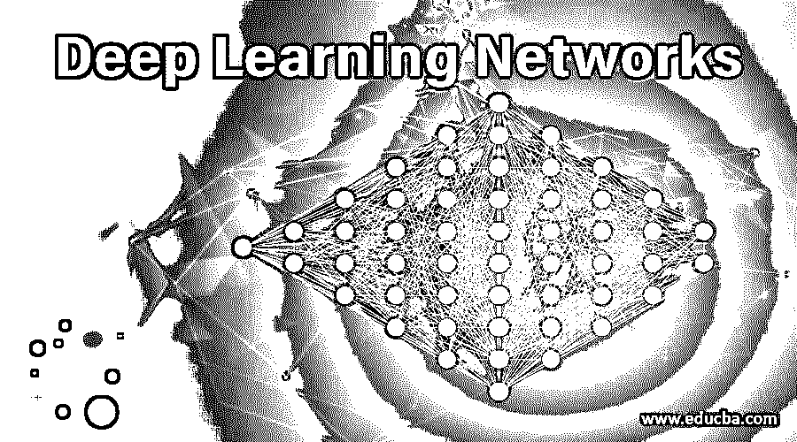
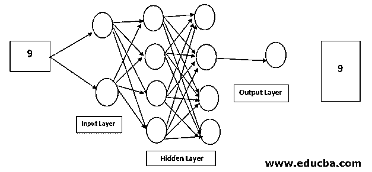
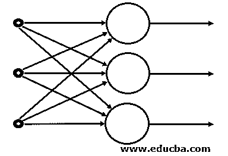
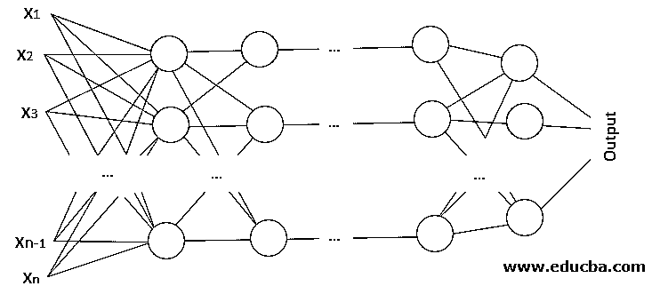
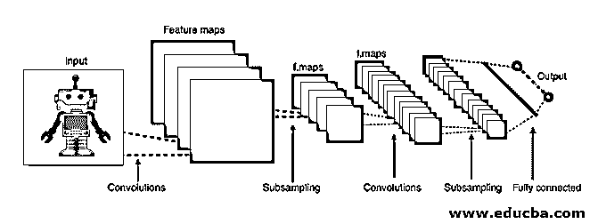
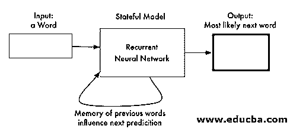
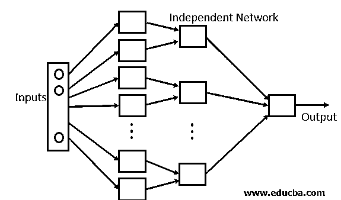

# 深度学习网络

> 原文：<https://www.educba.com/deep-learning-networks/>

## 深度学习网络简介

深度学习网络是用于模拟人脑的数学模型，因为它旨在使用非结构化数据解决问题，这些数学模型是以由神经元组成的神经网络的形式创建的。神经网络分为三个主要层，即输入层(神经网络的第一层)、隐藏层(神经网络的所有中间层)和输出层(神经网络的最后一层)。).基于这些类型的数据，我们将处理这些被分类为前馈神经网络、CNN、RNN、模块化神经网络等的神经网络。

### 深度学习网络的工作

让我们看看网络的一般工作情况。

<small>Hadoop、数据科学、统计学&其他</small>

考虑上面的神经网络，它将帮助预测数字的图像

*   有一个 28 x 28 像素的数字为“9”的图像。
*   28×28 = 784 像素的所有像素都被输入到输入层
*   所有这些神经元都有一个被称为激活函数的值，因此当达到该值时，特定的神经元将被激活，该值将传递到下一层，即隐藏层
*   对于两个隐藏层，将遵循相同的过程。
*   隐藏层的操作完成后，控制将转到输出层。从输入层到输出层的控制流称为正向传播
*   一旦在输出层中生成输出，它将与数字“9”的实际输出相匹配，并且将计算预测输出和实际输出之间的偏差，这被称为损失函数。
*   一旦计算出损失，相同的信息通过这些隐藏层从输出层传递回输入层。这种现象被称为反向传播
*   然后相应地调整输入，训练网络

### 深度学习网络的类型

现在让我们看看有哪些不同类型的深度学习网络

#### 1.前馈神经网络

*   这种类型的神经网络是非常基本的神经网络，其中流控制从输入层开始，并到达输出层。
*   这些类型的网络只有单层或只有一个隐藏层
*   因为数据只在一个方向上移动，所以在这个网络中没有反向传播技术
*   在该网络中，输入中存在的权重之和被输入到输入层
*   这些类型的网络用于使用计算机视觉的面部识别算法。

#### 2.径向基函数神经网络

*   这种神经网络通常具有多于 1 层，优选两层
*   在这种网络中，计算从任意点到中心的相对距离，并将其传递给下一层
*   径向基网络通常用于电力恢复系统，以在最短的时间内恢复电力，从而避免停电。

#### 3.多层感知器

*   这种类型的网络有 3 层以上，用于分类非线性数据
*   这些类型的网络与每个节点完全连接。
*   这些网络广泛用于语音识别和其他机器学习技术。

#### 4.卷积神经网络

*   CNN 是多层感知器的一种变体。
*   CNN 可以包含一个以上的卷积层，并且因为它包含一个卷积层，所以网络非常深，具有较少的参数。
*   CNN 对于图像识别和识别不同的图像模式是非常有效的。

#### 5.递归神经网络

*   RNN 是一种神经网络，其中特定神经元的输出作为输入反馈到相同的节点。
*   这种方法有助于网络预测输出。
*   这种网络有助于维护小内存状态，这对开发聊天机器人非常有用
*   这种网络用于聊天机器人开发和文本到语音转换技术。

#### 6.模块化神经网络

*   这种网络不是单一的网络，而是多个小神经网络的组合。
*   所有的子网络组成一个大的神经网络，它们都独立工作以实现一个共同的目标。
*   这些网络非常有助于将小问题分解成小问题，然后解决它。

#### 7.序列到序列模型

*   这种类型的网络通常是两个 RNN 网络的组合。
*   网络的工作原理是编码和解码，即它由用于处理输入的编码器和处理输出的解码器组成
*   通常，这种网络用于文本处理，其中输入文本的长度与输出文本的长度不同。

### 结论

在这篇文章中，我们看到了深度学习的含义以及目前市场上使用的所有不同的深度学习网络。我们也看到了所有这些网络运作的复杂性以及这些网络的应用。

### 推荐文章

这是深度学习网络指南。在这里，我们详细讨论深度学习网络的工作以及 7 种不同类型。您也可以看看以下文章，了解更多信息–

1.  [深度学习技术](https://www.educba.com/deep-learning-technique/)
2.  [深度学习算法](https://www.educba.com/deep-learning-algorithms/)
3.  [深度学习职业](https://www.educba.com/careers-in-deep-learnings/)
4.  [深度学习库](https://www.educba.com/deep-learning-libraries/)

