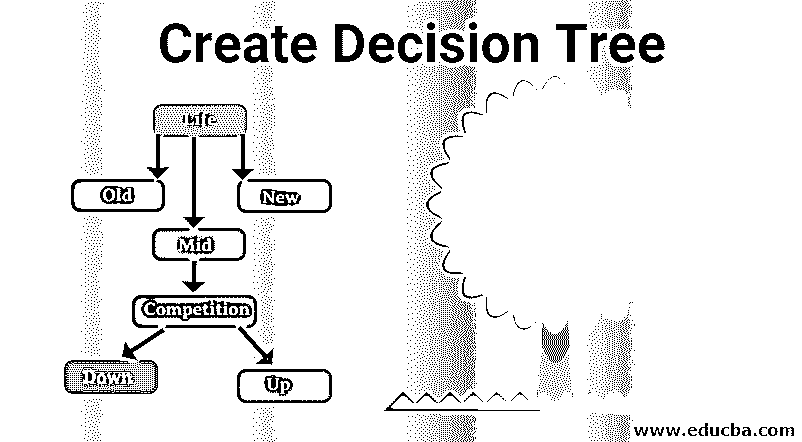
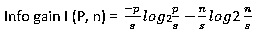
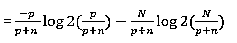
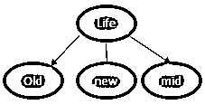
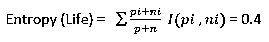

# 创建决策树

> 原文：<https://www.educba.com/create-decision-tree/>

## 创建决策树简介

以下文章提供了创建决策树的概要。随着最近由信息系统产生的用于处理大型数据集的数据量的快速增长，存在对决策树降低计算复杂度的显著需求。因此，决策树可以被认为是表示分类器的最重要的方法。换句话说，我们可以说数据是使用分而治之的策略构建的。决策树的结构是一个框架，可以精确计算每个节点级别的结果决策的值和概率，帮助决策者在各种不适当的数据中选择正确的预测。

### 什么是决策树？

决策树是一种二进制层次结构，它确定每个节点根据不同条件拆分数据集的方式。使用模型方法构建最佳树，对响应变量进行分类，该响应变量使用简单的决策规则(if-then-else 语句)预测目标变量的值。该方法是监督学习，主要用于分类问题，并且被认为是非常有效的预测模型。它们用于不同的应用领域，如博弈论、人工智能、机器学习、数据挖掘以及安全和医学等领域。

<small>Hadoop、数据科学、统计学&其他</small>

### 如何创建决策树？

决策树是以自顶向下的简单方式创建的；它们由形成有向节点的节点组成，有向节点的根节点没有传入边。所有其他节点称为决策节点(内部节点和对应于属性和类别标签的叶节点),至少有一条传入边。数据集的主要目标是通过在决策树中寻找最优解来最小化泛化错误。

下面用一个样本数据集来解释决策树的一个例子。目标是使用生活和竞争的属性来预测利润是下降还是上升。这里决策树变量是分类的(是，否)。

#### 数据集:

| **人生** | **比赛** | **类型** | **利润** |
| 老的 | 是 | 软件 | 向下 |
| 老的 | 不 | 软件 | 向下 |
| 老的 | 不 | 五金器具 | 向下 |
| 中间的 | 是 | 软件 | 向下 |
| 中间的 | 是 | 五金器具 | 向下 |
| 中间的 | 不 | 五金器具 | 向上 |
| 中间的 | 不 | 软件 | 向上 |
| 新的 | 是 | 软件 | 向上 |
| 新的 | 不 | 五金器具 | 向上 |
| 新的 | 不 | 软件 | 向上 |

从上面的数据集来看:寿命、竞争、类型是预测因素，属性利润是目标。有各种各样的算法来实现决策树，但是用于构建决策树的最佳算法是 ID3，它强调贪婪搜索方法。决策树遵循决策推理规则或析取正态 form(^).

#### 决策树:

最初，所有的训练属性都被认为是根。将属性放置为根的顺序优先级是通过以下方法完成的。这个过程对于属性选择来说是已知的，以识别哪个属性被设置为每个级别的根节点。树遵循两个步骤:树的构造，树的修剪。并且数据在所有决策节点中被拆分。

#### 信息增益:

它是基于独立变量的熵变化的度量。决策树必须找到最高的信息增益。

#### 熵:

熵被定义为对于有限集，数据中的随机性或事件可预测性的度量，如果样本是相似的值，那么熵是零，如果它与样本平分，那么它是一。

#### 类别的熵:

其中 p 是获得利润说'是'的概率，N 是损失说'否'。

因此，熵=1

一旦计算出熵值，就需要从属性中决定一个根节点。

#### 年龄熵:

根据生活属性的数据集，我们有老=3 下降，中= 2 下降和 1 上升关于利润标签。

| **人生** |  | **圆周率** | 倪 | **I(pi，ni)** |
| 老的 | Zero | Three | Zero |
| 中间的 | Two | Two | One |
| 新的 | Three | Zero | Zero |

增益=阶级熵–生命熵= 1–0.4 = 0.6

熵(竞争)= 0.87

| **比赛** |  | **圆周率** | 倪 | **I(pi，ni)** |
| 是 | One | Three | Zero point eight |
| 不 | Four | Two | Zero point nine |

增益=阶级熵–生命熵= 1–0.87 = 0.12

现在问题出现在属性生命中，mid 在向上和向下都有相等的概率。因此，熵是 1。类似地，再次为类型属性计算熵为 1，增益为 0。现在已经创建了一个完整的决策来获得中值的准确结果。

### 决策树的优点和缺点

下面给出了提到的优点和缺点:

#### 优势:

*   它们易于理解，生成的规则也很灵活。几乎不需要做数据准备。
*   一个可视化的方法来表示决策和结果是非常有用的。
*   决策树处理带有错误和缺失值的训练数据集。
*   它们可以处理离散值和数字属性。它处理输入和输出的分类变量和连续变量。
*   对于在特定条件下分析后必须做出决策的商业领域来说，它们是一个有用的工具。

#### 缺点:

*   学习者可以根据训练数据创建复杂的决策树。这个过程被称为过度拟合，这是决策树模型中的一个困难过程。
*   优选的值是分类的，如果它是连续的，决策树会丢失信息，导致容易出错。分析时指数计算增长更高。
*   许多分类标签会导致不正确的复杂计算，并降低数据集的预测精度。
*   在 DT 算法中获得的信息对分类较高的值给出了有偏的响应。

### 结论

因此，综上所述，决策树提供了一种实用而简单的学习方法，并且作为机器学习的有效工具而广为人知，因为在短时间内，它们在大数据集上表现良好。这是一项学习任务，它使用统计方法来得出一个概括的结论。现在更好地理解了为什么决策树被用于预测建模，对于数据科学家来说，它们是一个强大的工具。

### 推荐文章

这是一个创建决策树的指南。在这里，我们讨论如何创建一个决策树以及各种优点和缺点。您也可以浏览我们推荐的其他文章，了解更多信息——

1.  [R 中的决策树](https://www.educba.com/decision-tree-in-r/)
2.  [决策树算法](https://www.educba.com/decision-tree-algorithm/)
3.  [人工智能工具](https://www.educba.com/artificial-intelligence-tools/)
4.  [什么是决策树？](https://www.educba.com/what-is-decision-tree/)

