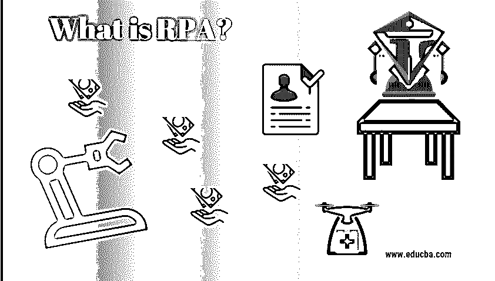
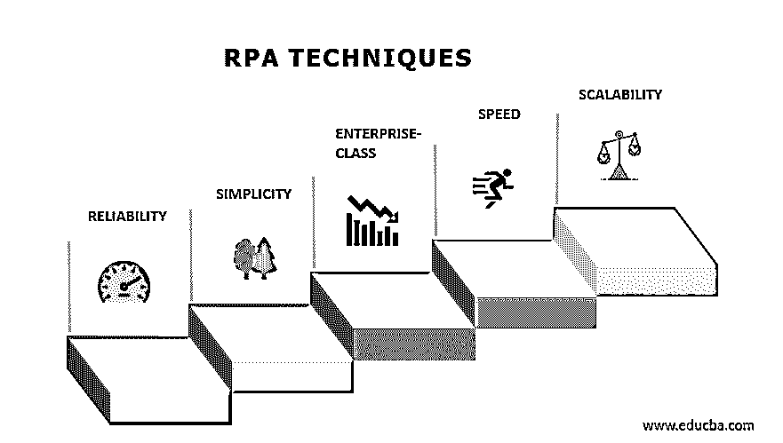

# RPA 是什么？

> 原文：<https://www.educba.com/what-is-rpa/>

## RPA 简介

随着世界转向使用技术变体，自动化也改进了简化我们工作的方式。虽然在 20 世纪 50 年代，自动化一词被创造出来，但很少有人理解它的含义。那么，这个博客里的 RPA 是什么呢？我将准确地谈论自动化、RPA 应用程序以及它们的不同变量。

### RPA 是什么？

RPA 代表机器人流程自动化。据说是在机器人的帮助下实现商业活动自动化的过程，以减少人工干预。

<small>Hadoop、数据科学、统计学&其他</small>

让我们详细阐述机器人流程自动化:

*   **机器人:**机器人实体被称为模仿人类动作的机器人。
*   过程:一个过程代表了导致重要工作的一系列步骤。例如，茶法或你最喜欢的菜，等等。
*   自动化:自动化是指机器人在没有人工干预的情况下执行的任何方法。

因此，当我们综合所有这些术语时，它也被称为机器人流程自动化，它模拟人类采取一系列措施导致重大活动的行动。它是一种技术应用程序，使用企业逻辑和结构化输入来自动化业务流程。企业可以设置软件或“机器人”软件来捕获和理解用于交易处理的应用程序，操纵信息，触发反应，并使用 RPA 工具与其他数字设备[进行通信。](https://www.educba.com/rpa-tools/)

### 它是如何工作的？

这一直是一个问题，它是否使用物理机器人或实际机器人可用于自动化任务。好吧，让我说，它不是对人的实际机器人的替代。但是市场上有软件可以让你配置工作流程来实现业务活动的自动化。不幸的是，我们的专家表示，由于缺乏市场专业知识，RPA 认证的需求将增长 130%。

### 如何启动机器人流程自动化？

*   **第一点:**深入了解 RPA 背后的历史。也就是说，学习传统自动化的一切。
*   **第二点:**学习 RPA 和不同的 RPA 应用。
*   **第三点:**选择你想要自动化的流程，回顾流程依赖。这是一种确保你的公司在实现任务自动化的同时不会失败的方法。
*   **第四点:**在 RPA 工具、[如 UiPath](https://www.educba.com/uipath-careers/) 、[蓝棱镜](https://www.educba.com/what-is-blue-prism/)以及自动化的任何地方获得全面的实用知识。

### RPA 的优点是什么？

德勤(Deloitte LP)董事总经理 David Schatsky 指出了银行在应用 RPA 方面的专业知识，其中部署了 85 个机器人，修改了 13 个程序，每年处理 150 万份申请。

*   确保遵守公司活动和程序的规定和标准。
*   机器人流程自动化可以帮助组织进行数字化之旅。
*   机器人流程自动化使公司能够降低员工成本和人为错误。
*   以便能够更快地完成程序。
*   通过数字化和过程数据审计提高效率。
*   创建一个手册，重复任务，节约成本。
*   提高员工工作效率。

### RPA 的应用有哪些？

下面给出了一个不同的应用:

**1。会计:**对于一般会计、运营会计、交易报告、
和预算组织，可以使用 RPA。

**2。医疗保健:**医疗机构可以使用它来处理病历、索赔、客户服务、账户管理、报告、[和数据分析](https://www.educba.com/what-is-data-analytics/)。

**

** 

**3。客户服务:**通过自动化联络中心职责，可以帮助企业提供更好的客户服务，包括电子签名验证、扫描记录上传和自动拒绝批准验证数据。

**

4。人力资源:**它可以实现人力资源功能的自动化，包括入职和离职、员工更新和时间表的提交程序。

**

5。金融服务:**金融服务公司可能会将 RPA 用于外汇支付、账户开立和关闭自动化、审计请求管理以及保险索赔处理

### RPA 里能找到什么？

当公司寻求 RPA 技术时，他们应该考虑几个因素，包括:

**1。可靠性:**随着企业开始使用自动完成数百甚至数千项任务的机器人，它们应该寻找能够提供集成监控和分析的工具，以监控其系统的健康状况。

**2。简单性:**组织应该为企业中的任何员工寻找足够简单的产品，以便为不同类型的工作构建和使用，包括数据收集和将内容转换为供领导者自己决定的信息。

**3。企业级:**公司应该从公司内部寻找旨在实现可扩展性、可靠性和管理效率的工具。

**4。速度:**公司应该能够在几个小时或更短的时间内快速开发、测试和优化机器人。
 **5。可扩展性:**组织不应选择要求他们部署桌面或虚拟化机器人的 RPA 软件。您应该寻找集中管理的大型 RPA 平台。

### 哪些企业使用机器人流程自动化？

采用 RPA 的众多公司包括沃尔玛、德意志银行、美国电话电报公司、先锋、安永、沃尔格林、Anthem 和美国运通全球商务旅行。我们已经完成了 RPA，并针对员工履行这些职责的情况对其进行了培训，”Thompson 说，他曾在西联汇款担任首席信息官时使用过类似的解决方案。美国运通全球商务旅行的首席信息官 David Thompson 实现了机票取消和退款的自动化。

### 结论

在本文中，我们了解了 RPA、它的工作原理、如何启动 RPA，以及它的应用和优势。

### 推荐文章

本文是什么是 RPA 的指南？在这里，我们讨论了它的工作原理、如何启动 RPA、它的应用和优势。您也可以浏览我们推荐的其他文章，了解更多信息——

1.  什么是测试自动化框架？
2.  [客户分析技术](https://www.educba.com/customer-analytics-techniques/)
3.  [什么是数据挖掘中的聚类？](https://www.educba.com/what-is-clustering-in-data-mining/)
4.  [了解各种数据仓库工具](https://www.educba.com/data-warehouse-tools/)

