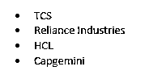
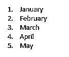

# Matlab 列表

> 原文：<https://www.educba.com/matlab-lists/>

## Matlab 列表介绍

MATLAB 列表可以是有序的、无序的、多层次的，并且可以在生成报告的程序中使用 DOM API 来创建和格式化。可以从 MATLAB 中的数组字符串创建列表，该字符串指定列表中的项目，或者创建一个项目逐个插入的列表。使用数组创建列表很容易，当项目中有多个元素时，通过逐个插入项目来创建列表很方便，比如表格或段落。

**语法:**

<small>Hadoop、数据科学、统计学&其他</small>

1.  在 MATLAB 中，我们将列表表示为[**mlreportgen . DOM . ordered list**](https://www.mathworks.com/help/rptgen/ug/mlreportgen.dom.orderedlist-class.html)或[**mlreportgen . DOM . unordered list**](https://www.mathworks.com/help/rptgen/ug/mlreportgen.dom.unorderedlist-class.html)对象
2.  [**mlreportgen . DOM . listitem**](https://www.mathworks.com/help/rptgen/ug/mlreportgen.dom.listitem-class.html)对象用于表示列表中的项目

**描述:**

1.  mlreportgen.dom.OrderedList 用于创建有序列表
2.  使用 mlreportgen.dom.UnorderedList 创建无序列表或项目符号列表

现在让我们来理解在 MATLAB 报告中创建列表的代码。

### Matlab 列表示例

让我们讨论 Matlab 列表的例子。

#### 示例#1

在第一个例子中，我们将在 MATLAB 报告中创建一个无序列表。该列表将从数组字符串中创建。下面是我们在这个例子中要遵循的步骤:

1.  导入库 mlreportgen.dom.*
2.  初始化要创建列表的文档
3.  使用 append 方法将列表项追加到文档中

**代码:**

`import mlreportgen.dom.*`

**【导入所需库】**

`Doc = Document("Employees", "html");`

**【初始化变量‘Doc’并在其中存储要追加的报告】**

`App = append(Doc, ["Tom", "Jack", "Berlin", “Ryan”, “Harris”]);`

**[使用数组字符串追加“雇员”报告]**

`close(Doc);`

**【追加后关闭报告】**

`rptview(Doc);`

**【打开“员工”报表，检查列表是否已创建】**

这是我们的输入和输出在 MATLAB 命令窗口中的样子:

**输入:**

`import mlreportgen.dom.*
Doc = Document("Employees", "html");
App = append(Doc, ["Tom", "Jack", "Berlin", "Ryan", "Harris"]);
close(Doc);
rptview(Doc);`

**输出:**

正如我们在输出中看到的，报告“Employees”现在像预期的那样附加了一个无序列表。

#### 实施例 2

让我们再举一个例子，在 MATLAB 报告中创建一个无序列表。该列表将从数组字符串中创建。下面是我们在这个例子中要遵循的步骤:

1.  导入库 mlreportgen.dom.*
2.  初始化要创建列表的文档
3.  使用 append 方法将列表项追加到文档中

**代码:**

`import mlreportgen.dom.*`

**【导入所需库】**

`Doc = Document("Organization", "html");`

**【初始化变量‘Doc’并在其中存储要追加的报告】**

`App = append(Doc, ["TCS", "Reliance Industries", “HCL", “Capgemini”]);`

**【使用数组字符串追加报告‘组织’】**

`close(Doc);`

**【追加后关闭报告】**

`rptview(Doc);`
T1】

这是我们的输入和输出在 MATLAB 命令窗口中的样子:

**输入:**

`import mlreportgen.dom.*
Doc = Document("Organization", "html");
App = append(Doc, ["TCS", "Reliance Industries", "HCL", "Capgemini"]);
close(Doc);
rptview(Doc);`

**输出:**

正如我们在输出中看到的，报告“Organization”现在如预期的那样附加了一个无序列表。

在上面的两个例子中，我们使用一个数组字符串创建了无序列表。接下来，我们将学习使用数组字符串创建一个有序列表。

#### 实施例 3

在这个例子中，我们将在 MATLAB 报告中创建一个有序列表。该列表将从数组字符串中创建。下面是我们在这个例子中要遵循的步骤:

1.  导入库 mlreportgen.dom.*
2.  初始化要创建列表的文档
3.  将输入数组字符串传递给有序列表构造函数
4.  使用 append 方法将列表项追加到文档中

**代码:**

`import mlreportgen.dom.*`

**【导入所需库】**

`Doc = Document("Months", "html");`

**【初始化变量‘Doc’并在其中存储要追加的报告】**

`NewList= OrderedList(["January", "February", "March", "April", "May"]);`

**【创建一个新变量并在其中存储一个有序列表】**

`append(Doc, NewList);`

**[使用在上述步骤中创建的“新列表”附加“月份”报告]**

`close(Doc);`

**【追加后关闭报告】**

`rptview(Doc);`

**【打开‘月’报表检查列表是否创建】**

这是我们的输入和输出在 MATLAB 命令窗口中的样子:

**输入:**

`import mlreportgen.dom.*
Doc = Document("Months", "html");
NewList = OrderedList(["January", "February", "March", "April", "May"]);
append(Doc, NewList);
close(Doc);
rptview(Doc);`

**输出:**

正如我们在输出中看到的，报告“Months”现在按照预期附加了一个有序列表。

#### 实施例 4

在这个例子中，我们将在 MATLAB 报告中创建另一个有序列表。该列表将从数组字符串中创建。下面是我们在这个例子中要遵循的步骤:

1.  导入库 mlreportgen.dom.*
2.  初始化要创建列表的文档
3.  将输入数组字符串传递给有序列表构造函数
4.  使用 append 方法将列表项追加到文档中

**代码:**

`import mlreportgen.dom.*`

**【导入所需库】**

`Doc = Document("Countries", "html");`

**【初始化变量‘Doc’并在其中存储要追加的报告】**

`NewList= OrderedList(["India", "Australia", "Japan", "USA", "UK"]);`

**【创建一个新变量并在其中存储一个有序列表】**

`append(Doc, NewList);`

**[使用上述步骤中创建的“新列表”附加“国家”报告]**

`close(Doc);`

**【追加后关闭报告】**

RPT view(Doc)；

**[打开“国家”报告，检查列表是否已创建]**

这是我们的输入和输出在 MATLAB 命令窗口中的样子:

**输入:**

`import mlreportgen.dom.*
Doc = Document("Countries", "html");
NewList = OrderedList(["India", "Australia", "Japan", "USA", "UK"]);
append(Doc, NewList);
close(Doc);
rptview(Doc);`

**输出:**

**T2】**

 **正如我们在输出中看到的，报告“Countries”现在像预期的那样附加了一个有序列表。

### 结论

mlreportgen.dom.OrderedList 用于在 MATLAB 中创建有序列表。mlreportgen.dom.UnorderedList 用于在 MATLAB 中创建无序列表或项目符号列表。可以将项目添加到使用数组字符串创建的列表中。

### 推荐文章

这是一个 Matlab 列表指南。这里我们分别讨论 Matlab 列表的介绍、语法、示例和代码实现。您也可以看看以下文章，了解更多信息–

1.  [Matlab 符号](https://www.educba.com/matlab-syms/)
2.  [Matlab 变量](https://www.educba.com/matlab-variables/)
3.  [带通滤波器 Matlab](https://www.educba.com/bandpass-filter-matlab/)
4.  [Matlab 编写](https://www.educba.com/matlab-fwrite/)

**