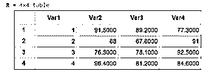
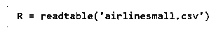
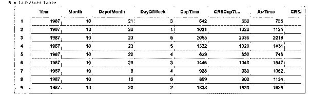
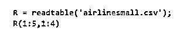
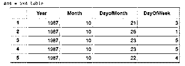

# Matlab 可读表格

> 原文：<https://www.educba.com/matlab-readtable/>

## matlab 可读介绍

MATLAB 中的 Read table 函数用于通过读取文件中以列的形式呈现的数据来创建新的表格。read table 函数可以从中读取数据的文件可以是文本文件、逗号分隔文件或 csv 文件，或者其他 excel 工作簿。通过读取文本文件来创建表格的功能也可以在 MATLAB 中使用内置的导入工具来实现。请注意，我们将在本文中使用内置的 MATLAB 文件。您可以使用相同的代码从本地机器中存储的文件创建表。在本主题中，我们将学习 Matlab readtable。

**读表函数语法:**

<small>Hadoop、数据科学、统计学&其他</small>

`R = readtable (file)`

`R = readtable (file, x, y)`

**语法描述:**

1.  R = readtable (file)用于在 MATLAB 中通过读取名为‘file’的文件中的数据来创建表格。这里的“文件”可以是文本、csv 或任何其他具有面向列的字段的 excel 文件。
2.  R = readtable (file，x，y)用于通过读取名为' file '的文件中的数据，在 MATLAB 中创建一个表。这里传递的额外参数用于控制我们从输入数据文件创建的表的类型。我们可以控制参数，如列的格式，行数或列数

### matlab 可读的例子

现在让我们理解在 MATLAB 中创建用户定义函数的代码

#### 示例#1

在本例中，我们将使用 readtable 函数从内置文本文件中读取数据，从而在 MATLAB 中创建一个表格。以下是需要遵循的步骤:

1.  用要读取的文件作为输入参数初始化函数 readtable
2.  对于本例，我们将使用名为“grades.txt”的内置文本文件

**代码:**

`R = readtable (‘grades.txt’)
[Initializing the readtable function and passing the in-built file ‘grades.txt’ as the argument] [readtable function will read this text file and will give a table as an output]`

这是我们的输入和输出在 MATLAB 中的样子:

**输入:**

**输出:**

正如我们在输出中看到的，readtable 函数已经读取了 grades.txt 文本文件，并给出了一个表作为输出。

在上面的例子中，文本文件只有 4 行 4 列；我们的输出表很小。然而，可能有这样的情况，我们有一个非常大的文件，我们只需要以表格的形式查看其中的一小部分。

#### 实施例 2

在本例中，我们将使用 readtable 函数从内置文本文件中读取数据，从而在 MATLAB 中创建一个表格。我们将在这个例子中使用的文件有 123523 行和 29 列。因此，我们将首先为整个文件创建一个表，在下一个例子中，我们将看到如何获得这个表的一个子集。以下是需要遵循的步骤:

1.  用要读取的文件作为输入参数初始化函数 readtable
2.  对于本例，我们将使用名为“airlinesmall.csv”的内置 csv 文件

**代码:**

`R = readtable (‘airlinesmall.csv)
[Initializing the readtable function and passing the in-built file ‘airlinesmall.csv’ as the argument] [readtable function will read this csv file and will give a table as an output]`

这是我们的输入和输出在 MATLAB 中的样子:

**输入:**

**输出:**

正如我们在输出中看到的，readtable 函数已经读取了 airlinesmall.csv 文件，并给出了一个表作为输出。由于输出表太大，无法在一个屏幕中显示，所以我们在输出中使用了滚动选项。

接下来，我们将学习如何获得这个表的一个子集作为输出。

#### 实施例 3

在本例中，我们将使用相同的“airlinesmall.csv”文件在 MATLAB 中创建一个表，但将创建整个表的子集。正如我们在前一个例子的输出中注意到的,' airlinesmall '数据中的行数和列数分别是 123523 和 29。因此，我们现在将创建一个 5 行 4 列的子表。以下是需要遵循的步骤:

1.  用要读取的文件作为输入参数初始化函数 readtable
2.  这里我们也将使用名为“airlinesmall.csv”的内置 csv 文件
3.  传递我们需要的范围作为参数

**代码:**

`R = readtable (‘airlinesmall.csv)
[Initializing the readtable function and passing the in-built file ‘airlinesmall.csv’ as the argument] R (1:5, 1:4)
[Passing the range, we need as argument]`

这是我们的输入和输出在 MATLAB 中的样子:

**输入:**

**输出:**

正如我们在输出中看到的，readtable 函数将范围作为参数传递，读取了 airlinesmall.csv 文件，并给出了一个子表作为输出。

### 结论

1.  通过使用 readtable 函数，我们可以在 MATLAB 中通过从文件中读取数据来创建一个表。
2.  不同的文件扩展名，如。txt，。csv 可以作为参数传递给 readtable 函数
3.  如果需要，我们可以使用 readtbale 函数来获取整个表的子集。

### 推荐文章

这是一个 Matlab 可读的指南。这里我们讨论 Matlab 可读的例子以及输入和输出。您也可以看看以下文章，了解更多信息–

1.  [Matlab 反斜杠](https://www.educba.com/matlab-backslash/)
2.  [Matlab 绘图图](https://www.educba.com/plot-graph-matlab/)
3.  [Matlab Saveas](https://www.educba.com/matlab-saveas/)
4.  [脉冲响应 Matlab](https://www.educba.com/impulse-response-matlab/)

