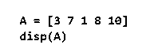
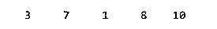
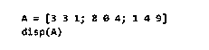
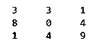
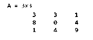
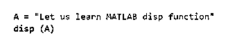
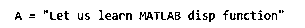
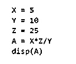
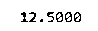
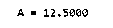

# Matlab disp(消歧义)

> 原文：<https://www.educba.com/matlab-disp/>

## Matlab 显示简介

Disp 函数在 MATLAB 中用来显示任何代码的输出，而不显示输入变量。当我们的代码不是很长或者不容易理解，并且不需要显示输入变量时，可以使用这个函数。

例如，如果我们使用 disp 函数显示存储在变量“A”中的字符串“MATLAB Disp function”，我们的输出将是“MATLAB Disp function”。但是，如果我们不使用 disp 函数，我们的输出将是 A = 'MATLAB Disp function '。

<small>Hadoop、数据科学、统计学&其他</small>

**disp 函数的语法:**

`disp (A)`

**显示功能描述:**

disp (A)函数用于显示或打印存储在变量' A '中的值，而不打印变量的名称

### Matlab 显示示例

现在让我们了解一下在 MATLAB 中使用 disp 函数的代码。

#### 示例#1

在这个例子中，我们将使用 disp 函数来显示向量的元素。以下是需要遵循的步骤:

1.  初始化输入向量
2.  使用 disp 函数显示矢量的元素

**代码:**

`A = [3 7 1 8 10] [Initializing an input vector and storing it in a variable ‘A’] disp (A)
[Using the disp function to display the value stored in the variable ‘A’]`

这是我们的输入和输出在 MATLAB 中的样子:

**输入:**

**输出:**

正如我们在输出中看到的，我们已经通过使用 disp 函数获得了存储在变量“A”中的值(即本例中的元素)。

**T2】**

 **如果我们在不使用 disp 函数的情况下打印输出，它将如下所示:

请注意，在这种情况下，甚至变量名也会显示在输出中。

#### 实施例 2

在这个例子中，我们将使用 disp 函数来显示矩阵的元素。以下是需要遵循的步骤:

1.  初始化输入矩阵
2.  使用 disp 函数显示矩阵的元素

**代码:**

`A = [3 3 1; 8 0 4; 1 4 9] [Initializing a 3 x 3 input matrix and storing it in a variable ‘A’] disp (A)
[Using the disp function to display the value stored in the variable ‘A’]`

这是我们的输入和输出在 MATLAB 中的样子:

**输入:**

**输出:**

正如我们在输出中看到的，我们已经通过使用 disp 函数获得了存储在变量“A”中的值(即本例中的矩阵元素)。

如果我们在不使用 disp 函数的情况下打印输出，它将如下所示:

请注意，在这种情况下，甚至变量名也会显示在输出中。

#### 实施例 3

在这个例子中，我们将使用 disp 函数来显示一个字符串。以下是需要遵循的步骤:

1.  初始化输入字符串
2.  使用 disp 函数显示字符串

**代码:**

`A = "Let us learn MATLAB disp function"
[Initializing a string and storing it in a variable ‘A’] disp (A)
[Using the disp function to display the value stored in the variable ‘A’]`

这是我们的输入和输出在 MATLAB 中的样子:

**输入:**

**输出:**

正如我们在输出中看到的，我们已经通过使用 disp 函数获得了存储在变量“A”中的值(即本例中的一串单词)。

如果我们在不使用 disp 函数的情况下打印输出，它将如下所示:

请注意，在这种情况下，甚至变量名也会显示在输出中。

#### 实施例 4

在本例中，我们将使用 disp 函数来显示数学表达式的输出。以下是需要遵循的步骤:

1.  初始化表达式中涉及的变量
2.  使用 disp 功能显示输出

**代码:**

`X = 5
[Initializing the 1st input variable] Y = 10
[Initializing the 2nd input variable] Z = 25
[Initializing the 3rd input variable] A = X * Z / Y
[Mathematical expression to be solved] disp (A)
[Using the disp function to display the value stored in the variable ‘A’]`

这是我们的输入和输出在 MATLAB 中的样子:

**输入:**

**输出:**

正如我们在输出中看到的，我们已经通过使用 disp 函数获得了存储在变量“A”中的输出值。

如果我们在不使用 disp 函数的情况下打印输出，它将如下所示:

请注意，在这种情况下，甚至变量名也会显示在输出中。

### 结论

1.  我们使用 disp 函数显示存储在变量中的值，而不打印变量名。
2.  如果我们希望我们的输出看起来整洁，除了实际输出没有任何其他信息，可以使用它。

### 推荐文章

这是一个 Matlab 显示指南。这里我们讨论 Matlab disp 的例子以及在 Matlab 中使用 disp 函数的代码。您也可以看看以下文章，了解更多信息–

1.  [什么是 Matlab？](https://www.educba.com/what-is-matlab/)
2.  [Matlab 极限](https://www.educba.com/matlab-limit/)
3.  [Matlab textread](https://www.educba.com/matlab-textread/)
4.  [脉冲响应 Matlab](https://www.educba.com/impulse-response-matlab/)

**