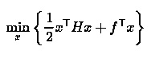
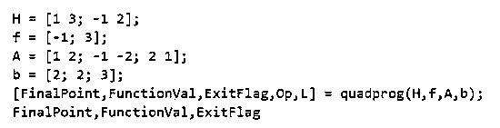
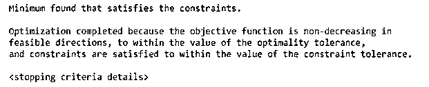
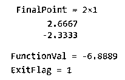
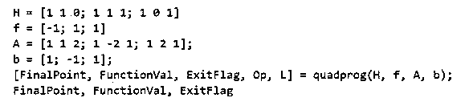
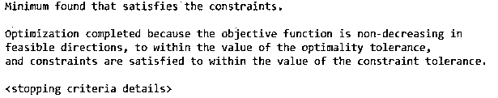
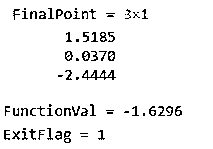
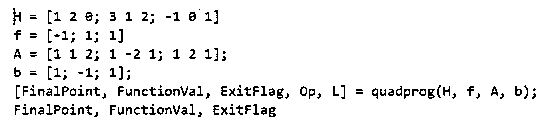
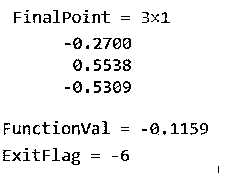

# Matlab quadprog

> 原文：<https://www.educba.com/matlab-quadprog/>

## Matlab quadprog 简介

以下文章提供了 Matlab quadprog 的概要。quadprog 或二次规划用于最小化或最大化受到各种约束的输入目标函数。二次规划在数学中用于寻找向量“x”，最小化定义为 minx{1/2 * x^T *Hx + f^T * x}的二次函数。

或者

<small>Hadoop、数据科学、统计学&其他</small>

以下约束适用于二次函数:

*   Ax ≤ b(不等式约束)
*   Ax = b(等式约束)
*   下限≤ x ≤上限(边界约束)

在现实世界中，二次规划用于解决问题，包括发电、投资组合管理、设计优化等。

**quad Prog 函数的语法**

下面给出了提到的语法:

`x = quadprog (H, f, A, b)`

**说明:**

*   x = quadprog (H，f，a，b)用于最小化二次函数 1/2 * x^T * Hx + f^T * x 受约束 A*x ≤ b

注意，对于二次规划，如果我们需要我们的问题给出一个有限的最小值，输入矩阵‘H’必须是正定的。

### Matlab quadprog 示例

下面给出了 Matlab quadprog 的例子:

#### 示例#1

此示例将使用 quadprog 函数来最小化目标函数“1/2 * x^T *Hx + f^T * x”。对于这个例子，我们将使用一个 3 x 3 的输入矩阵。

以下是需要遵循的步骤:

*   为输入目标函数初始化一个 2×2 输入矩阵‘H’。
*   初始化输入目标函数的向量“f”。
*   声明所需的约束。
*   使用 quadprog 函数最小化目标函数。

**代码:**

h =[1 3；-1 2][初始化输入目标函数的矩阵‘H]

f =[-1；3][初始化输入目标函数的向量‘f ’]

a =[1 0；-1 -2;0 1];
b =[2；2;3];
【声明约束】【FinalPoint，FunctionVal，ExitFlag，Op，L】= quad Prog(H，f，A，b)；
[使用 quadprog 函数获取目标函数所需的值]

终结点，函数值，退出标志

**输入:**

**输出:**

**输出 1:**

**输出 2:**

正如我们在输出中看到的，我们的目标函数现在在我们定义的约束下被最小化。此外，我们已经获得了出口标志为 1，这意味着我们已经获得了目标函数的局部最小值。

#### 实施例 2

此示例将使用 quadprog 函数来最小化目标函数“1/2 * x^T *Hx + f^T * x”。对于这个例子，我们将使用一个 3 x 3 的输入矩阵。

以下是需要遵循的步骤:

*   为输入目标函数初始化一个 3 x 3 的输入矩阵‘H’。
*   初始化输入目标函数的向量“f”。
*   声明所需的约束。
*   使用 quadprog 函数最小化目标函数。

**代码:**

h =[1 1 0；1 1 1;1 0 1][初始化输入目标函数的矩阵‘H]

f =[-1；1;1][初始化输入目标函数的向量‘f ’]

a =[1 1 2；1 -2 1;1 2 1];
b =[1；-1;1];
【声明约束】【FinalPoint，FunctionVal，ExitFlag，Op，L】= quad Prog(H，f，A，b)；
[使用 quadprog 函数获取目标函数所需的值]

**输入:**

**输出:**

**输出 1:**

**输出 2:**

正如我们在输出中看到的，我们的目标函数现在在我们定义的约束下被最小化。此外，我们已经获得了出口标志为 1，这意味着我们已经获得了目标函数的局部最小值。

在上面的两个例子中，输入矩阵‘H’是凸的，即正定的，因此我们得到了一个局部最小值。如果我们的矩阵不是凸的，我们就不会得到局部最小值。

#### 实施例 3

此示例将使用 quadprog 函数来最小化目标函数“1/2 * x^T *Hx + f^T * x”。对于这个例子，我们将使用一个 3 x 3 的输入矩阵。

以下是需要遵循的步骤:

*   为输入目标函数初始化一个 3×3 的输入矩阵“H ”,使得该矩阵不是正定的。
*   初始化输入目标函数的向量“f”。
*   声明所需的约束。
*   使用 quadprog 函数最小化目标函数。

**代码:**

h =[1 2 0；3 1 2;-101][初始化输入目标函数的矩阵‘H]

f =[-1；1;1][初始化输入目标函数的向量‘f ’]

a =[1 1 2；1 -2 1;1 2 1];
b =[1；-1;1];
【声明约束】【FinalPoint，FunctionVal，ExitFlag，Op，L】= quad Prog(H，f，A，b)；
[使用 quadprog 函数获取目标函数所需的值]

**输入:**

**输出:**

**输出 1:**

**输出 2:**

正如我们在输出中看到的，退出标志是-6，这意味着我们还没有获得目标函数的任何局部最小值。

### 结论

我们使用 quadprog 函数来寻找我们的目标函数的局部最小值，该目标函数受到一些约束。只有当矩阵 H 本质上是正定的，我们才能得到局部极小值。

### 推荐文章

这是一个 Matlab quadprog 的指南。这里我们讨论一下 Matlab quadprog 的介绍和例子，以便更好的理解。您也可以看看以下文章，了解更多信息–

1.  [什么是 Matlab？](https://www.educba.com/what-is-matlab/)
2.  [Matlab 极限](https://www.educba.com/matlab-limit/)
3.  [Matlab 绘图图](https://www.educba.com/plot-graph-matlab/)
4.  [绝对值 Matlab](https://www.educba.com/absolute-value-matlab/)

