# Matlab 转置

> 原文：<https://www.educba.com/matlab-transpose/>

## Matlab 转置简介

转置在数学中用于交换输入矩阵的行和列。因此，如果我们有一个 2 x 3 的矩阵作为输入，转置函数将给出一个 3 x 2 的矩阵作为输出。在 Matlab 中，我们使用“转置函数”来计算矩阵或向量的转置。对于具有“n”个元素的向量，转置函数给出“n×1”矩阵作为输出(“n”行和 1 列)。

**转置函数语法:**

<small>Hadoop、数据科学、统计学&其他</small>

`T = transpose (M)`

`T = M.’`

**说明:**

*   T = transpose (M)用于计算输入矩阵‘M’的转置，即它将交换矩阵‘M’的行和列。
*   T = M '是计算转置的另一种方式。它将给出与上述语法相同的输出。

### Matlab 转置示例

下面是 Matlab 转置的例子:

#### 示例#1

在这个例子中，我们将使用转置函数来计算一个 2 x 2 实矩阵的转置。

以下是需要遵循的步骤:

*   初始化输入矩阵。
*   将此输入矩阵作为参数传递给转置函数。

**代码:**

m =[6-5；1 6][初始化 2 x 2 输入矩阵]

T =转置(M)
【使用转置函数计算输入矩阵的转置】

**输入:**

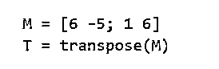

**输出:**

**转置前:**

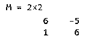

**转置后:**

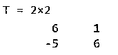

正如我们在输出中看到的，转置函数交换了输入矩阵的行和列。

#### 实施例 2

在这个例子中，我们将使用转置函数来计算一个 3 x 3 实矩阵的转置。

以下是需要遵循的步骤:

*   初始化输入矩阵。
*   将此输入矩阵作为参数传递给转置函数。

**代码:**

m =[2-1 4；1 16 2;0-4 3][初始化 3 x 3 输入矩阵]

T =转置(M)
【使用转置函数计算输入矩阵的转置】

**输入:**

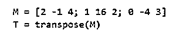

**输出:**

**转置前:**

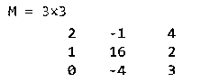

**转置后:**

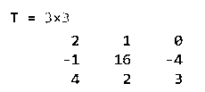

正如我们在输出中看到的，转置函数交换了输入矩阵的行和列。

在上面的两个例子中，我们的输入矩阵是实数元素。

接下来，让我们举一个例子，我们的输入矩阵也有复杂的元素。

#### 实施例 3

在这个例子中，我们将使用转置函数来计算一个 3×3 复矩阵的转置。

以下是需要遵循的步骤:

*   用复杂元素初始化输入矩阵。
*   将此输入矩阵作为参数传递给转置函数。

**代码:**

m =[2+3i 1-4 I 1；1+3i 0 3-2i；0 3 2][用复杂元素初始化 3 x 3 输入矩阵]

T =转置(M)
【使用转置函数计算输入矩阵的转置】

**输入:**

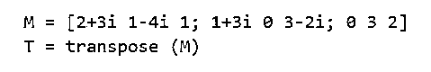

**输出:**

**转置前:**

**转置后:**

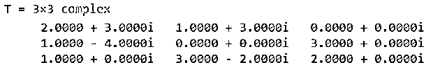

正如我们在输出中看到的，转置函数交换了输入复矩阵的行和列。

在上面的 3 个例子中，我们使用了一个方阵作为输入。

接下来，我们将使用一个非方阵作为转置函数的输入。

#### 实施例 4

在这个例子中，我们将使用转置函数来计算一个 2 x 3 实矩阵的转置。

以下是需要遵循的步骤:

*   初始化输入矩阵。
*   将此输入矩阵作为参数传递给转置函数。

**代码:**

m =[1 6 4；14-2][初始化 2×3 输入矩阵]

T =转置(M)
【使用转置函数计算输入矩阵的转置】

**输入:**

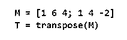

**输出:**

**转置前:**

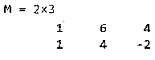

**转置后:**

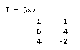

正如我们在输出中看到的，转置函数交换了非方形输入矩阵的行和列。

在上面的 4 个例子中，我们使用了一个矩阵作为转置函数的输入。

接下来，我们将使用转置函数来计算向量输入的转置。

#### 实施例 5

在这个例子中，我们将使用转置函数来计算一个包含 5 个元素的向量的转置。

以下是需要遵循的步骤:

*   用 5 个元素初始化输入向量。
*   将这个输入向量作为参数传递给转置函数。

**代码:**

m =[8-11 4 5 7][用 5 个元素初始化输入向量]

T = transpose (M)
【使用转置函数计算输入向量的转置】请注意，由于我们的输入有 5 列 1 行，所以我们的输出将有 5 行 1 列。

**输入:**

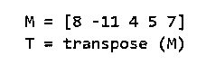

**输出:**

**转置前:**

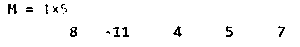

**转置后:**

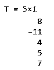

正如我们在输出中看到的，转置函数交换了输入向量的行和列。

### 结论

我们使用转置函数来计算矩阵的转置，即交换矩阵的行和列。转置函数可用于实矩阵和复矩阵。对于向量输入，转置函数会将向量中的许多元素转换为输出的许多行。

### 推荐文章

这是一个 Matlab 转置指南。这里我们讨论 Matlab 转置的介绍和例子，以便更好的理解。您也可以看看以下文章，了解更多信息–

1.  [什么是 Matlab？](https://www.educba.com/what-is-matlab/)
2.  [Matlab 极限](https://www.educba.com/matlab-limit/)
3.  [Matlab 绘图图](https://www.educba.com/plot-graph-matlab/)
4.  [绝对值 Matlab](https://www.educba.com/absolute-value-matlab/)

