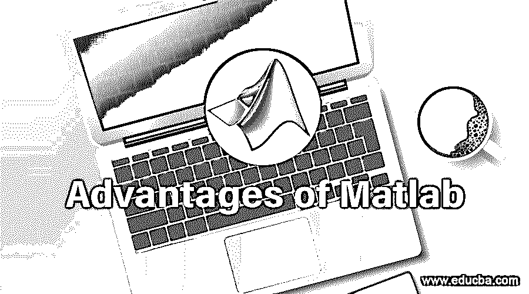

# Matlab 的优势

> 原文：<https://www.educba.com/advantages-of-matlab/>

## Matlab 简介

本文将介绍 Matlab 的概况以及 Matlab 的优势。[Mathworks 公司提供矩阵实验室或 Matlab](https://www.educba.com/matrix-in-matlab/) ，这是一个用于执行数学计算、编程和可视化的编程环境。它是一个强大的工具，包括其高级语言和功能，用于更快地执行数学相关的任务。它在许多组织中用于处理现实世界中的问题，降低了复杂性，并有助于更容易地向他人解释结果。

### Matlab 的十大优势

Matlab 环境中有许多可用的特性或功能，这使得它比许多其他的[编程语言](https://www.educba.com/what-is-a-programming-language/)更好。Matlab 的一些特性是不同的预定义函数、与其他环境的集成支持以及用于自定义绘图和图形的可视化工具。请注意以下几点，这证明了 Matlab 被广泛应用于许多领域。

<small>Hadoop、数据科学、统计学&其他</small>

1.  Matlab 环境有其预定义的函数和库，这有助于程序员方便地使用它。我们在日常生活中面临着各种复杂的数学问题；这可以在 Matlab 中用单个函数或代码来执行。类似地，Matlab 提供了一系列工具箱，用于航空航天工程、通信和信号处理等许多领域。
2.  Matlab 支持各种平台，如 LINUX、不同版本的 Windows 等。因此，在一个平台上编写的程序或应用文件也可以在另一个平台上运行或读取，这使得它更加高效和有效。
3.  Matlab 不需要编译器来执行代码，所以如果我们写几行代码，我们将立即得到其他编程语言(如 C、C++)无法得到的结果。这使得在 Matlab 中解释和实现代码变得更加容易。然而，这个过程有点慢，因此， [Matlab 编译器是可用的](https://www.educba.com/matlab-compiler/)，它可以用来更快地运行程序。
4.  Matlab 有许多用于可视化的内置命令，这些命令是绘图和其他应用程序所需要的。它们可以通过任何连接到安装 Matlab 的设备的输出设备来查看。它还可以用来轻松处理图像和视频。这使得 Matlab 成为一个伟大的可视化工具，使绘图变得容易。
5.  Matlab 也用于进行数据分析。无论是 excel 还是数据库，都有不同的来源可以集成。将数据集导入环境后，它提供了各种工具和库来执行清理和其他技术，以使数据适合于进一步分析。在移除不需要的信息后，我们必须根据业务目标建立一个模型。它有自己的工具包、软件包和模型开发功能，如逻辑回归、聚类、随机森林和支持向量模型。在构建模型之后，可以使用模型细化工具来比较不同的模型，并提供具有更好准确性的模型，该模型可以在生产中部署。因此，从最初的分析方法到最后，所有的功能都在 Matlab 中，这使它成为一个伟大的数据分析工具。
6.  Matlab 编码器也有助于将 Matlab 中的代码转换成任何其他语言，如 C++，JAVA 等。这增加了可读性并帮助程序员容易地阅读代码。
7.  Matlab 提供深度学习工具和库，包括在其最新版本中，以产生所需的结果。它包含了这个重要的库，可用于许多其他领域，如控制系统、通信、图像和信号处理。
8.  Matlab 有其预定义的库和工具，使用户能够为他们各自的程序构建 [GUI(图形用户界面)](https://www.educba.com/what-is-gui/)。这对于之前没有任何 Matlab 经验和知识的用户来说也是一个很大的帮助。
9.  Matlab Online 提供平台的知识和使用，无需下载和安装软件。如果您可以访问互联网，您可以使用任何网络浏览器来使用它。
10.  它有与环境中使用的任何函数或库相关的编写良好的帮助文档。各种在线研讨会，每半年更新有关不同的错误是在市场上推出，这有助于用户学习容易。

### 结论–Matlab 的优势

众多的优势证明 Matlab 是一个伟大的工具，其中信息分析是首选的任务。如果工作涉及一些研究，那么选择 Matlab 而不是任何其他工具几乎在每个领域都是正确的选择，因为它有许多概述功能，可以提供更好的见解。

### 推荐文章

这是一个 Matlab 优势的指南。在这里，我们详细讨论了 Matlab 的十大优势，以及证明 Matlab 是一个伟大工具的大量资产。您也可以浏览我们推荐的其他文章，了解更多信息——

1.  [MATLAB 中数据类型概述](https://www.educba.com/data-types-in-matlab/)
2.  [Matlab 运算符|前五名](https://www.educba.com/matlab-operators/)
3.  [MATLAB 面试试题及其用法](https://www.educba.com/matlab-interview-questions/)
4.  [MATLAB 与 R |最大差异](https://www.educba.com/matlab-vs-r/)
5.  [MATLAB 函数](https://www.educba.com/matlab-functions/)
6.  [Matlab 编译器| Matlab 编译器的应用](https://www.educba.com/matlab-compiler/)

