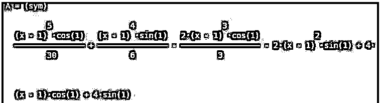

# 泰勒级数 Matlab

> 原文：<https://www.educba.com/taylor-series-matlab/>

## 泰勒级数 Matlab 简介

下面的文章提供了泰勒级数 Matlab 的大纲。泰勒级数用于将函数展开成无穷多个项的和。泰勒级数用函数在某一点的导数来表示函数。

**举例:**

<small>Hadoop、数据科学、统计学&其他</small>

**e^x 的泰勒级数= 1 + x + x^2/2！+ x^3/3！+ x^4/4！+ x^5/5！+ …**

从上面的例子可以看出，我们已经把'e^x'函数分解成了一个无限次的多项式。它在现代物理学中的应用是通过把复杂的计算分解成简单的项的和来简化它们。在 Matlab 中，我们使用“泰勒”函数来获得任何函数的泰勒级数。

**语法:**

`A = taylor (Fx, p)`

`A = taylor (Fx, p, a)`

`A = taylor (Fx, Name, Value)`

**说明:**

*   taylor (Fx，p)将计算输入函数的泰勒级数。默认情况下，该系列计算到第 5 个阶，以“p = 0”为点。
*   taylor (Fx，p，a)将计算点 p = a 处输入函数的泰勒级数。
*   taylor (Fx，Name，Value)可用于放置附加条件，这些附加条件可使用成对参数(Name，Value)来指定。

### 泰勒级数 Matlab 实例

现在让我们看看在 Matlab 中使用“taylor (Fx，p) function”进行计算的代码:

#### 示例#1

在本例中，我们将使用一个简单的 cos 函数，并使用泰勒级数函数对其进行扩展。

我们将遵循以下 2 个步骤:

*   在 Matlab 中创建 cos 函数。
*   使用“泰勒函数”计算泰勒级数。

**语法:**

`syms x
[Initializing the variable ‘x’] A = taylor (5* cos (x))`

[Creating the cos function and passing it as an input to the taylor function] [Please note that, since we did not pass any value for point ‘p’, the Taylor series will be computed at the point p = 0, by default] [Mathematically, the Taylor series of 5*cos(x) is (5*x^4)/24 – (5*x^2)/2 + 5]

**代码:**

`syms x
A = taylor (5* cos (x))`

**输出:**

**

** 

现在让我们看看，如果我们想使用我们选择的泰勒级数的点，泰勒级数的代码在 Matlab 中是什么样子的。为此，我们将使用“taylor (Fx，p，a)”函数，并将为“p”传递一些值。

#### 实施例 2

在本例中，我们将使用正弦函数，并在点 p = 1 处找到泰勒级数。

我们将遵循以下 2 个步骤:

*   在 Matlab 中创建正弦函数。
*   使用“taylor (Fx，p，a) function”计算泰勒级数，并将“p”作为 1 传递。

**语法:**

`syms x
[Initializing the variable ‘x’] A = taylor(4*sin(x)) x, 1)`

[Creating the polynomial function of sine and passing it as an input to the taylor function] [Please note that we have passed ‘x’, ‘1’ as arguments, which represent the point x = 1] [Mathematically, the Taylor series of 4*sin (x) at point x = 1 is4*sin(1) – 2*sin(1)*(x – 1)^2 + (sin(1)*(x – 1)^4)/6 + 4*cos(1)*(x – 1) – (2*cos(1)*(x – 1)^3)/3 + (cos(1)*(x – 1)^5)/30

**代码:**

`syms x
A = taylor(4*sin(x), x, 1)`

**输出:**

**

** 

如果我们需要使用“名称”、“值”对参数添加更多条件，现在让我们看看泰勒级数的代码是什么样子。为此，我们使用“taylor (Fx，Name，Value)”函数。

#### 实施例 3

在本例中，我们将使用与上例中相同的多项式函数，但将发现泰勒级数仅到第 2 阶和第阶。

我们将遵循以下 2 个步骤:

*   创建余弦和正弦函数。
*   使用函数“taylor (Fx，Name，Value)”计算泰勒级数。

**语法:**

`syms x
[Initializing the variable ‘x’] A = taylor ((5*cos (x) + 4*sin (x)), x, 1, 'Order', 2)`

[Creating the polynomial function of cos & sine and passing it as an input to the taylor function] [Please note that we have passed ‘Order’, ‘2’ as name-value pair arguments] [Mathematically, the taylor series of 5*cos (x) + 4*sin (x) at point x = 1 and order 2 is 5*cos (1) + 4*sin (1) + (x – 1) * (4*cos (1) – 5*sin (1))]

**代码:**

`syms x
A = taylor ((5*cos (x) + 4*sin (x)), x, 1, 'Order', 2)`

**输出:**

**

** 

### 结论

一个函数的泰勒级数可以在 Matlab 中用泰勒函数找到。默认情况下，泰勒级数在 x = 0 点计算。如果我们需要泰勒级数 w.r.t 其他点，我们可以使用泰勒(Fx，p，a)。

### 推荐文章

这是泰勒级数的 Matlab 指南。这里我们分别结合实例讨论泰勒级数的 Matlab 介绍。您也可以看看以下文章，了解更多信息–

1.  [拉普拉斯变换 MATLAB](https://www.educba.com/laplace-transform-matlab/)
2.  [MATLAB 特征值](https://www.educba.com/matlab-eigenvalues/)
3.  [Matlab 绘图标题](https://www.educba.com/matlab-plot-title/)
4.  [Matlab 索引超过矩阵维数](https://www.educba.com/matlab-index-exceeds-matrix-dimensions/)

