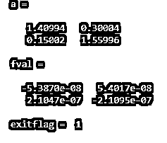
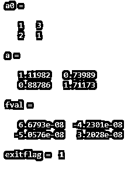

# 在 Matlab 中求解

> 原文：<https://www.educba.com/fsolve-in-matlab/>

## Matlab 中的 fsolve 简介

等式被定义为由等号给出的右边和左边的表达式。有各种类型的方程，其中之一是非线性方程。非线性方程被定义为方程中的一个变量大于 1 的一组表达式。在数学上，有各种各样的方法来解决非线性方程。在 Matlab 中，fsolve 是用于求解非线性方程的函数。它求解方程并返回语法中输入的目标函数的向量值。

### 在 Matlab 中使用 fsolve 的语法和例子

在 Matlab 中，fsolve 函数用于获得在环境中定义或声明的任何非线性方程的解。请找到以下在处理 fsolve 函数时使用的语法:

<small>Hadoop、数据科学、统计学&其他</small>

*   **a = fsolve(func，a0)** **:** 这从一个初始点 a0 开始，继续求解函数等于零的方程。
*   **a = fsolve(func，a0，options)** **:** 这是用语法中提到的各种选项来求解非线性方程组。Matlab 中使用 options 来声明所需的选项。
*   **a****= f solve(****problem****):**这是用来求解非线性方程组的问题，在语法中提到它被指定为一个结构。
*   **[** **a** **，****fval****]= f solve(_ _ _):**用于在定义的解 a 的输入中找到声明的目标函数值
*   ****a，** **fval** **，** **exitflag** **，****output****]= f solve(_ _ _):**当我们想要显示输出或 exitflag 时，就要用到这个语法。exitflag 给出了 fsolve 算法停止的原因，输出定义了优化的过程。**
***   ****a****，** **fval** **，** **exitflag** **，** **output** **，****jacobian****= fsolve(_ _ _):**这个语法用来显示被声明函数的 Jacobian。****

 ****上述语法中提到的输入和输出参数需要遵循一定的规则和标准。“func”是可以以函数句柄或函数名的形式指定的第一个输入参数。它将输入作为向量接受，并返回一个向量。如果它们中的任何一个以数组的形式给出，那么它们就通过线性索引方法被转换成向量。接受的数据类型有 char、函数句柄和字符串。“a0”是另一个输入参数，用于指定初始点或起始点。fsolve 使用变量的数量和初始点(a0)的大小来决定函数应该接受的变量的数量和大小。它可以以实向量或实数组的形式给出。a0 接受的数据类型是 double。“problem”是另一个被指定为结构的输入参数。它有各种字段，如 objective(声明目标函数)、a0(声明算法中所需的初始点)、solver (fsolve 求解方程)、options(在整个过程中更改和修改优化的过程)。“选项”是一个输入参数，它有各种选项，可以使用 optimoptions 进行设置。有些选项可以应用于所有算法，有些则不能。其中一些列举如下:

*   显示选项:用于决定显示的级别，如下所示:
    *   “关闭”选项意味着没有输出显示。
    *   iter '选项意味着每次迭代都会显示输出，并提供退出消息(默认)。
    *   “iter-detailed”选项意味着每次迭代都会显示输出，并带有退出消息(技术)。
    *   ' final '选项意味着显示整个迭代过程的最终输出，并显示退出消息(默认)。
    *   “最终-详细”意味着显示整个迭代过程的最终输出，并显示退出消息(技术)。
*   MaxFunctionEvaluations 选项:这意味着整个过程中允许的最大求值次数。默认的求值次数是 100 乘以变量数。它仅以正整数的形式给出。
*   MaxIterations 选项:这意味着整个过程中允许的最大迭代次数。默认的迭代次数是 400。
*   诊断选项:该选项用于某些算法中，用于显示关于需要求解或最小化的函数的诊断信息。它可以有两个值，即“开”，默认为“关”。

### Matlab 中的 fsolve 实例

下面的例子展示了如何在 Matlab 中使用 fsolve 函数:

#### 示例#1

要在矩阵中使用 fsolve 并查找 fval 的值及其 exitflag 值:

**代码:**

`fun = @(a)a*a*a - [3,2;1,4];
a0 = ones(2);
[a,fval,exitflag,output] = fsolve(fun,a0);
a,fval,exitflag`

**输出:**

#### 实施例 2

**代码:**

`a0=[1,0,-2,1];
a=fsolve(@(a)[3*a(2)+3.*a(1).*a(4);2.*a(1)+a(2).*a(4);2.*a(3)+a(4);2-(a(1).^2)-0.5.*(a(3).^2)-a(4)],[a0])`

**输出:**

#### 实施例 3

要使用以下目标函数找到退出标志的值:

**代码:**

`fun = @(a)a*a*a - [4,5;6,8];
a0 = [1,3;2,1] [a,fval,exitflag,output] = fsolve(fun,a0);
a,fval,exitflag`

**输出:**

语法部分提到的输出参数也有一定的标准，如“a”是以实向量或实数组形式返回的输出参数。解“a”的大小与为初始点“a0”声明的大小相同。Exitflag 是另一个输出参数，它告诉我们 fsolve 算法终止的原因。它可以有正值和负值，如 1，2，3，4，0，-1，-2，-3，每个值都有自己的终止原因。输出是另一个参数，包含关于整个优化过程的信息，它可以有几个字段，如迭代次数(显示迭代的总次数)、funcCount(函数求值的总次数)、message(显示退出消息)、algorithm(优化过程中使用的算法的名称)。

如果有许多变量，那么为了节省内存和时间，那么算法选项应该设置为“信任区域”。

### 结论

fsolve 在 Matlab 中被广泛使用，所以了解它的工作原理是很重要的。在处理 fsolve 函数时，应该注意某些限制，其中之一是；需要求解的函数本质上必须是连续的，如果整个过程成功，那么 fsolve 函数只给出一个根。

### 推荐文章

这是一个 Matlab 中 fsolve 的指南。在这里，我们用语法和例子以及代码和输出来讨论 Matlab 中 fsolve 的工作。您也可以看看以下文章，了解更多信息–

1.  [Matlab 中的瓦拉金](https://www.educba.com/varargin-in-matlab/)
2.  [费瓦尔 Matlab](https://www.educba.com/feval-matlab/)
3.  [MATLAB 工具箱](https://www.educba.com/matlab-toolbox/)
4.  [MATLAB 文本()](https://www.educba.com/matlab-text/)

****