# Matlab QR

> 原文：<https://www.educba.com/matlab-qr/>

## Matlab QR 简介

以下文章提供了 Matlab QR 的概要。数学中使用 QR 分解来分解矩阵，并将其表示为名为“Q”和“R”的两个不同矩阵的乘积。矩阵‘Q’称为‘正交矩阵’，矩阵‘R’称为‘直角三角形矩阵’。

如果‘A’是我们的输入矩阵，那么 QR 矩阵分解如下:

<small>Hadoop、数据科学、统计学&其他</small>

A = Q x R

QR 分解用于数据科学、数据分析和统计。例如，它在计算最小二乘问题的解时非常有用。

**QR 函数的语法**

下面给出了提到的语法:

`X = qr (A)`

`QR = qr (A)`

**说明:**

*   X = qr (A)用于返回上三角因子，即“R”矩阵。如果输入‘A’是全矩阵，那么右上三角矩阵‘R’由‘triu(X)’给出；但是，如果 A 是稀疏矩阵，那么 R 将等于‘X’。
*   [Q，R] = qr (A)用于得到输入矩阵 A 的 qr 分解，在输出中，' R '将是直角三角形，' Q '将是正交矩阵。

### Matlab QR 示例

以下是 Matlab QR 的示例:

#### 示例#1

这个例子将使用 QR 函数来计算一个 4 x 5 矩阵的上三角矩阵。

以下是需要遵循的步骤:

*   首先，初始化 4 x 5 输入矩阵。
*   将这个输入矩阵作为参数传递给 qr 函数。
*   使用函数“triu”获得上三角矩阵“R”。

**代码:**

a =[2 4 1 4 2；1 -1 3 0 2;2 11 6 0 -2;0 1 2 3 1];
[初始化 4 x 5 输入矩阵]

X = qr (A)
【使用 qr 函数计算输入矩阵的 qr 分解】

R = triu (X)
【使用 triu 函数计算上三角矩阵】

**输入:**

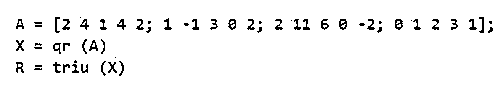

**输出:**

**(矩阵 X):**

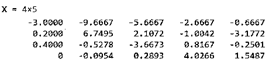

**(上三角矩阵):**

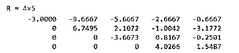

正如我们在输出中看到的，qr 函数提供了输入矩阵的 qr 分解。另外，triu 函数为我们提供了上三角矩阵。

#### 实施例 2

这个例子将使用 QR 函数来计算一个 5 x 5 矩阵的上三角矩阵。

以下是需要遵循的步骤:

*   首先，初始化 5 x 5 输入矩阵。
*   将这个输入矩阵作为参数传递给 qr 函数。
*   使用函数“triu”获得上三角矩阵“R”。

**代码:**

a =[1-4 3 4 6；1 3 3 10 2;3 1 4 0 4;3 5 2 1 -1;3 5 0 1 2];
[初始化 5 x 5 输入矩阵]

X = qr (A)
【使用 qr 函数计算输入矩阵的 qr 分解】

R = triu (X)
【使用 triu 函数计算上三角矩阵】

**输入:**

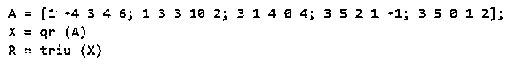

**输出:**

**(矩阵 X):**

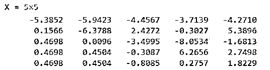

**(上三角矩阵):**

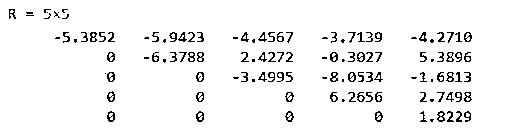

正如我们在输出中看到的，qr 函数提供了输入矩阵的 qr 分解。另外，triu 函数为我们提供了上三角矩阵。

在上面的两个例子中，我们使用了 qr 函数和 triu 函数来获得输入矩阵的上三角矩阵。

接下来，我们将看到如何使用 qr 函数获得上三角矩阵和正交矩阵。

#### 实施例 3

这个例子将使用 QR 函数来计算一个 5 x 5 矩阵的上三角矩阵和正交矩阵。

以下是需要遵循的步骤:

*   首先，初始化 5 x 5 输入矩阵。
*   将这个输入矩阵作为参数传递给 qr 函数。

**代码:**

a =[3-4-4 7 6；11 7 13 10 8;2 11 14 1 8;13 15 2 7 -1;6 15 10 11 2];
【初始化 5×5 输入矩阵】【Q，R】= qr(A)
【使用 qr 函数计算输入矩阵的 QR 分解】

**输入:**

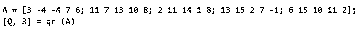

**输出:**

**(矩阵 Q):**

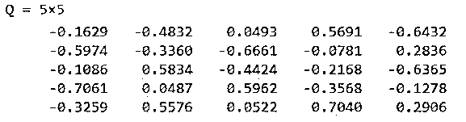

**(矩阵 R):**

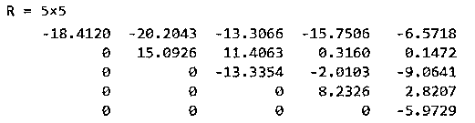

正如我们在输出中看到的，qr 函数提供了输入矩阵的 qr 分解。

#### 实施例 4

这个例子将使用 QR 函数计算一个 4 x 4 矩阵的上三角矩阵和正交矩阵。

以下是需要遵循的步骤:

*   首先，初始化 4 x 4 输入矩阵。
*   将这个输入矩阵作为参数传递给 qr 函数。

**代码:**

a =[3 4 0 7；1 4 3 10;11 4 1 8;13 15 2 7];
【初始化 4 x 4 输入矩阵】【Q，R】= qr(A)
【使用 qr 函数计算输入矩阵的 QR 分解】

**输入:**

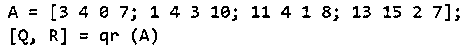

**输出:**

**(矩阵 Q):**

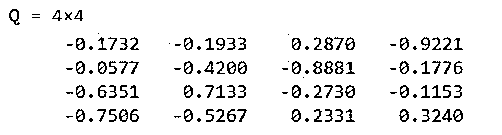

**(矩阵 R):**

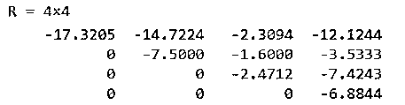

正如我们在输出中看到的，qr 函数提供了输入矩阵的 qr 分解。

### 结论

在 Matlab 中使用 qr 函数来获得输入矩阵的 qr 分解。它可以用来得到上三角矩阵和正交矩阵。它被广泛用于解决数据科学中的最小二乘问题。

### 推荐文章

这是一个 Matlab QR 的指南。为了更好的理解，我们在这里讨论 Matlab QR 的介绍和例子。您也可以看看以下文章，了解更多信息–

1.  [什么是 Matlab？](https://www.educba.com/what-is-matlab-2/)
2.  [Matlab 极限](https://www.educba.com/matlab-limit/)
3.  [Matlab 绘图图](https://www.educba.com/plot-graph-matlab/)
4.  [绝对值 Matlab](https://www.educba.com/absolute-value-matlab/)

