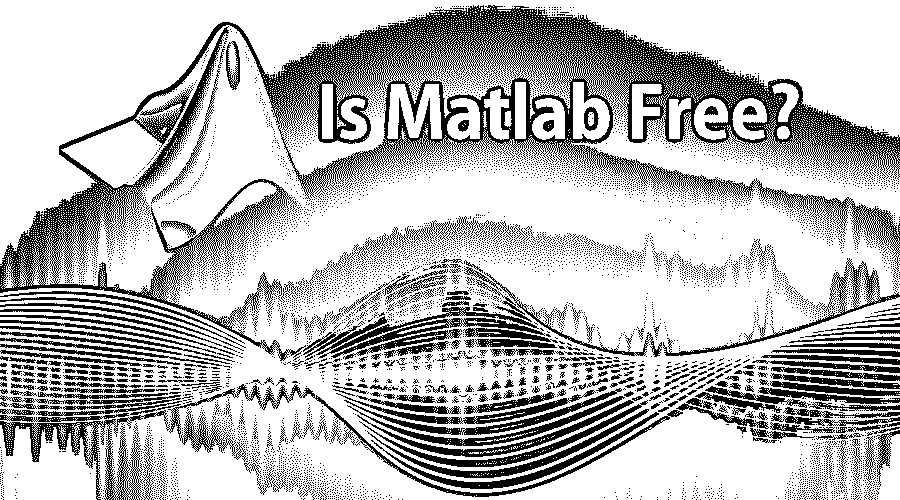

# Matlab 免费

> 原文：<https://www.educba.com/matlab-free/>

## Matlab 免费吗？

下面的文章提供了 Matlab 免费版的概要。Matlab 是一种交互式数学计算编程环境，广泛应用于数据预处理、数据分析、探索、实验、算法开发、应用程序开发、问题解决和可视化等领域。Matlab 函数是以称为工具箱的库的形式组织的。它是美国马萨诸塞州 MathWorks 公司的产品。

Matlab 提供了丰富的功能，如易于使用，没有变量声明，复杂的矩阵处理，易于使用的图形，简洁的语法等。，这使它区别于其他科学编程语言，如 C 和 FORTRAN。Matlab 可以处理多维数组。Matlab 的内部数据结构仅限于二维矩阵。但是要处理多维数组，可以在 Matlab 中创建自己的函数。因此这两个 Matlab 都是巨大的成功。

<small>Hadoop、数据科学、统计学&其他</small>

### Matlab 系统的部件

以下是 Matlab 系统的组成部分:

#### 1.Matlab 语言

它是一种高级矩阵语言，具有函数、控制语句、数据结构、输入/输出和面向对象的编程特性。

#### 2.Matlab 工作环境

这包括使用变量、在工作空间中导入/导出数据集等工具和设施。

#### 3.处理图形

这些是 Matlab 中可用于二维和三维可视化、动画、图像处理和演示图形的高级命令。还可以使用低级命令来定制图形的外观。

#### 4.数学函数库

Matlab 中有大量可用的数学函数。从正弦、余弦、正切、求和等基本函数开始。复杂和高级函数，如贝塞尔函数、矩阵的特征值/特征向量、矩阵求逆等。

#### 5.应用程序接口

它是一个允许你写 C 和 Fortran 程序的库，可以和 Matlab 交互。这是从 Matlab 调用例程的一种方式。Matlab 不是开源软件。然而，Matlab 的学生版(个人许可证)学生用户需要 50 美元，家庭用户需要 150 美元。Matlab 的商业版本将花费大约。110 万卢比。

### Matlab 的特点

Matlab 提供的功能肯定会让你觉得价格在它提供的功能面前不值一提。

#### 1.独立于平台

Matlab 语言支持 Windows，Linux，Unix，Macintosh。在一个平台上编写的程序可以很容易地在其他平台上运行。这是一个独立于平台的特性。

#### 2.完整的图形功能

Matlab 提供了高级图形，可以很好地帮助可视化科学和工程数据。二维、三维图表、大容量图表、动画和交互式图表都属于其他图形。所有图表都可以导出为已知的流行图形格式。图形是高度可定制的:可以改变颜色线和标记，添加注释，乳胶表达式，图例，添加多个轴等。

#### 3.易用性

MATLAB 是一种解释型和交互式语言。用户可以使用内置的集成开发环境和调试器轻松编写和修改程序。

#### 4.很好的帮助来源

MATLAB 是一门技术编程语言，需要从很好的来源学习。从初学者到专家，下面的链接可以帮助你学习:

http://www.quickcode.co/free/courses/learn/Matlab/66

https://www.tutorialspoint.com/matlab/matlab_overview.htm

这将帮助你理解处理变量，创建脚本，矩阵操作，文件处理，文本处理，直到使用结构和地图容器的基础知识。

以下是 Matlab 最常用的计算列表:

*   二维和三维绘图和图形
*   处理矩阵和数组
*   非线性函数
*   数据分析
*   线性代数
*   代数方程
*   统计数字
*   微积分和微分方程
*   数值计算
*   转换
*   综合
*   曲线拟合
*   各种其他特殊功能

以下是 Matlab 广泛应用的科学和工程领域:

*   计算金融
*   控制系统
*   测试和生物
*   计算生物学
*   图像处理
*   视频处理
*   信号处理
*   通信

### Matlab 的技术问题

使用 Matlab 时，有几个技术问题需要了解:

#### Q1。M 文件和 MEX 文件的区别。

**答案:**

*   M-file: 它是一个普通的 ASCII 文本，在运行时被解释。这些基本上就像存储在文本文件中的子程序。M 扩展名，因此称为 M 文件。在处理 Matlab 开发的时候，大部分场景都是用 Matlab。
*   **MEX 文件:**这些是在运行时直接链接到 Matlab 的 C 和 C++文件。MEX 文件能够使 MATLAB 应用程序崩溃，因此需要小心处理。

#### Q2。解释 Matlab 中的内插和外插以及它们的类型？

**答案:**

插值是一个词，用于取出数组中数据点之间的函数值。而外推是一个词，指的是找到数组端点之外的值。

插值和外推有两种类型:

*   线性插值和外推
*   二次插值和外推

#### Q3。什么是 Xmath-Matlab？提到 Xmath 特性？

**答案:**

X-math 是一个交互式脚本和图形环境，用于 Xwindow 工作站。X-math 的特性如下:

*   具有 GUI 功能的调试工具
*   彩色图形可以被指向和点击
*   与 C 和 LNX C 语言兼容的库
*   具有面向对象特性的脚本语言

#### Q4。如何改变/修改 Matlab 路径？

**答案:**

可以使用:使用 PathTool GUI 来修改 Matlab 路径。从命令行添加路径目录，然后添加路径 torc，以便将当前路径写回“pathdef.m”。如果没有权限写入“pathdef.m”，则可以将路径写入不同的文件，您可以从“startup.m”执行

#### Q5。多项式如何在 MatLab 中表示？

**答案:**

在 Matlab 中，多项式由一个向量表示。需要将多项式的系数以降序输入向量，因此可以创建多项式。

### 推荐文章

这是 Matlab 免费的指南。这里我们讨论了 Matlab 的基本概念、特性和技术问题。您也可以阅读以下文章，了解更多信息——

1.  [MATLAB 职业生涯](https://www.educba.com/career-in-matlab/)
2.  [Matlab vs Octave](https://www.educba.com/matlab-vs-octave/)
3.  [MATLAB 面试问题](https://www.educba.com/matlab-interview-questions/)
4.  [MATLAB 面试问题](https://www.educba.com/matlab-interview-questions/)

