# 如何安装 MATLAB

> 原文：<https://www.educba.com/install-matlab/>

## MATLAB 概述

安装 Matlab，Matlab 是 MathWorks 开发的多范式数值计算环境和专有编程语言。它主要用于数值计算。多范例数值计算环境允许开发人员、学生和工程师与用不同语言开发的程序进行交互，这使得利用每种语言的优势实现各种目的成为可能。它被用于各种领域，如图像和信号处理、通信、工业控制系统、计算金融、深度学习、机器学习以及图像处理，这使它成为一种非常重要和通用的工具。根据维基百科的最新数据，MATLAB 在全球拥有超过 300 万用户。

### 为什么要用 MATLAB？

*   在 Matlab 中，基本的数据元素是矩阵。所以如果我们输入一个简单的整数，它被认为是一行一列的一维矩阵。MATLAB 环境中内置了一些处理数组或矩阵的数学运算。例如，叉积、点积、行列式、逆矩阵。
*   另一个重要的特性是矢量化运算，这意味着您可以只使用一个命令将两个数组相加，而不是使用 for 或 while 循环。
*   图形输出针对交互进行了优化。你可以很容易地绘制数据，然后改变颜色、大小、比例等。，通过使用图形交互工具。
*   它的功能可以通过添加工具箱来大大扩展。这些是提供更专门化功能的特定函数集。例如，Excel 链接允许以 Excel 可识别的格式写入数据；统计工具箱允许对数据进行更专业的统计处理(方差分析、基本拟合等)。).因此，基本上，我们可以根据需要优化数据。
*   因此，基本上，它不仅是一种编程语言，它基本上是一种编程环境，正如我在这篇如何安装 Matlab 的文章的第一行中所说的。
*   我们甚至可以从命令行执行操作。

正如每个硬币都有两面一样，MATLAB 也是如此。如下所述，它有一些缺点:

<small>Hadoop、数据科学、统计学&其他</small>

*   它需要大量的内存。因此，它很难在内存较少的计算机上使用，你也无法发挥它的潜力。
*   它位于 windows 之上，这意味着它可以获得 windows 允许的 CPU 时间；这使得实时计算成为问题。

### 安装 MATLAB 的步骤

现在我们要安装 Matlab R2018b，这是目前本博客的最新版本。

**第一步:**选择电脑上安装的任意浏览器，打开浏览器。我现在将使用谷歌浏览器来安装 Matlab。

**第二步:**在浏览器搜索中输入‘MathWorks’。

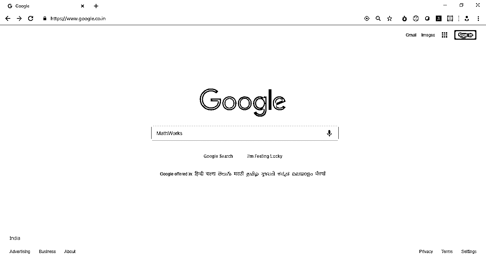

**第三步:**点击链接 MathWorks-Makers of Matlab and Simulink-Matlab&Simulink。

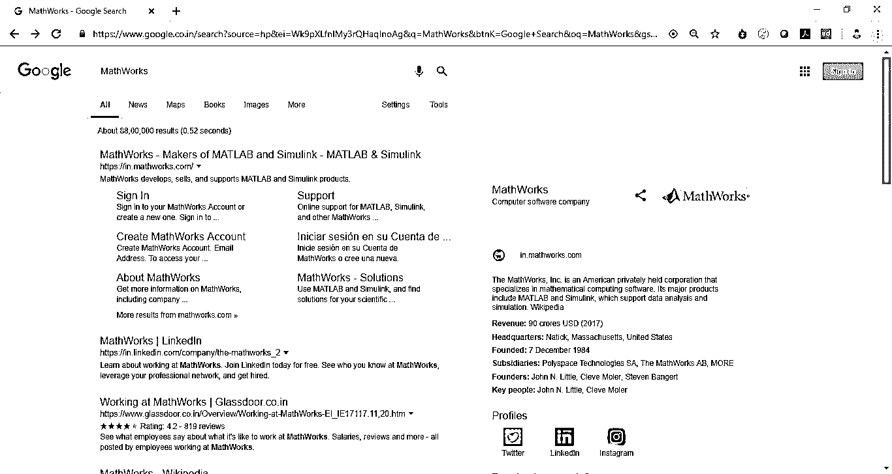

**第四步:**点击链接，你会被引导到 MathWorks 的主页，这是屏幕的样子。

**第五步:**向下滚动，你会发现一个如下黑色矩形块所示的链接，它会给你这个特定版本的亮点。

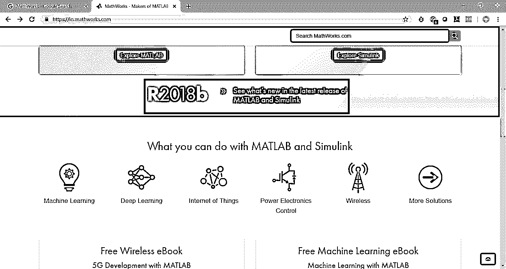

**第六步:**点击后会进入下面的页面，向下滚动可以看到各种发布亮点，如果想了解更多可以点击查看。

**第七步:**继续向下滚动，你会发现两个按钮，如下图所示。

现在，请点击链接并安装 MATLAB“获取试用版”。

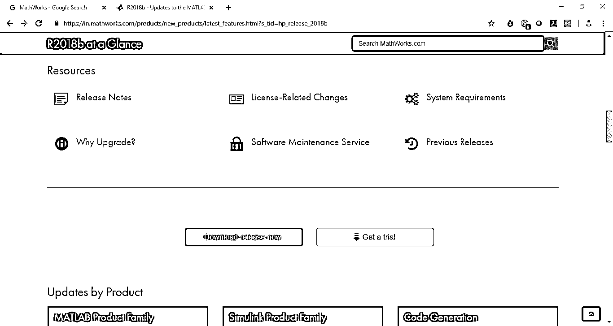

**第八步:**点击上面的链接，会被重定向到不同的页面，试用版只有 30 天。向下滚动，你会看到各种各样的路径包。

下面给出了所有的试验包:

*   数据分析
*   图像处理
*   信号处理和通信
*   计算金融
*   控制系统
*   计算生物学

在电子邮件文本栏中输入您的邮件 id，然后点按“继续”。

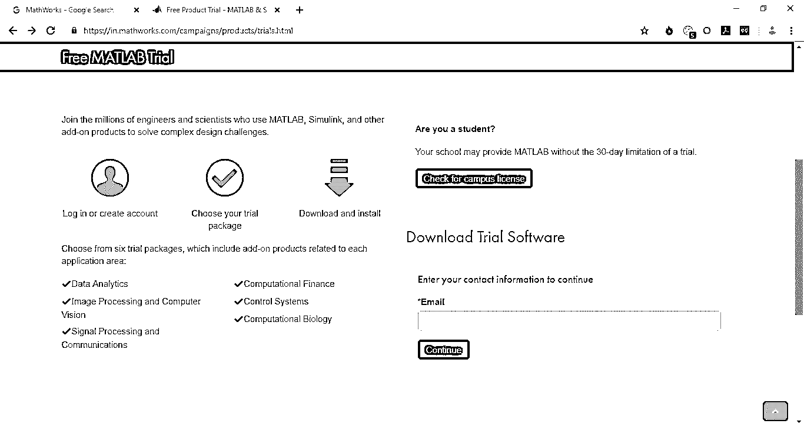

**第 9 步:**点击后，您将重定向到一个页面，要求您创建一个帐户并继续您的产品试用。填写完详细信息后，按“创建”按钮。

**第十步:**点击继续当前邮件如下图。

第 11 步:然后会要求你验证邮件。转到您的收件箱，单击收件箱中提供的验证按钮，您将被重定向到帐户信息。请填写详细信息，然后单击“创建”安装 Matlab。

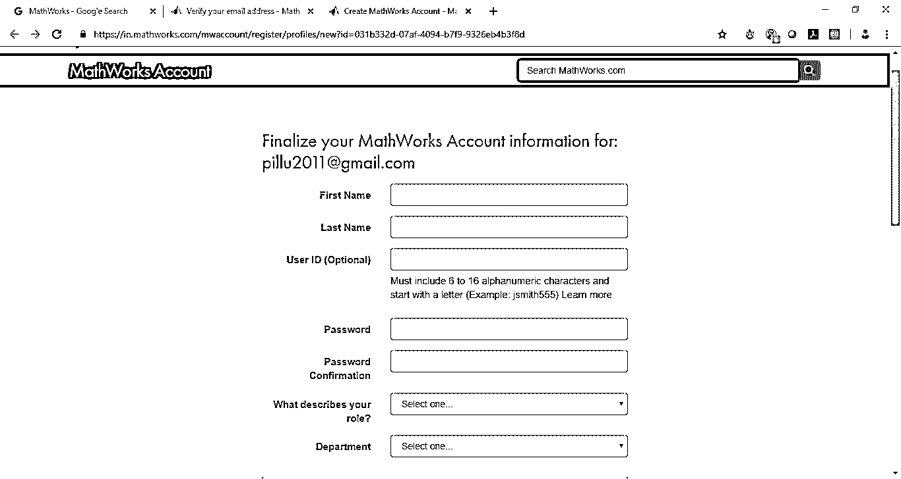

**第 12 步:**然后，您可以选择您希望成为试用版一部分的各种软件包，如下所示，并选择继续安装 Matlab。

*   数据分析
*   图像处理
*   信号处理和通信
*   计算金融
*   控制系统
*   计算金融

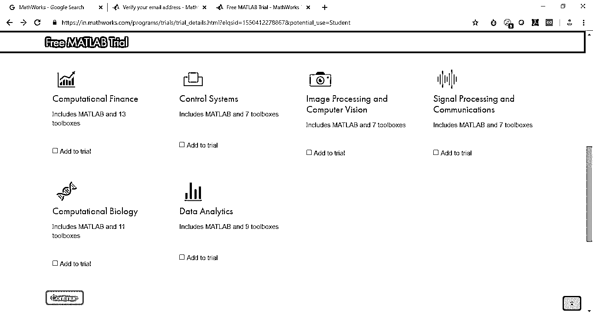

**步骤 13:** 根据您的环境和预期用途选择适当的链接，然后单击继续。

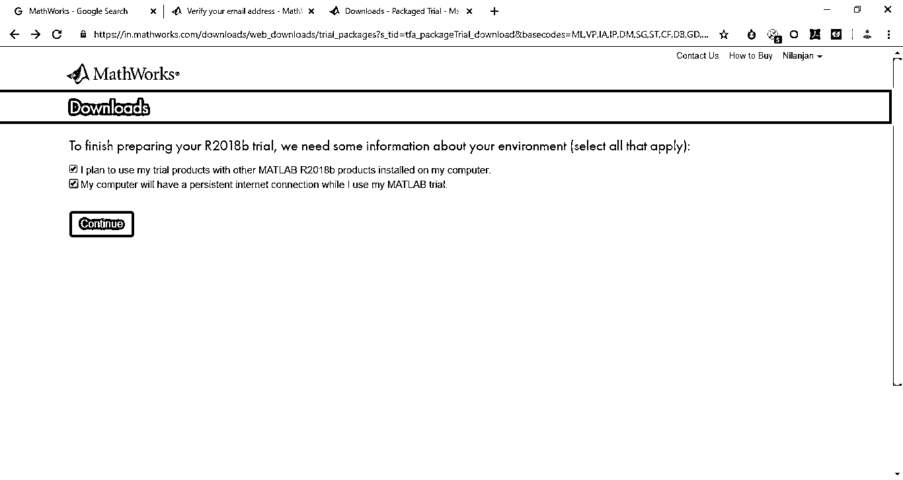

**第十四步:**下载根据你电脑的操作系统，我的是 Windows，所以我会下载 Windows (64 位)。

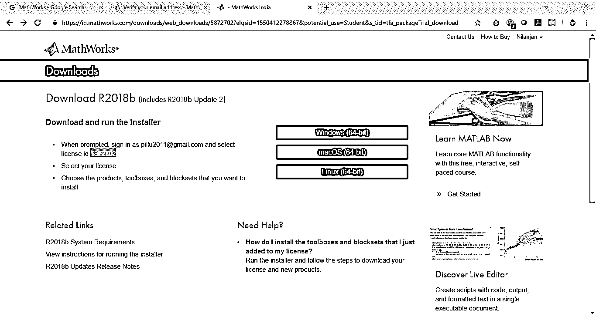

**步骤 15:** 根据你的操作系统点击所需链接，开始下载，并等待下载完成。

**步骤 16:** 双击设置，它将开始使用 Win-Zip 自解压程序进行解压，如下所示。

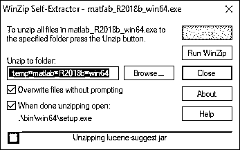

**步骤 17:** 当下面的询问您的许可的弹出窗口出现时，单击 yes，安装程序将开始安装 Matlab 的过程。

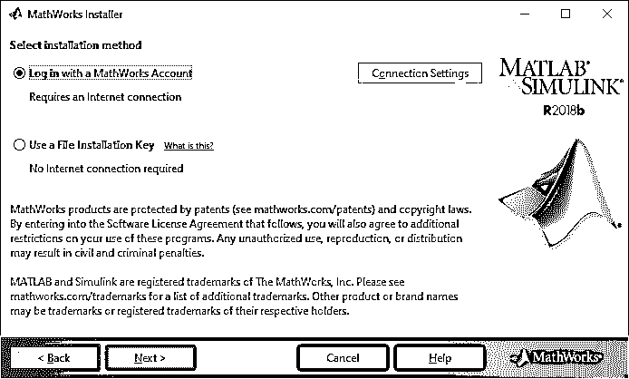

**第 18 步:**点击下一步，你会看到下面的画面。

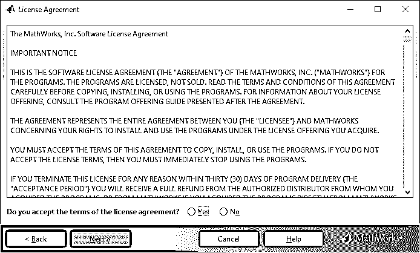

**第 19 步:**点击是，点击下一步，出现如下对话框。

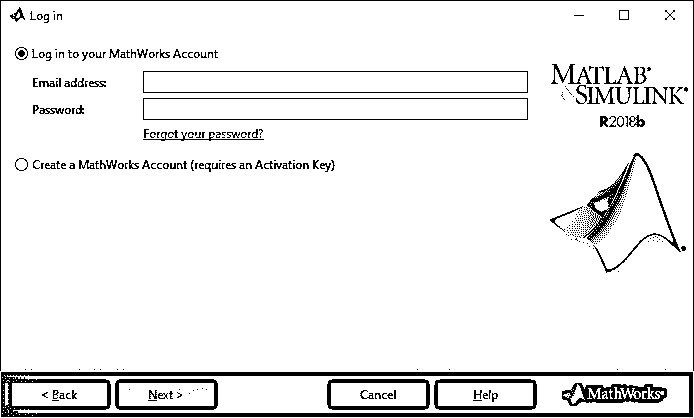

**步骤 20:** 输入您的电子邮件地址和密码，点击下一步，然后选择一个许可证，如下所示，选择许可证后，点击下一步。

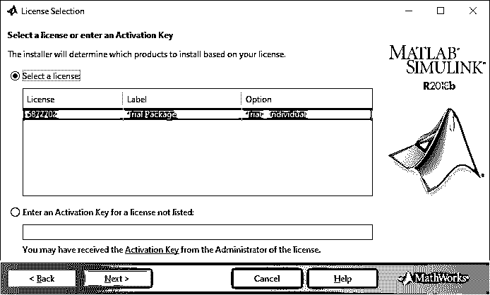

**步骤 21:** 点击下一步后选择目标文件夹，然后点击下一步开始安装过程，如下图所示。

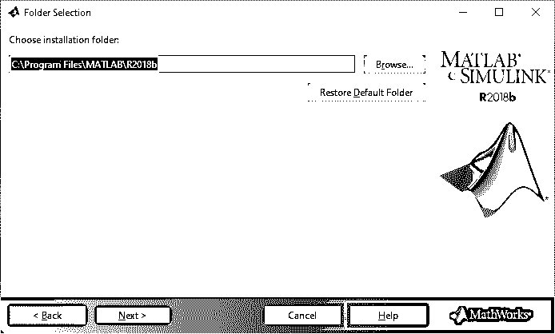

第 22 步:然后会要求选择你想要安装的工具箱。根据需要选择工具箱。

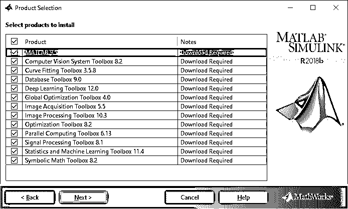

**步骤 23:** 会出现一个确认对话框，选择下一步开始安装过程。这将需要一些时间，取决于你的网速。

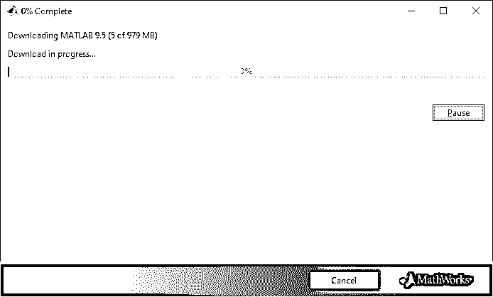

**第 24 步:**安装完成后，您将看到以下页面。单击完成。

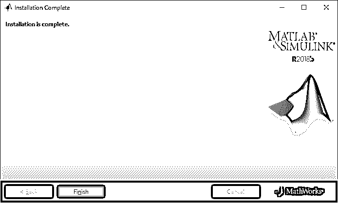

**第 25 步:**点击完成，意味着 MATLAB 已经安装，MATLAB 应用程序将打开，看起来是这样的。

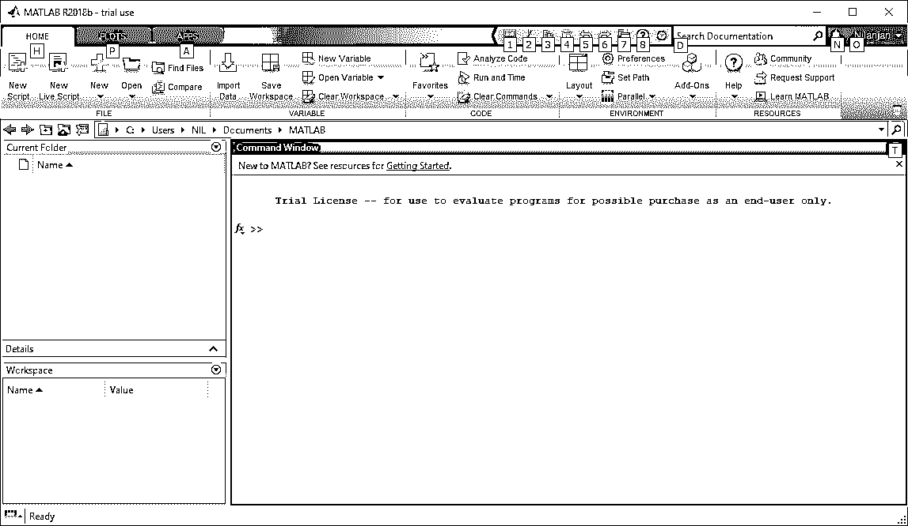

Matlab 安装教程到此结束。

### 推荐文章

这是如何安装 MATLAB 的指南。在这里，我们讨论了 MATLAB 的介绍以及适当的安装步骤。您也可以阅读以下文章，了解更多信息——

1.  [MATLAB 生涯——你必须尝试一下](https://www.educba.com/aws-commands/)
2.  [MATLAB 面试问答](https://www.educba.com/matlab-interview-questions/)
3.  [MATLAB 与 R 的不同](https://www.educba.com/matlab-vs-r/)
4.  [Matlab 的不同用途](https://www.educba.com/uses-of-matlab/)

