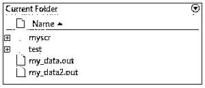
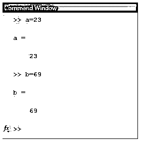
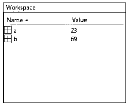
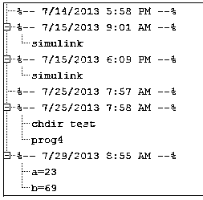

# Matlab 怎么用？

> 原文：<https://www.educba.com/how-to-use-matlab/>

## Matlab 概述

本文的目的是彻底了解如何使用 Matlab。如果使用的是 Windows 平台，双击 Matlab 快捷图标即可启动。在 UNIX 平台上，您可以通过在操作系统提示符下键入 Matlab 来启动它。它的初创企业也可以定制。例如，可以在名为 startup.m 的脚本文件中更改它启动或自动执行 Matlab 语句的目录。

要在桌面中结束 Matlab 会话，请选择文件，然后使用退出 Matlab，或者您可以在命令窗口中键入“quit”。您还可以运行一个名为 finish.m 的脚本文件。

<small>Hadoop、数据科学、统计学&其他</small>

**Matlab 中的命名变量:**其中的变量名称由单个字母后跟所需数量的数字、字母、下划线组成。这里我们需要记住，这是一个区分大小写的环境。

**保存工作:**‘save’命令可以用来保存我们工作空间中的变量。文件另存为。当前目录下的 mat 扩展名。

**Matlab 文档:**它为其用户提供了大量的在线文档以获得任何帮助。我们需要选择“Matlab 帮助”,它可以在 Matlab 的帮助菜单中找到。

Matlab 文档分为以下几个主要主题:

*   桌面工具&开发环境:提供如何启动&关机的帮助，以及帮助我们使用的基本工具。
*   **数学**:提供数学运算&数据分析的帮助。
*   编程(Programming):为应用程序的开发提供帮助。
*   **图形:**与绘图、打印、图形注释和处理图形的技术相关的主题。
*   3d 可视化:提供可视化工具和技术的帮助。
*   **创建图形用户界面**:与 GUI 构建技术和编写“回调函数”相关的文档。
*   **外部接口/API:** 包含与 Matlab 引擎、MEX 文件、Java 接口和串口相关的文档。

### Matlab 中使用的运算符

以下是一些常用运算符的列表，可直接用于实现所需的结果:

| **操作员** | **目的** |
| + | 用于添加 |
| – | 用于减法 |
| * | 矩阵和标量乘法 |
| .* | 对于数组乘法 |
| ^ | 对于矩阵和标量指数计算 |
| .^ | 对于数组求幂 |
| / | 右除法 |
| \ | 左除法 |
| : | 生成具有规则间距的元素 |

### Matlab 系统由 5 个主要部分组成

下面给出了 5 个主要部分:

#### 1.发展环境

它是一套帮助我们使用文件和函数的设施和工具。这些工具中的大多数都是图形用户界面的形式。它包括 Matlab 桌面和命令窗口、编辑器和调试器、命令历史、帮助浏览器、工作区、搜索路径和文件。

#### 2.Matlab 数学函数库

它是一个计算算法的集合，从基本函数如和、乘、三角和复数运算，到复杂函数如矩阵特征值、矩阵求逆、贝塞尔函数。

#### 3.Matlab 语言

它是一种高级矩阵或数组语言，包含控制流语句、函数、输入输出、数据结构和面向对象的编程特性。它允许创建快速，使用和投掷程序，也允许创建大型，复杂的应用程序。

#### **4。**图形

它提供了将矩阵和向量显示为图形的广泛功能。这些图表也可以根据需要打印和注释。图形包括 2D 和 3D 图像处理、数据可视化、演示图形和动画的高级功能。它还包括一些功能，允许我们完全定制图形的外观和感觉，并在我们的 Matlab 应用程序上构建成熟的图形用户界面。

#### 5.Matlab 外部接口/API

这个库允许我们编写能够与之交互的 Fortran 和 C 程序。它包括用于动态链接的设施，即从 Matlab 调用例程，将其作为计算引擎调用，以及用于 MAT 文件的读写。

### 本地 Matlab 环境

现在让我们看看如何在我们的系统中设置一个 Matlab 环境。您可以从以下链接下载它:

[https://in.mathworks.com/downloads/web_downloads](https://in.mathworks.com/downloads/web_downloads)。

MathWorks 提供 3 个版本的 Matlab，一个试用版，一个学生版和一个授权产品。对于学生版或试用版，我们需要登录到他们的网站，然后等待一会儿，以获得批准。一旦下载了该软件，就可以像其他软件一样轻松安装。

一旦我们启动它，我们会看到一个叫做桌面的主工作窗口。此桌面显示为默认布局。

桌面包含以下面板:

#### 1.当前文件夹

此面板用于查看项目文件和文件夹

以下是“当前文件夹”的外观:

#### 2.命令窗口

此面板是在命令行中输入命令的区域。在命令提示符(>>)的帮助下显示命令窗口

这是“命令窗口”的视图:

#### 3.工作空间

该面板显示从文件中创建或导入的变量。

下面是“工作区”的视图:

#### 4.命令历史

它显示并返回在命令行中输入的命令。

这里有一个观点:

### 结论

它表现为环境并解释环境。我们可以给它一个命令&它会立即执行。如果我们键入一个简单的加法表达式，如 4 +4，并按 enter 键，它返回答案为 8。其他运营商的情况也类似。

### 推荐文章

这是如何使用 Matlab 的指南？这里我们讨论 Matlab 系统的 5 个主要部分以及本地环境的基本概念。您也可以看看以下文章，了解更多信息–

1.  [Matlab 中的 Repmat](https://www.educba.com/repmat-in-matlab/)
2.  [转置矩阵 Matlab](https://www.educba.com/transpose-matrix-matlab/)
3.  [MATLAB 中的稀疏矩阵](https://www.educba.com/sparse-matrix-in-matlab/)
4.  [Matlab 中的 Simulink 是什么？](https://www.educba.com/what-is-simulink-in-matlab/)

