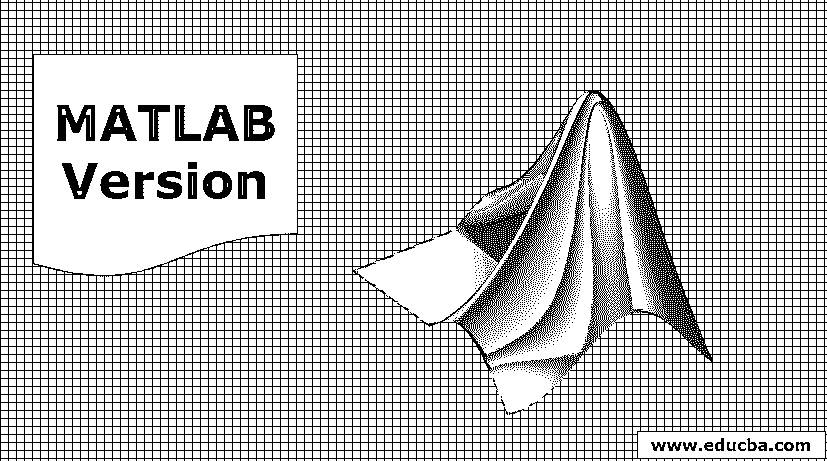
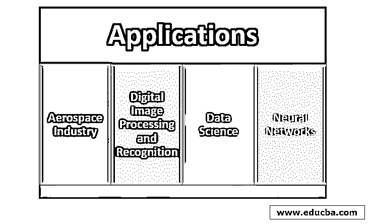

# MATLAB 版本

> 原文：<https://www.educba.com/matlab-version/>

## MATLAB 简介

Mathworks 公司提供的 Matrix Laboratory 或 MATLAB 是一种用于执行数学计算、编程和可视化的编程环境。它是一个强大的工具，包括自己的高级语言和函数，用于更快地执行数学相关的任务。它在许多组织中用于处理现实世界中的问题，降低了复杂性，并有助于更容易地向他人解释结果。

### MATLAB 版本的特性和优势

从 1984 年至今，已经发布了 50 多个 Matlab 版本。Matlab 1.0 是 1984 年发布的第一个版本。然而，最近的版本是用 C、C++和 Java 编写的。Mathworks 最近发布了 Matlab 9.7 R2019b 版本，其中包括人工智能技能和工具，使决策更容易。

<small>Hadoop、数据科学、统计学&其他</small>

*   MATLAB 1.0 :由 Mathworks 于 1984 年发布。它是用 C 语言编写的，可以在各种机器上运行。
*   **MATLAB 2**:1986 年发布。
*   **MATLAB 3**:1987 年发布。
*   MATLAB 3.5: 发布于 1990 年。它与 MS-DOS 兼容。
*   **MATLAB 4** 。它于 1992 年发行。它可以在 Windows 3 和 MAC 上运行。
*   MATLAB 4.2c :发布于 1994 年。
*   MATLAB 5.0 :发布于 1996 年。面向所有平台发布。
*   MATLAB 5.1 :发布于 1997 年。
*   MATLAB 5.1.1 R9.1 :发布于 1997 年。
*   MATLAB 5.2 R10 :发布于 1998 年。这是在老式 MAC 电脑上运行的最后一个版本。
*   MATLAB 5.2.1 1 :发布于 1998 年。
*   MATLAB 5.3 R11 :发布于 1999 年。
*   MATLAB 5.3.1 R11.1 :发布于 1999 年。
*   MATLAB 6.0 R12 :发布于 2000 年。这是 Java 虚拟机的第一个版本。
*   MATLAB 6.1 R12.1 :发布于 2001 年。
*   MATLAB 6.5 R13:2002 年发布。它包括用于导入数据的新图形用户界面，并提供元数据的图形视图。
*   MATLAB 6 . 5 . 1 r13sp 1:2003 年发布
*   MATLAB 6 . 5 . 2 r13p 2:2003 年发布。
*   MATLAB 7 R14 :发布于 2004 年。它引入了嵌套函数并重新引入了 MAC。
*   MATLAB 7 . 0 . 1 r14sp 1:2004 年发布
*   **MATLAB 7 . 0 . 4 r14sp 2**:2005 年 3 月发布。
*   **MATLAB 7.1 r14sp 3**:2005 年 9 月发布。它适用于 Windows XP-64 位
*   **MATLAB 7.2 r 2006 a**:2006 年 3 月发布。
*   **MATLAB 7.3 r 2006 b**:2006 年 9 月发布。
*   **MATLAB 7.4 r 2007 a**:2007 年 3 月发布。引入 Bsxfun 函数来应用二元运算。
*   **MATLAB 7.5 r 2007 b**:2007 年 9 月发布。
*   **MATLAB 7.6 r 2008 a**:2008 年 3 月发布。与面向对象编程能力相关的增强已经完成。
*   **MATLAB 7.7 r 2008 b**:2008 年 10 月发布。对[随机数发生器](https://www.educba.com/random-number-generator-in-matlab/)进行了升级。
*   **MATLAB 7.8 r 2009 a**:2009 年 3 月发布。这是微软 32 位和 64 位 Windows 7 的第一个版本。NET 框架已经完成了。
*   **MATLAB 7.9 r 2009 b**:2009 年 9 月发布。Intel 64 位 MAC 有了第一个版本，引入了一个新的操作符(~)。
*   **MATLAB 7 . 9 . 1 r 2009 bsp 1**:2010 年 4 月发布。此次升级修复了一些错误。
*   **MATLAB 7.10 r 2010 a**:2010 年 3 月发布。这是英特尔 32 位 Mac 的最新版本
*   **MATLAB 7.11 r 2010 b**:2010 年 9 月发布。为枚举添加了帮助。
*   **MATLAB 7 . 11 . 1 r 2010 bsp 1**:2011 年 3 月发布。错误修复和更新。
*   **MATLAB 7 . 11 . 2 r 2010 bsp 2**:2011 年 4 月发布。错误修复和更新
*   **MATLAB 7.12 r 2011 a**:2011 年 4 月发布，引入 rng 函数用于随机数生成。
*   **MATLAB 7.13 r 2011 b**:2011 年 9 月发布。更改了部分变量并增加了本地工人的最大值。
*   **MATLAB 7.14 r 2012 a**:2012 年发布。这是 32 位 Linux 支持的最新版本。
*   MATLAB 8 r 2012 b:2012 年发布。发布了工具条界面，并重新设计了文档系统。
*   **MATLAB 8.1 r 2013 a**:2013 年 3 月发布。添加了单元测试框架。
*   **MATLAB 8.2 r 2013 b**:2013 年 9 月发布。添加了表数据类型，并将 Java 运行时环境更新到版本 7。
*   **MATLAB 8.3 r 2014 a**:2014 年 3 月发布。核心 MATLAB 中的 USB 网络摄像头支持，本地工作人员的数量不限于 12 人。
*   **MATLAB 8.4 r 2014 b**:2014 年 10 月发布。改进了用户工具箱，增加了新的函数和包，如 py(用于使用 Python)、web count、直方图、TCP 客户端等。
*   **MATLAB 8.5 r 2015 a**:2015 年 3 月发布。这是支持 Windows XP 和 Vista 的最后一个版本。
*   **MATLAB 8.5 r 2015 ASP 1**:2015 年 10 月发布。
*   **MATLAB 8.6 r 2015 b**:2015 年发布。添加了一个新的执行引擎(LXE)和新的类，如 graphs 和 digraphs，来处理图形。
*   **MATLAB 9.0 r 2016 a**:2016 年 3 月发布。添加了应用程序设计器来构建和设计应用程序。引入新的暂停按钮是为了在执行过程中暂停运行。
*   **MATLAB 9.1 r 2016 b**:2016 年 9 月发布。JAVA 的官方 MATLAB 引擎，JSON 的新编码和解码函数，增加了新的“字符串”数据类型。
*   **MATLAB 9.2 r 2017 a**:2017 年 3 月发布。基于云的 MATLAB (MATLAB Online)，一个用于单元测试的框架，增加了用于记忆和创建热图图表的高数组操作功能。
*   **MATLAB 9.3 r 2017 b**:2017 年 9 月发布。增加了新的函数，如本征函数和新的图表颜色以及新的默认颜色。
*   **MATLAB 9.4 r 2018 a**:2018 年 3 月发布。为图形和图表添加了不同的新功能。修改了单元测试框架。
*   **MATLAB 9.5 r 2018 a**:2018 年 9 月发布。
*   **MATLAB 9.6 r 2019 a**:2019 年 3 月发布。它包含对人工智能和分析的增强以及错误修复。
*   **MATLAB 9.7 r 2019 b**:2019 年 9 月发布。它包括人工智能的更新，[支持机器人](https://www.educba.com/what-is-robotics/)的新产品和建模的新资源。

### MATLAB 的应用

以下是以下几点:

#### 1.航空和航天工业

一般在其工程课程期间使用。我们可以使用内置的航空数学运算、坐标系和空间变换来评估飞行器的运动和方向。

#### 2.数字图像处理和识别

MATLAB 中的图像处理工具箱(IPT)应用程序有助于执行图像分割、图像增强、降噪、几何变换、图像配准和 3D 图像处理。

#### 3.数据科学

它提供了各种各样与机器学习和统计相关的库，以及一些高级功能，如非线性优化、系统识别。我们可以使用逻辑回归、分类树、支持向量、随机森林方法等各种算法建立预测模型，并使用模型优化工具来创建准确的模型。

#### 4.神经网络

神经网络的目的是模仿人脑，即大脑是如何工作的。MATLAB 包括深度学习工具和库，用于构建和训练神经网络并验证结果。

### 结论–MATLAB 版本

有许多行业使用 MATLAB，其中信息分析是首选任务。如果工作涉及一些研究，那么选择 MATLAB 在几乎每个领域都是正确的选择，因为它有许多概述功能，可以提供更好的见解。

### 推荐文章

这是一个 MATLAB 版本的指南。在这里，我们还讨论了 MATLAB 的介绍，特点和优势以及 MATLAB 的应用。您也可以浏览我们推荐的其他文章，了解更多信息——

1.  [什么是 Matlab？](https://www.educba.com/what-is-matlab/)
2.  [Matlab 的用途](https://www.educba.com/uses-of-matlab/)
3.  [MATLAB 函数](https://www.educba.com/matlab-functions/)
4.  [MATLAB 中的数据类型](https://www.educba.com/data-types-in-matlab/)
5.  [Matlab 命令](https://www.educba.com/matlab-commands/)
6.  [JavaScript 中的随机数生成器](https://www.educba.com/random-number-generator-in-javascript/)
7.  [数字图像处理的应用](https://www.educba.com/digital-image-processing/)
8.  [什么是数字图像？|前 2 个类别](https://www.educba.com/what-is-digital-image/)

