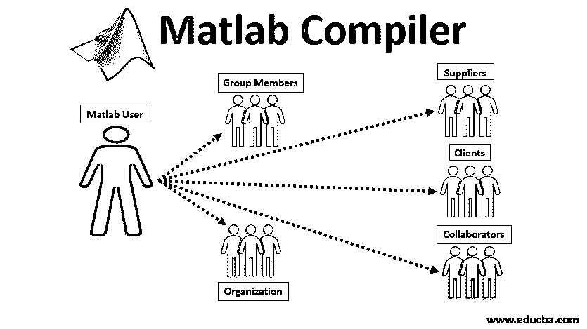

# Matlab 编译器

> 原文：<https://www.educba.com/matlab-compiler/>

## Matlab 编译器介绍

Matlab 编译器通过三种方式调用系统:独立应用程序、excel 插件和 Hadoop 软件包。我们可以与其他用户(小组成员、供应商、客户、合作者、组织等)一起使用这些功能。)否则他们可能不需要使用 Matlab。 [Matlab 应用程序](https://www.educba.com/what-is-matlab/)用于指导我们完成打包工作流程，并创建一个我们可以共享的安装程序。我们只需要选择[主 Matlab 函数](https://www.educba.com/matlab-functions/)进入应用程序，点击软件包，它会自动创建一个单独的安装程序文件。我们的 Matlab 程序在这些应用中是加密的，因此知识产权仍然受到保护。

我们可以通过简单地为软件组件添加一个 SDK 编译器并与 clang 等其他编程语言集成来扩展编译器的功能。CPP lang。Java.net 等。这些应用程序使用 Matlab 运行时，一组共享库支持编译后的应用程序和组件的执行。通过 Matlab 生产服务器支持 Matlab 分析与企业应用的大规模部署。用于调用 Matlab 编译器的命令是' mcc '。我们可以从命令提示符或“UNIX”或“DOS”命令行发出命令(mcc)。

<small>Hadoop、数据科学、统计学&其他</small>

**语法:**

我们可以管理多个标记为 MCC 的 Matlab 编译器操作，其中大多数只有一个单字母名称。我们可以在命令行中单独考虑选项。

*   MCC-m–n fun

我们可以通过单个'–'添加多个选项。我们也可以单独定义它。任务控制中心

*   MCC–Mn fun

正如我们拿一些不能组合的具体论点来说，除非我们在陈述中定义:

*   **MCC-m–n full fun**–这里参数选项是分开的。
*   **MCC–Mn fun**-这里的参数选项是组合的。

如果我们在 mcc 命令中包含一个 C 程序或 CPP 程序，那么文件将直接传递给' Mex '或 mbuild。

### 宏的使用

正如我们在上面的段落中看到的，Matlab 编译器有各种选项，让我们可以完成任务。如果我们想简化我们的编译，那么我们可以使用宏。这样我们就可以完成基本的编译工作。

**例子:**

**1。-m:** 宏选项 m，它创建独立的任何‘c’应用程序。它还有一种选择，通过使用函数包装器、语言输出、stage、help、文件库等将 m 翻译成 c 或 CPP。

**2。-p:** 宏选项 p，它创建独立的 CPP 应用，备选是 libmmfile.mlib

**3。-x:** 宏选项 x，它创建 MEX 函数，备选为' libmatlbmx.mlib '。

**4。-g:** 宏选项 g，用于调试目的。另一个选项是“debugline:on = 0none”。

**5。-s:** 宏选项 g，用于模拟，备选为' libmaatlbmax.mlb '，下表显示了命令及其备选选项的用法。

| **语法** | **使用** | **备选方案** |
| **-m** | 为任何“c”应用程序创建独立的 | 函数包装器、语言输出、stage、help、文件库等。 |
| **-p** | 创建独立的 CPP 应用程序 | libmmfile.mlib 文件 |
| **-x** | 创建墨西哥函数 | libmatlbmx.mlib |
| **-g** | 用于调试目的 | debugline:on =0none |
| **-s** | 用于模拟 | libmaatlbmax.mlb |

### Matlab 编译器的应用

以下是 Matlab 编译器的应用:

*   Matlab 的一个重要应用是，它创建独立的应用程序，并与其他用户共享，无需版税。独立应用程序是使用图形的完整应用程序，它们使用命令行执行。

| **Mcc** | **编译功能** |
| 应用程序编译器 | 将功能构建到独立的应用程序中 |
| 部署工具 | 外部使用的编译功能 |
| 已部署 | 确定代码状态(已部署或 Matlab) |
| Ismcc | 在编译时测试代码 |
| ctxroot | 文件位置 |

*   它在创建 web 应用程序时也很有用；在这种情况下，用户可以通过浏览器的唯一 URL 访问每个 web 应用程序，而无需任何其他附加软件。

| **网络编译器** | **Web 部署包** |

*   Matlab 编译器用于托管 web 应用程序，并在可信的内部网环境中与其他用户共享它们。它可以通过一个主页访问。
*   Matlab 和其他插件中的包创建新的公式；它像 excel 一样接受来自单元格的输入并将结果返回到输出端。
*   创建大阵列 Matlab 应用程序作为独立功能运行，作为 Hadoop 上 Spark 作业的一部分来计算集群。
*   它还创建了 Map-reduce Matlab 应用程序；这些应用程序也称为独立应用程序。

| **Mcc** | **m 函数编译** |
| 部署工具 | 为部署编译函数 |
| MapReduce | map-reduce 定义 |
| Hadoop 编译器 | 针对 Hadoop 的编译器 |

### 结论

Matlab 编译器设计各种程序和系统，范围很广。它还创建独立的应用程序、web 应用程序，为用户托管应用程序，并通过使用不同的包以有效的方式与用户交互。

### 推荐文章

这是一个 Matlab 编译器指南。在这里，我们讨论 matlab 编译器的介绍及其应用以及宏的使用。您也可以浏览我们推荐的文章，了解更多信息——

1.  [MATLAB 函数介绍](https://www.educba.com/matlab-functions/)
2.  [Matlab 的十大优势](https://www.educba.com/advantages-of-matlab/)
3.  [Matlab 中均值函数概述](https://www.educba.com/mean-function-in-matlab/)
4.  [Matlab 中的 Switch 语句是什么？](https://www.educba.com/switch-statement-in-matlab/)

