# Matlab 命令

> 原文：<https://www.educba.com/matlab-commands/>

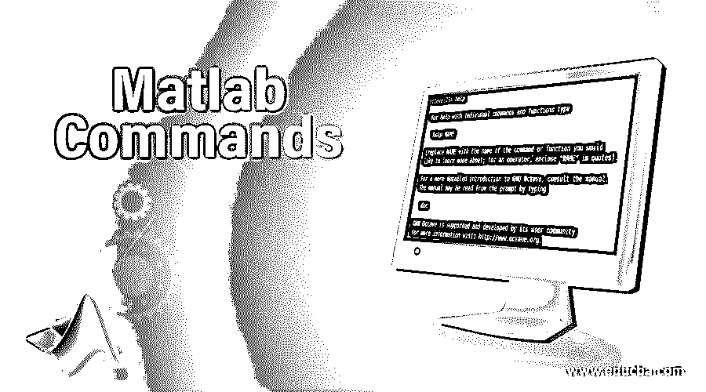

## Matlab 是什么？

它被缩写为基于矩阵的语言，是为计算机科学家和工程师设计的。Matlab 在计算数学方面提供了很好的解决方案。

它可用于–

<small>Hadoop、数据科学、统计学&其他</small>

1.  数据分析
2.  算法开发
3.  创建模型和应用程序

Matlab 在机器学习和深度学习中找到了一个很好的用例，因为它们处理只能以矩阵形式表示和分析的 n 维空间。除此之外，使用它的其他技术还有控制系统设计、图像处理和计算金融。

### Matlab 命令

Matlab 提供了用户必须使用命令行界面与应用程序进行交互时使用的命令。在这里，我们将借助示例来了解如何使用这些命令

#### 基本命令

**1。清除**–该命令从存储器中删除变量

**2。exist**–该命令检查变量是否存在

**3。CLC**–该命令清除命令窗口

**4。全局**–该命令将一个变量声明为全局变量

**5。帮助**–如果你需要搜索任何帮助，只需在命令窗口中输入关键字，它就会显示你可用的选项

**6。谁**–该命令列出当前变量

**7。type**–该命令显示文件的内容。

**8。pwd**–该命令显示当前目录。

**9。日期**–该命令显示当前日期

10。这个命令列出了当前目录下的所有 Matlab 文件

**例 1:**

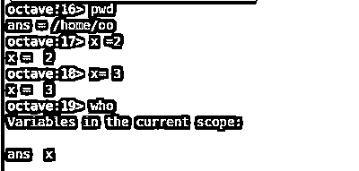

**例 2:**

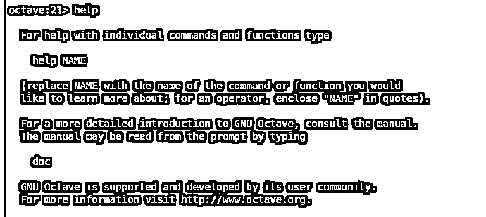

**例 3:**

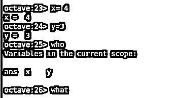

**例 4:**

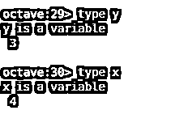

**例 5:**

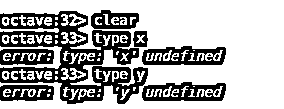

因此，如果您仔细观察上面的示例 5，您会发现这些语句是正确的，在最后一个示例中，我们首先调用 clear command，然后我们寻找 x 和 y 的类型，现在这种类型未定义，但在示例 4 中并非如此。

请注意，这些示例是用 octave 提供的，octave 是 Matlab 的开源等效平台，使用相同的命令集。

#### 中间 Matlab 命令

以下是中间命令:

##### 1.数学函数

这里，我们正在探索 plot 命令，该命令用于绘制随时间变化的正弦波曲线，其中时间范围为 1 到 30，以 0.01 的间隔增加。

同样，我们也可以对构成数学主要部分的任何其他三角函数这样做

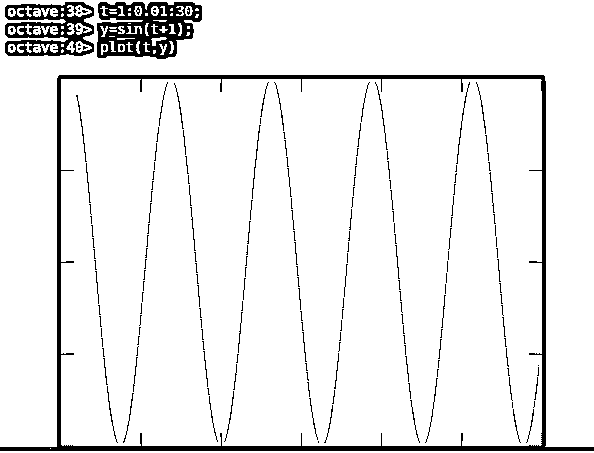

##### **2。**阵列相关命令

*   **Cat–**它用于连接两个数组，它采用的第一个参数是要创建的数组的维度，比如它是 1D、2D 还是 n 维数组，此后 n 个数组作为参数传递，这些数组将被连接起来，如快照所示
*   **Length–**计算数组中元素的数量
*   **Min，max–**这些命令返回数组中的 max 和 Min 元素。

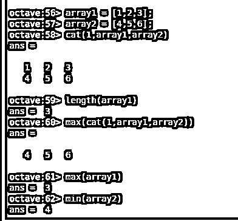

##### 3.矩阵相关命令

*   **Eye—**这创建了一个单位矩阵
*   **1—**这将创建 1 的数组
*   **零**–这将创建一个零数组

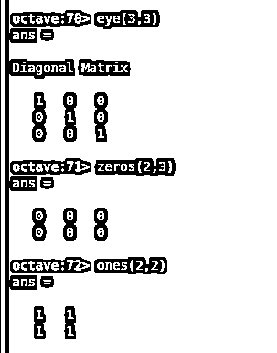

##### 4.矩阵算术命令

*   **点-** 该命令生成两个矩阵的点积，注意矩阵的列和行决定了生成的矩阵
*   **交叉**–同义地，这创建了叉积，当以矩阵形式表示时，有助于向量运算

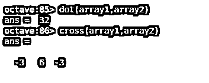

##### 5.用于线性方程相关运算的矩阵命令

*   **秩–**该命令提供矩阵的一个重要数学参数的结果，称为秩，是母矩阵中携带子矩阵的非零行列式的最低阶的量化
*   **Det–**使用该命令计算矩阵的行列式。
*   **Inv–**该命令的执行为我们提供了一个矩阵的逆矩阵。

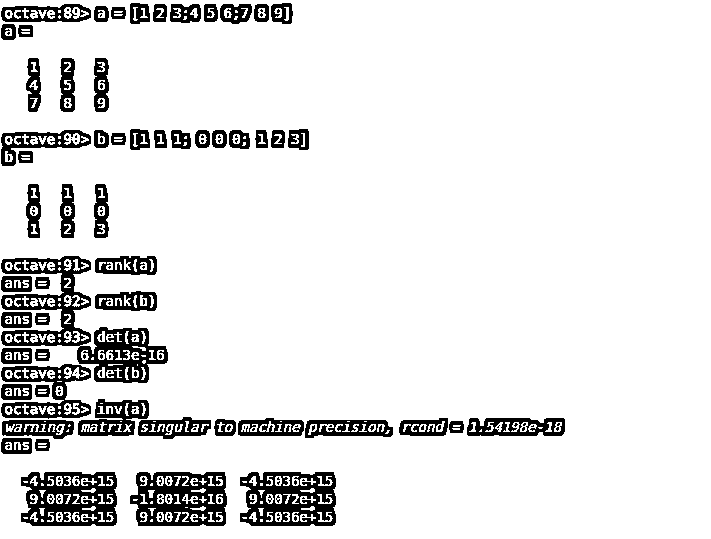

##### 6.时序相关命令

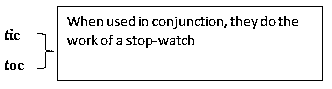

**CPU time**–以秒为单位计算 CPU 时间

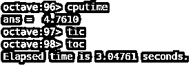

##### 7.字符串相关命令

*   **Findstr–**查找短语中字符串出现的起始索引。
*   **Strcmp–**该命令用于比较两个字符串，如果匹配正确则返回 1，否则返回 0。

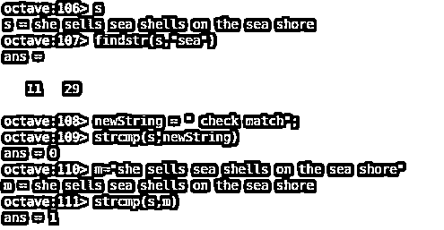

#### 高级 Matlab 命令

让我们看看下面给出的一些高级命令:-

##### 1.轮廓

每当你在工程中处理控制系统设计时，奈奎斯特图轮廓等给你一个系统稳定性的标志，我们可以在 Matlab 中定制绘图的风格(如颜色和线型等)。

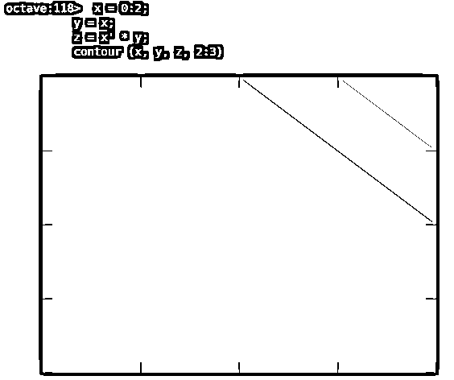

##### 2.多项式相关命令

*   **poly 2 sym(vector)–**该命令将一个系数向量转换成相应的符号多项式(从最高幂到最低幂)。
*   **poly2sym(vector，' v ')–**该命令将一个系数向量转换成相应的符号多项式 inv(从最高幂到最低幂)。

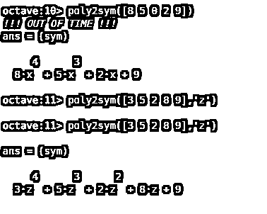

##### 3.方程求解的命令

**syms x1 x2…xn；solve(eq1，eq2，…，eqn，x1，x2，…，xn)–**该命令求解 n 个联立方程，这些方程的解被分配给从 x1，x2 到 xn 的变量。

下面所附的图片进行了演示

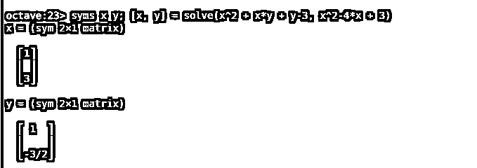

##### 4.求解线性方程组的命令

**X = linsolve (A，B)–**假设我们需要找到一个针对给定方程的解

2x+y+z+m=1

x+2y+z+m=2

x+y+2z+m=3

x+y+z+2m=4

这可以根据附图解决

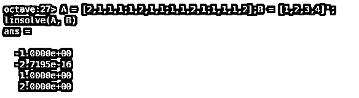

### 使用命令的提示和技巧

*   程序员应该知道像 Matlab 什么时候做就地计算这样的用例。
*   处理表格时使用灵活的索引
*   用灵活的调用语法编写 Matlab 函数

示例–

我们应该用给定的语法设计一个函数

`function a = findArea(width,margin)
% findArea(width)
% findArea(width,height)
% findArea(... 'shape',shape)`

因此，在这里，通过使用 inputParser，您可以指定哪些输入参数是必需的(宽度)，哪些是可选的(高度)，以及哪些是可选的名称-值对(“形状”)。inputParser 还让您确认每个输入都是有效的

因为 inputParser 是一个 MATLAB 对象。确保首先创建一个对象，然后调用函数来添加各种输入参数。

### 结论

MATLAB 是一个用于科学计算和高级编程的平台，它使用交互式环境来执行复杂的计算，比使用传统语言(如 [C 和 C++)更有效。](https://www.educba.com/c-vs-c-plus-plus/)

具有支持多种操作的模块，与 Simulink 集成，可用于模拟电子控制系统，进行与数值方法、数字信号处理、图像处理和视频处理相关的复杂计算。

### 推荐文章

这是一个 Matlab 命令指南。这里我们已经讨论了基本的、中级的以及高级的 Matlab 命令。您也可以阅读以下文章，了解更多信息——

1.  [如何使用 Docker 命令？](https://www.educba.com/docker-commands/)
2.  [轨道命令列表](https://www.educba.com/rails-commands/)
3.  [CSS 命令指南](https://www.educba.com/css-commands/)
4.  [推进 C#命令的基本步骤](https://www.educba.com/c-sharp-commands/)
5.  [MATLAB 函数|带示例的函数类型](https://www.educba.com/matlab-functions/)
6.  [Simulink Matlab 函数指南](https://www.educba.com/simulink-matlab-function/)

