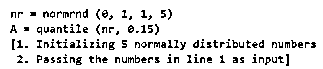
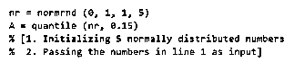
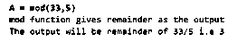
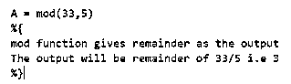
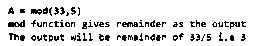
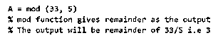

# Matlab 块注释

> 原文：<https://www.educba.com/matlab-block-comment/>

## Matlab 块注释简介

“块注释”是编码语言中的一种方式，通过这种方式，我们对一个块或多行代码进行注释，以防止编译器执行它们。在 MATLAB 中，我们可以注释小至单行的代码，也可以注释长达数百行的代码。开发人员添加各种要点来解释代码，并使其易于被人类理解，从而使其对于代码开发人员之外的受众来说更具可读性。“注释”这些行确保编译器不会执行它们，并防止任何潜在的错误。

**注释代码块的语法:**

<small>Hadoop、数据科学、统计学&其他</small>

1.通过使用 Live 编辑器中的“Comment”按钮(以“%”
2 表示)。通过使用键盘
3 中的“%”符号。通过使用快捷键-“Ctrl+R”

现在让我们了解如何在 MATLAB 中注释代码块。

### 例子

让我们讨论 Matlab 块注释的例子。

#### 示例#1

在这个例子中，我们将使用 MATLAB 的 Live 编辑器中的“Comment”按钮来注释一段代码。我们将写一个伪代码，并给出一些解释这个代码的要点。我们不希望这些点被 MATLAB 编译器执行，所以会对它们进行“注释”。以下是需要遵循的步骤:

1.编写代码以及解释要点
2。选择您想要注释的代码块(作为解释的要点)
3。点击“Live Editor”选项卡中的“Comment”按钮(用“%”符号表示)，如下所示

**代码:**

nr = normrnd (0，1，1，5)
A =分位数(nr，0.15)

1.初始化 5 个正态分布数
2。传递第 1 行中的数字作为输入

这是我们的输入和输出在 MATLAB 中的样子:

**输入:**

**输出(注释完代码块之后):**

如果我们直接执行我们的输入，MATLAB 将对第 3 & 4 行抛出一个错误，因为这些行是用人类友好的语言写的，MATLAB 编译器不能理解。我们必须“注释”这两行以避免错误。在这里，我们使用 MATLAB 实时编辑器中的“注释”按钮对它们进行了注释

#### 实施例 2

在这个例子中，我们将使用键盘上的“%”键来注释一段代码。这里我们也将写一个伪代码，并给出一些解释这个代码的要点。我们不希望这些点被 MATLAB 编译器执行，所以会对它们进行“注释”。以下是需要遵循的步骤:

1.编写代码以及解释要点
2。选择您想要注释的代码块(作为解释的要点)
3。在要注释的代码的开头添加“% {”
4。在要注释的代码末尾添加“%}”

**代码:**

`A = mod (33, 5)`

mod 函数将余数作为输出

输出将是 33/5 的余数，即 3

这是我们的输入和输出在 MATLAB 中的样子:

**输入:**

**输出(注释完代码块之后):**

如果我们直接执行我们的输入，MATLAB 将对第 2 & 3 行抛出一个错误，因为这些行是用人类友好的语言写的，MATLAB 编译器不能理解。我们必须注释这两行以避免错误。在这里，我们使用“%”键对这两行代码块进行了注释

#### 实施例 3

在这个例子中，我们将使用键盘上的快捷键来注释代码块。为此，我们将在键盘上使用“Ctrl”和“R”组合键。这里我们将使用与上面例子中相同的代码。以下是需要遵循的步骤:

1.编写代码以及解释要点
2。选择您想要注释的代码块(作为解释的要点)
3。同时按“Ctrl”和“R”键

**代码:**

`A = mod (33, 5)`

mod 函数将余数作为输出

输出将是 33/5 的余数，即 3

这是我们的输入和输出在 MATLAB 中的样子:

**输入:**

**输出(注释完代码块之后):**

正如我们在输出中看到的，解释点现在被注释了。我们通过同时按下“Ctrl”和“R”键实现了这一点。

[Please note that, the output shown in above examples is not the output of the functions used in the code, but the result after commenting the block having explanation of the code]

### 结论

1.在 MATLAB 中，如果我们想防止某个特定的代码块被执行
2，就要使用块注释。这样做通常是为了在不干扰编译器
3 的情况下提供代码解释。在 MATLAB 中，我们有多种方法可以注释一段代码

### 推荐文章

这是一个 Matlab 块注释指南。在这里，我们讨论介绍，语法，以及如何用例子注释 MATLAB 中的代码块。您也可以看看以下文章，了解更多信息–

1.  [MATLAB 中的热图](https://www.educba.com/heatmap-in-matlab/)
2.  [奈奎斯特 Matlab](https://www.educba.com/nyquist-matlab/)
3.  [Matlab 极限](https://www.educba.com/matlab-limit/)
4.  [Matlab 绘图图](https://www.educba.com/plot-graph-matlab/)

