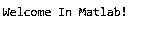
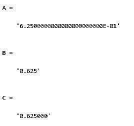
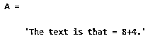
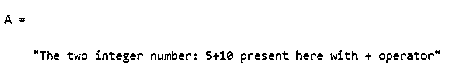

# Matlab sprintf

> 原文：<https://www.educba.com/matlab-sprintf/>

## Matlab sprintf 简介

Matlab 为用户提供了不同类型的函数；sprintf()是 Matlab 提供的函数之一。基本上，sprintf()是一个字符串变量，它是在 Matlab 内存中创建的，这意味着我们可以通过使用 sprintf()来创建字符串变量，而不是将其写入文本文件。sprint()的工作方式与 fprintf()相同，但唯一的区别是，当我们使用 fprintf()时，它用于将数据写入文本文件，通过使用 sprint，我们可以格式化数据字符串

**语法**

<small>Hadoop、数据科学、统计学&其他</small>

`string = sprintf(formatSpec, Array1,Array2,…….ArrayN)
[string,error_message] = sprintf (formatSpec, Array1,Array2,…….ArrayN)
string = sprintf (text)`

**解释**

Matlab 中的 sprintf()有多种语法，如上面的语法所示。

在第一种语法中，我们使用 formatSpec 格式操作符将数据指定为数组格式，这有助于我们将结果从文本返回到字符串中。在这里，我们还使用 Array1、Array2 进行列排序，并使用 sprint()对其进行格式化。请注意，如果 formatSpec 是一个字符串，那么它将结果返回到一个字符串中，否则返回的结果是一个字符向量。

在第二种语法中，当我们的事务不成功时使用错误消息，否则显示空的错误消息。

在第三行中，我们尝试打印文本，如\n 和\t。

### sprint 在 Matlab 中是如何工作的？

现在我们来看看如何在 Matlab 中使用 sprintf()，如下所示。

格式化文本是 sprintf()函数的主要部分。通过使用不同的输入参数和不同的数据类型，我们可以按照我们的要求格式化文本。在 Matlab 中，我们可以选择使用 sprintf()函数来控制文本的格式，我们也可以使用带有不同转换字符的格式操作符。

Sprintf 使用如下不同的输入参数。

#### 1 格式规范:

我们通过使用不同的操作符来指定输出的格式。这里我们使用 formatSpec 格式操作符，它包括文本和特殊字符。有时 formatSpec 会使用所有字符的 sprintf 翻译文本。formatSpec 的格式是单引号或字符串。现在让我们看看 Matlab 中的格式化操作符，如下所示。

**Matlab 中 sprintf 的格式化运算符**

格式运算符使用%符号开始，并且必须带有转换字符。我们可以在%和转换字符之间使用标识符、标志、宽度和精度来代替转换字符。

**Matlab 中 sprintf 的转换字符**

Matlab 提供了不同类型的转换字符，如有符号整数、无符号整数、浮点数以及字符或字符串。根据转换字符，我们可以使用不同的字符，如%d 或%i 表示有符号整数，当我们有%u 表示像这样的无符号整数时，我们可以根据需要使用不同的转换字符。

#### 2 个数字、字符或字符串数组:

这是 Matlab 中 sprintf 的另一种输入格式化类型。对于字符串数组、字符和数字，我们可以使用不同的数据类型，如 single、double、int8、int16、string、logical 等。

#### 3.文字文本:

这是 Matlab 中的另一个输入文本，但不同之处在于:这里我们可以使用没有任何格式操作符的输入文本，这意味着没有字符向量或字符串标量。literalText 使用两种数据类型，如 char 和 string。

现在我们来看看 sprintf 中的一些输出参数，如下所示。

**1。字符串格式:**

在这种类型中，我们使用 formatSpec 选项来匹配输出的格式化文本。

**2。错误消息:**

它用于返回字符，否则当事务执行不成功时，它将返回错误消息。

### 例子

现在让我们看看 Matlab 中 sprintf()函数的不同示例，以便更好地理解 sprintf()函数，如下所示。

现在我们来看一个 sprintf()的简单例子，如下所示。

`A = sprintf('In Matlab%s', '!');
B = sprintf('Welcome %s', A);`

**解释**

在上面的例子中，我们试图实现如何使用 sprintf()函数连接两个不同的字符串。在这个例子中，我们使用了两个变量 A 和 B，并给 A 和 B 变量分配了一些文本，如上面的程序所示。但是请注意，在第二行中，我们试图使用 sprintf()函数来合并这两个单词。这个程序的最终输出用下面的截图来说明。

现在让我们看看如何使用 sprintf()函数来表示浮点数，如下所示。

`X = 5/8;
A = sprintf('%0.22E',X)
B = sprintf('%5G',X)
C = sprintf('%3f',X)`

**解释**

在上面的例子中，我们通过使用%E、%G 和%f 说明符实现了浮点格式，如上面的代码所示。这里%E 用于指数值，%G 用于更紧凑的表示法，如 5.14 这样，而%f 用于表示定点值。这个程序的最终输出用下面的截图来说明。

现在让我们看看 sprintf()函数的另一个例子，如下所示。

`data = sprintf('%f   %.2G   %f   %.2E', pi*30*ones(1,4))`

**解释**

在上面的例子中，我们试图实现 sprintf()函数的另一个例子。在上面的代码中，我们使用一个函数来实现浮点数。这个程序的最终输出用下面的截图来说明。

现在让我们尝试将文本实现为字符串数组，如下所示。

`formatSpec = "The two integer number: %d+%d %s";
Array1 = 5;
Array2 = 10;
Array3 = "present here with + operator";
A  = sprintf(formatSpec,Array1,Array2,Array3)`

**解释**

在上面的例子中，我们将指定的格式化文本实现到一个字符串数组中，如上面的程序所示。这个程序的最终输出用下面的截图来说明。

### 结论

我们希望你能从这篇文章中学习 Matlab sprintf。从上面的文章中，我们已经了解了 sprintf 的基本语法。我们也看到了 sprintf 的不同例子。从这篇文章中，我们了解了如何以及何时使用 Matlab sprintf。

### 推荐文章

这是一个 Matlab sprintf 的指南。这里我们讨论 sprintf 的基本语法。我们也看到了 sprintf 的不同例子。您也可以看看以下文章，了解更多信息–

1.  [Matlab 对](https://www.educba.com/matlab-mod/)的影响
2.  [奈奎斯特 Matlab](https://www.educba.com/nyquist-matlab/)
3.  [Matlab 绘图图](https://www.educba.com/plot-graph-matlab/)
4.  [Matlab 单元格](https://www.educba.com/matlab-cell/)

