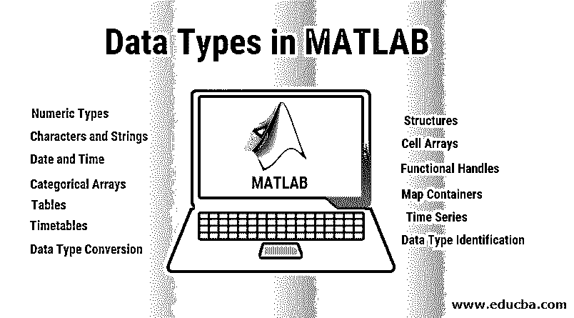

# MATLAB 中的数据类型

> 原文：<https://www.educba.com/data-types-in-matlab/>

## MATLAB 中的数据类型概述

MATLAB 中的数据类型是用于计算的受支持的数据格式。MATLAB 是一种流行的数学和统计数据分析工具，具有广泛的计算功能。MATLAB 支持的各种数据类型有数字类型、字符、字符串、日期和时间、分类数组、表格、时间表、结构、单元格数组、函数处理程序、地图容器、时间序列、数据类型标识、数据类型转换。每种数据类型都通过变量接受和处理某种类型的数据格式。MATLAB 提供了使用转换函数将一种数据类型转换为另一种兼容数据类型的功能

### MATLAB 中的数据类型

以下是数据类型:-

<small>Hadoop、数据科学、统计学&其他</small>

*   数字类型
*   字符和字符串
*   日期和时间
*   分类数组
*   桌子
*   时间表
*   结构
*   单元阵列
*   功能手柄
*   地图容器
*   时间序列
*   数据类型识别
*   数据类型转换

**让我们详细看看 MATLAB 中各个数据类型的意义-**

1.  **数值类型:**该类型下是整数、浮点或小数数据
2.  **字符和字符串:**文本用字符数组和字符串数组表示
3.  **日期和时间:**这包含了日期和时间值的数组，可以用不同的格式显示，如日/月/年或月/日/YY 等。
4.  **分类数组:**这是定性数据的数组，比如一个列表，其中的值来自一个有限的离散采样集或非数字类型的数据。
5.  **表:**数组在这里以表格的形式表示，其命名列可能包含不同的类型，如数值、分类等。
6.  **时间表:**表格形式的时间戳记数据，如日/月/年/小时/分/秒。
7.  **结构:**最通用也最复杂，这种类型包含带有命名字段的数组，这些字段包含不同的类型和大小。
8.  **单元格数组:**这也是一种数据类型，数组可以包含不同类型和大小的数据。
9.  **函数句柄:**这样的数据类型允许变量间接调用函数。
10.  **Map Containers:** 类似于许多语言中的字典，这样的数据类型具有带键的对象，其中键被索引到值，其中键不必是整数。
11.  **时间序列:**时间序列数据具有特定的类型，其中数据向量是在该时间段内采样的。
12.  **数据类型识别:**这样的数据类型帮助我们确定任何变量的数据类型。
13.  **数据类型转换:**使用这些类型，我们可以在数字数组、单元格数组、字符数组、结构、函数句柄、表格等多种数据类型之间进行转换。

#### 现在，让我们更详细地了解每种类型

| **数据类型** | **定义** |
| Int8 | 这被称为 8 位有符号整数 |
| Uint8 | 这是 8 位无符号整数 |
| Int16 | 16 位有符号整数 |
| Uint16 | 16 位无符号整数 |
| Int32 | 32 位有符号整数 |
| Uint32 | 32 位无符号整数 |
| Int64 | 64 位有符号整数 |
| Uint64 | 64 位无符号整数 |
| 单一的 | 这称为单精度数值数据 |
| 两倍 | 这是双精度数值数据 |
| 逻辑学的 | 逻辑值 0 或 1 代表真或假 |
| 茶 | 字母等字符数据 |
| 单元阵列 | 索引单元格的数组，其中每个单元格能够存储相同或不同维度和不同数据类型的数组 |
| 结构 | 这更像是一个 C 结构，其中每个结构都有一个命名字段，能够存储不同大小或维度以及不同数据类型的数组 |
| 功能句柄 | 这相当于一个函数的指针 |
| 用户类别 | 这种数据类型表示从用户定义的类构造的对象 |
| Java 类 | 这种类型表示从 Java 类构造的对象。 |

**例题**

下面是一个例子

**代码:**

`strg = 'Hello MATLAB!'
n = 234510
dbl = double(n)
unt = uint32(7891.50)
rrn = 15678.92347
cons = int32(rrn)`

**输出:–**

strg =你好 MATLAB！n = 234510 dbl = 234510 unt = 7901 rn = 15678.9 cons = 15679

*   在上面的示例中，strng 是字符串数据类型，n 是数值数据类型，dbl 是双精度数据类型，unt 是 32 位无符号整数，rrn 是转换为 int 32 整数并存储为 cons 的小数数据。

### MATLAB 中数据类型的转换

| **功能** | **目的** |
| 茶 | 此函数将从转换为字符数组(字符串) |
| int2str | 该函数将整数数据转换为字符串 |
| mat2str | 这个函数将矩阵转换成字符串 |
| num2str | 这个函数将数字转换成字符串 |
| str2double | 此函数将字符串转换为双精度值 |
| str2num | 这个函数将字符串转换成数字 |
| native2unicode | 这个函数将数字字节转换成 Unicode 字符 |
| unicode2nactive | 这个函数将 Unicode 字符转换成数字字节 |
| base2dec | 这个函数将基数 N 的数字串转换成十进制数 |
| bin2dec | 这个函数将二进制数字串转换成十进制数字 |
| dec2base | 这个函数将字符串中的十进制数转换为基数 N 的数 |
| dec2bin | 这个函数将字符串中的十进制数转换成二进制数 |
| dec2hex | 这个函数将字符串中的十进制数转换成十六进制数 |
| hex2dec | 这个函数将十六进制数字字符串转换成十进制数字 |
| hex2num | 此函数将十六进制数字字符串转换为双精度数字 |
| num2hex | 该函数将单精度和双精度转换为 IEEE 十六进制字符串 |
| cell2mat | 这个函数将单元格数组转换成数值数组 |
| 单元 2 结构 | 此函数将单元格数组转换为结构数组 |
| cellstr | 这个函数从一个字符数组中创建一个字符串的单元格数组 |
| mat 2 电池 | 这个函数从数组转换到单元格数组，单元格的大小可能不同 |
| num2cell | 此函数将数组转换为单元格大小一致的单元格数组 |
| 结构 2 单元格 | 此函数将结构转换为单元格数组 |

### 结论

*   从上面的讨论和例子中，我们深入了解了 MATLAB 编程语言的各种数据类型。这些数据类型中的每一种都非常重要，MATLAB 用户需要深入了解每一种类型的属性和用法，以编写高效的 MATLAB 程序，这些程序速度快，性能优化，并可根据未来需求进行扩展。
*   作为初学者，建议用户大量练习这些语法，以便他们能够理解它们的用法和相对的优缺点。这种编码实践对于掌握任何语言以及能够编写高效的 MATLAB 代码都很重要。

### 推荐文章

这是 MATLAB 中的数据类型指南。这里我们用一个例子来讨论 MATLAB 中数据类型的介绍、列表和转换。您也可以浏览我们推荐的其他文章，了解更多信息——

1.  [Matlab 运算符](https://www.educba.com/matlab-operators/)
2.  [Matlab 命令应用入门](https://www.educba.com/matlab-commands/)
3.  [MATLAB 职业生涯](https://www.educba.com/career-in-matlab/)
4.  [MATLAB 面试问题](https://www.educba.com/matlab-interview-questions/)
5.  [Matlab 编译器| Matlab 编译器的应用](https://www.educba.com/matlab-compiler/)

