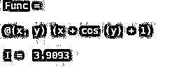
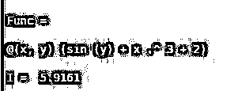
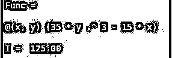
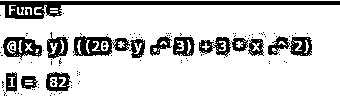
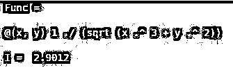

# Matlab 二重积分

> 原文：<https://www.educba.com/matlab-double-integral/>

## Matlab 二重积分简介

Matlab 二重积分是定积分的延伸。在二重积分中，对具有两个变量的函数进行积分。在其最简单的形式中，对具有一个变量的函数的积分是在一维空间上完成的，同样，对具有两个变量的函数的积分是在二维空间上完成的。在 MATLAB 中，我们使用“integral2 函数”来获得函数的二重积分。

**语法**

<small>Hadoop、数据科学、统计学&其他</small>

现在让我们理解 MATLAB 中 integral2 函数的语法:

`I = integral2 (Func, minX, maxX, minY, maxY)
I = integral2 (Func, minX, maxX, minY, maxX, Name, Value)`

**说明:**

I = integral2 (Func，minX，maxX，minY，maxY)将在区域 minX ≤ X ≤ maxX 和 minY ≤ Y ≤ maxY 上对函数‘Func’(此处‘Func’是两个变量 X 和 Y 的函数)进行积分

I = integral2 (Func，minX，maxX，minY，maxX，Name，Value)可用于向 integral2 函数传递更多选项。这些选项作为成对参数传递

### Matlab 二重积分实现实例

现在让我们来了解一下在 MATLAB 中使用“integral2 函数”计算二重积分的代码。

#### 示例#1

在本例中，我们将采用一个包含两个变量“x”和“y”的 cos 函数。我们将遵循以下 2 个步骤:

步骤 1:创建一个 x 和 y 的函数

步骤 2:将函数和要求的限制传递给 integral2 函数

**代码:**

`Func = @ (x,y) (x + cos (y) + 1)
[Creating the cos function in ‘x’ and ‘y’] I = integral2 (Func, 0, 1, 0, 2)
[Calling the integral2 function and passing the desired limits as 0 <= x <= 1; 0 <= y <= 2)] [Mathematically, the double integral of x + cos (y) + 1 is 3.9093]`

**输出:**

**说明:**在输出中我们可以看到，我们得到了我们输入函数的二重积分为 3.9093，和我们预期的一样。

#### 实施例 2

在本例中，我们将采用一个包含两个变量“x”和“y”的 sin 函数。我们将遵循以下 2 个步骤:

步骤 1:创建 x 和 y 的正弦函数

步骤 2:将函数和要求的限制传递给 integral2 函数

**代码:**

`Func = @(x,y) (sin(y) + x.^3 + 2)
[Creating the sin function in ‘x’ and ‘y’] I = integral2 (Func, 0, 1, 0, 2)
[Calling the integral function and passing the desired limits as 0 <= x <= 1; 0 <= y <= 2)] [Mathematically, the double integral of sin(y) + x.^3 + 2 is 5.9161]`

**输出:**

**说明:**在输出中我们可以看到，我们得到了我们输入函数的二重积分为 5.9161，和我们预期的一样。

#### 实施例 3

在本例中，我们将采用 x 和 y 的多项式函数。我们将遵循以下 2 个步骤:

步骤 1:创建 x 和 y 的多项式函数

步骤 2:将函数和要求的限制传递给 integral2 函数

**代码:**

`Func = @(x,y) (35*y.^3 - 15*x)
[Creating the polynomial function in ‘x’ and ‘y’] I = integral2 (Func, 0, 1, 0, 2)
[Calling the integral function and passing the desired limits as 0 <= x <= 1; 0 <= y <= 2)] [Mathematically, the double integral of 35*y.^3 - 15*x is 125]`

**输出:**

**说明:**在输出中我们可以看到，我们得到了我们输入函数的二重积分为 125，和我们预期的一样。

#### 实施例 4

在这个例子中，我们将采用 x 和 y 的三次多项式函数。我们将遵循以下 2 个步骤:

步骤 1:创建一个 x 和 y 的三次多项式函数

步骤 2:将函数和要求的限制传递给 integral2 函数

**代码:**

`Func = @(x,y) ((20*y.^3) + 3*x.^2)
[Creating the polynomial function in ‘x’ and ‘y’] I = integral2 (Func, 0, 1, 0, 2)
[Calling the integral function and passing the desired limits as 0 <= x <= 1; 0 <= y <= 2)] [Mathematically, the double integral of (20*y.^3) + 3*x.^2 is 82]`

**输出:**

**说明:**在输出中我们可以看到，我们得到了我们输入函数的二重积分为 82，和我们预期的一样。

#### 实施例 5

在这个例子中，我们将采用一个带除法的多项式函数。我们将遵循以下 2 个步骤:

步骤 1:创建一个带除法的 x 和 y 的多项式函数

步骤 2:将函数和要求的限制传递给 integral2 函数

**代码:**

`Func = @(x,y) 1./(sqrt(x.^3 + y.^2))
[Creating the polynomial function in ‘x’ and ‘y’ and division] I = integral2 (Func, 0, 1, 0, 2)
[Calling the integral function and passing the desired limits as 0 <= x <= 1; 0 <= y <= 2)] [Mathematically, the double integral of 1./(sqrt(x.^3 + y.^2))  is 2.9012]`

**输出:**

**说明:**在输出中我们可以看到，我们得到了我们输入函数的二重积分为 2.9012，和我们预期的一样。

### 结论

在 MATLAB 中可以使用 Integral2 函数来得到函数的二重积分。二重积分用于在由极限指定的二维区域上积分两个变量的函数。

### 推荐文章

这是一个 Matlab 二重积分的指南。这里我们讨论一个 Matlab 二重积分的介绍，语法，例子。您也可以浏览我们的其他相关文章，了解更多信息——

1.  [MATLAB 缸()](https://www.educba.com/matlab-cylinder/)
2.  [Matlab mesh()](https://www.educba.com/matlab-mesh/)
3.  [Matlab 图](https://www.educba.com/matlab-figure/)
4.  [Matlab sphere()](https://www.educba.com/matlab-sphere/)

