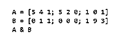
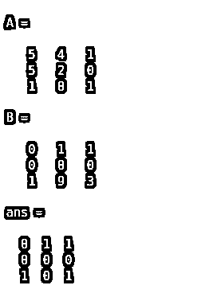
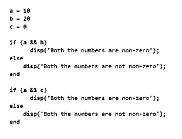
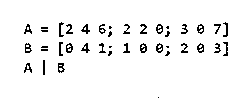
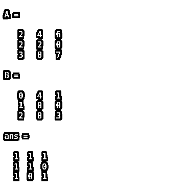
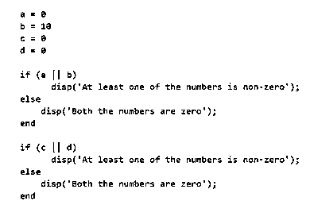
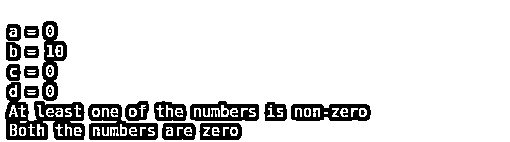

# Matlab 布尔型

> 原文：<https://www.educba.com/matlab-boolean/>

## Matlab 布尔函数简介

MATLAB 布尔运算符用于返回逻辑值(True 表示 1，False 表示 0 ),以防我们想要检查是否满足某个条件。布尔运算符在我们需要根据特定条件执行代码行的代码中非常有用。

例如，我们可以使用逻辑运算符比较两个数字，如果两个数字相等，则输出结果为真，否则为假。

<small>Hadoop、数据科学、统计学&其他</small>

**语法:**

逻辑 AND (&)、OR (|)、NOT (~)是一些常用的布尔运算符。

### 如何用实例使用 Matlab 布尔？

现在让我们了解如何在 MATLAB 中使用逻辑或布尔运算符。我们将讨论两种场景:

1.  布尔运算符在数组中的使用
2.  布尔运算符在电路中的使用

#### 示例#1

在这个例子中，我们将在两个矩阵之间使用一个' & '运算符。如果两个矩阵中的对应元素都不为零，则' & '运算符将输出' 1 '，否则将输出' 0 '。本例中要遵循的步骤是:

1.  初始化输入矩阵
2.  在矩阵之间使用' & '运算符

**代码:**

`A = [5 4 1; 5 2 0; 1 0 1] [Initializing the 1st matrix] B = [0 1 1; 0 0 0; 1 9 3] [Initializing the 2nd matrix] A & B
[Using the Boolean operator ‘&’ between the matrices. The output will be a matrix of 0s and 1s]`

这是我们的输入和输出在 MATLAB 中的样子:

**输入:**

`A = [5 4 1; 5 2 0; 1 0 1] B = [0 1 1; 0 0 0; 1 9 3] A & B`

**输出:**

正如我们在输出中所看到的，如果两个矩阵中的相应元素都不为零，布尔运算符' & '将输出' 1 '，否则将输出' 0 '

接下来，我们将看到在电路中使用' & '运算符

#### 实施例 2

在电路中使用时，如果两个变量都不为零，则' & '运算符将输出' 1 '，否则将输出' 0 '。本例中要遵循的步骤是:

1.  初始化输入变量
2.  使用 if-else 循环和布尔运算符' & '

**代码:**

`a = 10
[Initializing the 1st variable] b = 20
[Initializing the 2nd variable] c = 0
[Initializing the 3rd variable] if (a && b)
disp(‘Both the numbers are non-zero’);
else
disp(‘Both the numbers are not non-zero’);
end
[This loop with Boolean ‘&’ operator will check if both the variables are non-zero; In this example we have taken both ‘a’ and ‘b’ as non-zero] if (a && c)
disp(‘Both the numbers are non-zero’);
else
disp(‘Both the numbers are not non-zero’);
end
[This loop will check if both the variables ‘a’ and ‘c’ are non-zero]`

这是我们的输入和输出在 MATLAB 中的样子:

**输入:**

`a = 10
b = 20
c = 0
if (a && b)
disp('Both the numbers are non-zero');
else
disp('Both the numbers are not non-zero');
end
if (a && c)
disp('Both the numbers are non-zero');
else
disp('Both the numbers are not non-zero');
end`

**输出:**

*   在第一个第一个循环中，变量‘a’和‘b’都不为零，所以使用布尔运算符“&”后的输出是“两个数都不为零”
*   在第二个和第二个循环中，变量‘a’不为零，而变量‘c’为零，所以使用布尔'&'运算符后的输出是“两个数字都不非零”

#### 实施例 3

在本例中，我们将在两个矩阵之间使用“|”(或)运算符。如果矩阵中的任何一个对应元素不为零，则“|”运算符将输出“1”，否则将输出“0”。本例中要遵循的步骤是:

1.  初始化输入矩阵
2.  在矩阵之间使用“|”运算符

**代码:**

`A = [2 4 6; 2 2 0; 3 0 7] [Initializing the 1st matrix] B = [0 4 1; 1 0 0; 2 0 3] [Initializing the 2nd matrix] A | B
[Using the Boolean operator ‘|’ between the matrices. The output will be a matrix of 0s and 1s]`

这是我们的输入和输出在 MATLAB 中的样子:

**输入:**

`A = [2 4 6; 2 2 0; 3 0 7] B = [0 4 1; 1 0 0; 2 0 3] A | B`

**输出:**

正如我们在输出中看到的，如果矩阵中任何一个相应的元素不为零，布尔运算符“|”输出“1”，否则输出“0”。

接下来，我们将看到“|”运算符在电路中的使用

#### 实施例 4

在电路中使用时，如果任何一个变量为非零，则“|”运算符将输出“1”，否则将输出“0”。本例中要遵循的步骤是:

1.  初始化输入变量
2.  将 if else 循环与布尔“|”运算符一起使用

**代码:**

`a = 0
[Initializing the 1st variable] b = 10
[Initializing the 2nd variable] c = 0
[Initializing the 3rd variable] d = 0
[Initializing the 4th variable] if (a || b)
disp(‘At least one of the numbers is non-zero’);
else
disp(‘Both the numbers are zero’);
end
[This loop with Boolean ‘|’ operator will check if any one of the variables is non-zero; In this example we have taken ‘a’ as zero and ‘b’ as non-zero] if (c || d)
disp(‘At least one of the numbers is non-zero’);
else
disp(‘Both the numbers are zero’);
end
[This loop will check if one of the variables ‘c’ and ‘d’ is non-zero]`

这是我们的输入和输出在 MATLAB 中的样子:

**输入:**

`a = 0
b = 10
c = 0
d = 0
if (a || b)
disp('At least one of the numbers is non-zero');
else
disp('Both the numbers are zero');
end
if (c || d)
disp('At least one of the numbers is non-zero');
else
disp('Both the numbers are zero');
end`

**输出:**

*   在 1 st 循环中，变量‘a’为 0，‘b’为非零，所以使用布尔“|”运算符后的输出为“至少有一个数为非零”
*   在第二个和第二个循环中，变量‘c’和‘d’都是零，所以使用布尔“|”运算符后的输出是“两个数都是零”

### 结论

*   布尔运算符在我们想要检查条件是否满足的情况下很有用。
*   布尔运算符也用在电路代码中，我们需要根据某些条件执行代码行。

### 推荐文章

这是一个 Matlab 布尔的指南。这里我们讨论如何在 MATLAB 中使用逻辑或布尔运算符，并给出例子和输出。您也可以阅读以下文章，了解更多信息——

1.  [Matlab 极限](https://www.educba.com/matlab-limit/)
2.  [Matlab Saveas](https://www.educba.com/matlab-saveas/)
3.  [Arctan Matlab](https://www.educba.com/arctan-matlab/)
4.  [Matlab polyfit()](https://www.educba.com/matlab-polyfit/)

