# Matlab vpa

> 原文：<https://www.educba.com/matlab-vpa/>

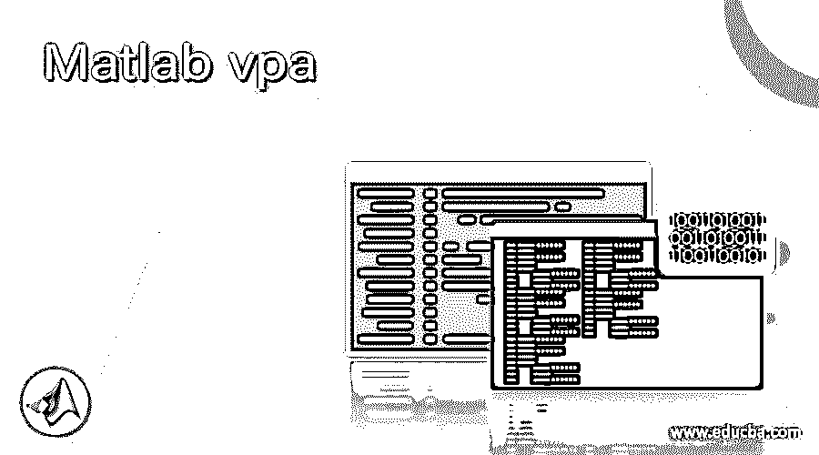

## Matlab vpa 简介

以下文章提供了 Matlab vpa 的概述。Matlab 可变精度算法用于涉及大量数字(作为输入或输出)的计算，主要关注精度而不是计算速度。这些长数字的高精度是通过将这些数字分成较小部分进行计算的算法实现的。

例如，数学上的‘圆周率’有超过 31 万亿位数，但我们通常用 3.14 作为它的值。然而，我们的一些计算可能需要涉及更多的数字，这就是 vpa(可变精度算术)派上用场的地方。

<small>Hadoop、数据科学、统计学&其他</small>

**语法:**

`vpa (a)`

`vpa (a, n)`

**说明:**

*   vpa (a)用于计算输入‘a’到‘n’个有效数字的元素。
*   默认情况下，vpa 函数的有效数字值为 32。

### Matlab vpa 示例

下面给出的例子说明了如何在 Matlab 中使用 vpa:

#### 示例#1

在本例中，我们将使用 vpa 来执行非终止除法。首先，我们将使用 Matlab 中的正规除法计算结果，然后我们将使用 vpa 来清楚地了解 vpa 的效用。

对于这个例子，我们将 2 除以 3，这将给出一个非终止输出。

**不使用 vpa 的代码:**

a1 = double(2)/double(3)
[使用' double '作为数据类型，以确保小数部分显示在输出中]

a1
[显示输出(无 vpa)]

**输入:**

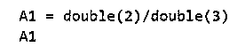

**输出:**

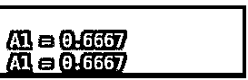

**使用 vpa 的代码:**

符号 x
[初始化符号输入]

input number = sym(2/3)；
【声明输入】

a2 = vpa(input number)
[使用 VPA 显示输出]

**输入:**

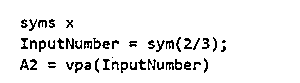

**输出:**

如果我们比较上面的两个输出，我们会注意到第一个有 4 个有效数字，而第二个有 32 个，因此第二个使用 vpa，提供更高的精度。

#### 实施例 2

接下来，我们将使用 vpa 来计算数学表达式的值。

对于本例，我们将添加两个非终接号码，并将看到使用 vpa 时精度的差异。这里的输出也将是一个非终结数。

**不使用 vpa 的代码:**

input 1 = double(2/3)
[声明第一个输入，使用“double”作为数据类型，以确保小数部分显示在输出中]

Input2 = double (pi)
【声明第二次输入】

输入 1 +输入 2
[将 2 个输入相加(不使用 vpa)]

**输入:**

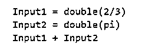

**输出:**

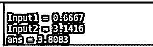

**使用 vpa 的代码:**

符号 x
[初始化符号输入]

input 1 = sym(2/3)
[声明第一个输入]

input 2 = sym(pi)
[声明第二个输入]

vpa(输入 1) + vpa(输入 2)
[使用 vpa 添加 2 个输入]

**输入:**

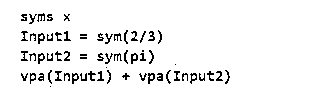

**输出:**

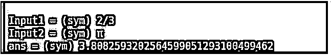

正如我们在上面的两个输出中看到的，我们在不使用 vpa 的情况下获得了 5 个有效数字，而使用 vpa 时获得了 32 个有效数字，从而提高了精度。

#### 实施例 3

接下来，我们将使用 vpa 来计算涉及平方根的数学表达式的值。

在本例中，我们将把两个数字相加，它们的平方根不终止也不重复，我们将看到使用 vpa 时精度的差异。这里，输出也将是一个非终结数。

**不使用 vpa 的代码:**

input 1 = sqrt(2)
[声明第一个输入变量并使用 sqrt 函数计算平方根]

input 2 = sqrt(5)
[声明第二个输入变量并使用 sqrt 函数计算平方根]

输入 1 +输入 2
[将 2 个输入相加(不使用 vpa)]

**输入:**

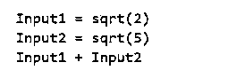

**输出:**

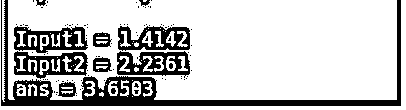

**使用 vpa 的代码:**

符号 x
[初始化符号输入]

Input1 = sqrt (2)
【声明第一个输入变量】

Input2 = sqrt (5)
【声明第二个输入变量】

vpa(输入 1) + vpa(输入 2)
[使用 vpa 添加 2 个输入]

**输入:**

**输出:**

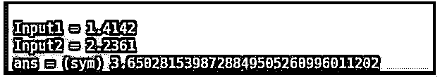

正如我们在上面获得的两个输出中看到的，我们在不使用 vpa 的情况下获得了 5 个有效数字，而使用 vpa 时获得了 32 个有效数字，从而提高了精度。

在上面的 3 个例子中，我们得到了 32 个有效数字作为输出；然而，如果需要，我们可以得到多于或少于 32 位的数字。为此，我们将把所需的位数作为第二个参数传递给 vpa 函数。

#### 实施例 4

在这个例子中，我们将学习如何在输出中获得 32 位以上的数字，比如 50 位。

**代码:**

符号 x
[初始化符号输入]

A = vpa(sqrt(3)，50)
【声明第一个输入，使用 vpa 得到 50 个有效数字】

B = vpa(3*pi，50)
【声明第二次输入】

vpa(A + B，50)
[使用 vpa 将两个输入相加，并再次将 50 作为第二个参数传递，以获得 50 个有效数字]

**输入:**

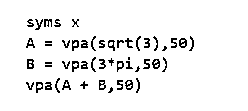

**输出:**

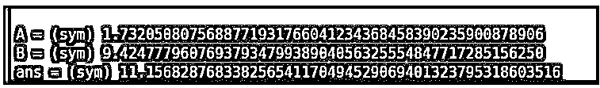

正如我们在输出中看到的，我们现在有 50 个有效数字，正如我们所期望的。

### 结论

在 Matlab 中使用 vpa 来提高输出精度。我们可以使用输入参数控制输出中有效数字的数量；默认情况下，这个数字是 32。使用 vpa 会影响程序的性能，因为重点是精度。

### 推荐文章

这是一个 Matlab vpa 的指南。为了更好的理解，我们在这里讨论 Matlab vpa 的介绍和例子。您也可以看看以下文章，了解更多信息–

1.  [什么是 Matlab？](https://www.educba.com/what-is-matlab/)
2.  [Matlab 极限](https://www.educba.com/matlab-limit/)
3.  [Matlab 绘图图](https://www.educba.com/plot-graph-matlab/)
4.  [绝对值 Matlab](https://www.educba.com/absolute-value-matlab/)

